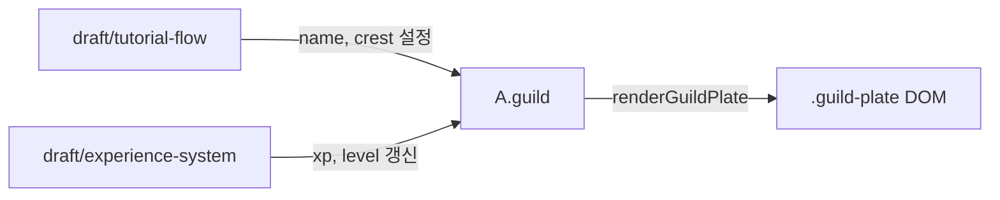

# Guild Info — 길드 정보 플레이트

> **문서 성격**: 좌상단 `daily-status-panel`의 **길드 플레이트**(`.guild-plate`) 시스템 스펙.
> 길드 정체성(문장·이름·레벨·역할) 표시를 담당합니다.
> 용어 정의는 `project-dictionary.md` 2.2.1.1., 시각 토큰은 `html-design-style-guide.md`를 따릅니다.
> 작성 규칙은 `project-docs-guide.md` 참조.

> ⚠️ **파일명 주의**: 이 문서의 파일명은 `guild-info.md`이지만, 다루는 범위는 `.guild-plate` 컨테이너 **전체**입니다. 내부의 CSS 클래스 `.guild-info`(오른쪽 텍스트 컬럼)와 혼동하지 마세요. 자세한 매핑은 3.2. 참조.

---

## 📑 목차

- [1. 현재 상태](#1-현재-상태)
- [2. 변경 목표 (이번 작업 범위)](#2-변경-목표-이번-작업-범위)
- [3. UI 구조](#3-ui-구조)
- [4. 데이터 모델](#4-데이터-모델)
- [5. 동작 규칙](#5-동작-규칙)
- [6. 상호작용](#6-상호작용)
- [7. 다이어그램](#7-다이어그램)
- [8. 구현 체크리스트](#8-구현-체크리스트)
- [9. 관련 시스템](#9-관련-시스템)

---

## 1. 현재 상태

| 항목 | 값 |
|------|-----|
| **구현 정도** | ✅ 완료 (Phase 1 기본 구조 구현) |
| **코드 위치** | `guild-master-desktop.html` — `.tl-block` 내부의 `.guild-plate` |
| **데이터 소스** | HTML 하드코딩 (전역 상태 `A`에 미연동) |
| **상호작용** | 없음 (정적 표시 전용) |

**현재 HTML에 표시되는 값** (모두 [현재] 디자인 확인용 더미):

- 길드명: `Grimhollow`
- 레벨: `Lv.7`
- 역할: `Guild Master`
- 문장(crest): `G` (Cinzel 폰트)

---

## 2. 변경 목표 (이번 작업 범위)

### 2.1. 이 문서 단계의 목표

- [공통] 현재 구조·명명·스타일을 공식 문서화
- [목표] 하드코딩된 더미 값을 **동적 데이터로 교체**할 구조 준비
- [목표] 외부 시스템(`tutorial-flow`, `experience-system`)과의 **연동 지점** 정의

### 2.2. 이번 단계에서 다루지 않는 것

- 실제 튜토리얼 흐름 → `project-plan/draft/tutorial-flow.md`
- 경험치 계산·레벨 업 로직 → `project-plan/draft/experience-system.md`
- 길드 설정 변경 UI → 향후 별도 draft
- 길드원 관계·고용 시스템 → `project-plan/draft/guild-member-hiring.md`

---

## 3. UI 구조

### 3.1. ASCII 와이어프레임

```
┌──────────────────────────────────────────────┐
│  .tl-block (daily-status-panel 컨테이너)    │
│                                              │
│  ┌────────────────────────────────────────┐ │
│  │ .guild-plate (.glass)                  │ │  ← 이 문서의 범위
│  │ ┌──────┐  Grimhollow                   │ │
│  │ │  G   │  ┌──────┐  GUILD MASTER       │ │
│  │ │      │  │ LV.7 │                     │ │
│  │ └──────┘  └──────┘                     │ │
│  │  crest   name·lvl-row(lvl + sub)       │ │
│  └────────────────────────────────────────┘ │
│                                              │
│  ┌────────────────────────────────────────┐ │
│  │ .todo-overlay                          │ │
│  │ (→ today-todo-overlay.md)              │ │
│  └────────────────────────────────────────┘ │
└──────────────────────────────────────────────┘
```

### 3.2. CSS 클래스 계층 (중요 — 명명 매핑)

```
.tl-block                           daily-status-panel 영역 컨테이너
└── .guild-plate                    길드 플레이트 (이 문서의 범위)
    ├── .guild-crest                문장 뱃지
    └── .guild-info                 내부 오른쪽 컬럼 컨테이너 ※ 파일명과 동음이의
        ├── .guild-name             길드명
        └── .guild-lvl-row          레벨+역할 행
            ├── .guild-lvl          레벨 태그
            └── .guild-sub          역할 라벨
```

### 3.3. 스타일 요약

(상세 토큰은 `html-design-style-guide.md` 참조, 여기서는 요점만)

| 요소 | 핵심 스타일 |
|------|----------|
| `.guild-plate` | `.glass` 클래스 적용 (골드 테두리·블러·그림자) |
| `.guild-crest` | 46×46px 라운드 사각, Cinzel 700 18px, `--gold-soft` 텍스트, 골드 그라데이션 배경 |
| `.guild-name` | Cinzel 600 16px, `--text-primary`, letter-spacing 0.1em |
| `.guild-lvl` | DM Mono 9px 대문자, `--gold-soft` 텍스트 / `--gold-dim` 배경, 골드 테두리 |
| `.guild-sub` | DM Mono 9px 대문자, `--text-muted` |

---

## 4. 데이터 모델

### 4.1. [현재] HTML 하드코딩

전역 상태 객체 `A`에 길드 정보가 **저장되지 않습니다**. 모든 값이 HTML 텍스트로 직접 작성됨.

### 4.2. [목표] 스키마

```javascript
A.guild = {
  name: string,      // 길드명. 기본값 "Grimhollow"
  level: number,     // 길드 레벨. 기본값 1
  xp: number,        // 누적 경험치. 기본값 0
  crest: string      // 문장 글자. 기본값 "G"
  // role은 "Guild Master" 고정이므로 저장하지 않음
}
```

### 4.3. 필드 규칙

| 필드 | 제약 | 변경 주체 |
|------|-----|---------|
| `name` | 1~20자, 사용자 입력 정규화 | `tutorial-flow` 최초 설정, 향후 설정 UI |
| `level` | 1 이상 정수, **Lv.1부터 시작** | `experience-system` (XP 임계값 도달 시 자동) |
| `xp` | 0 이상 정수 | `experience-system` (퀘스트·세션 완료 시) |
| `crest` | 1글자 영문 대문자 (현재 프로토타입 제약) | `tutorial-flow` 설정, 향후 확장 |
| `role` | `"Guild Master"` 고정 — **절대 변경 불가** | 없음 |

### 4.4. 영속성

[공통] `A.guild`는 **영속화 대상**. `html-design-style-guide.md` 1. HTML 프로토타입 작업 제약의 "영속화 가능 구조" 원칙에 따라, 현재 메모리 기반이어도 영속화 전환을 전제로 설계합니다.

---

## 5. 동작 규칙

### 5.1. 초기화

- [목표] 앱 시작 시 저장된 `A.guild`가 없으면 `{name: "Grimhollow", level: 1, xp: 0, crest: "G"}`으로 초기화
- [목표] 저장된 값이 있으면 해당 값으로 복원
- [목표] 초기화 직후 `A.guild.name`이 기본값이고 tutorial 미완료 플래그가 있으면 `tutorial-flow` 트리거 (상세는 `draft/tutorial-flow.md`)

### 5.2. 렌더링

- [목표] 상태 변경 시 `renderGuildPlate()` 호출 → 4개 DOM 요소 갱신
  - `.guild-crest` 텍스트 ← `A.guild.crest`
  - `.guild-name` 텍스트 ← `A.guild.name`
  - `.guild-lvl` 텍스트 ← `"Lv." + A.guild.level`
  - `.guild-sub` 텍스트 ← 항상 `"Guild Master"` (하드코딩 유지)

### 5.3. 레벨 표기

- 형식: `"Lv." + 숫자`. 예: `Lv.1`, `Lv.12`, `Lv.100`
- 자릿수 제한 없음. 3자리까지는 시각적 문제 없음을 프로토타입에서 확인
- 4자리 이상(`Lv.1000+`) 도달 시 레이아웃 조정 필요 여지 있음 (향후 검토)

### 5.4. 역할 불변

`role`은 코드·UI·데이터 어디서든 **`"Guild Master"` 고정**. 변경 **절대 금지**.

---

## 6. 상호작용

### 6.1. [현재]

- 없음. 정적 표시 전용.

### 6.2. [목표] — 이번 작업 범위

- 없음. 상호작용 없이 **동적 데이터 바인딩만** 추가.

### 6.3. 향후 검토 (별도 draft에서 결정할 영역)

- 길드 플레이트 클릭 → 설정 화면 진입?
- 레벨 태그 hover → 현재 XP / 다음 레벨까지 남은 XP 툴팁?
- crest hover → 변경 진입점?

---

## 7. 다이어그램

### 7.1. 데이터 흐름



---

## 8. 구현 체크리스트

### 8.1. 이번 문서 단계 (설계)

- [x] 현재 HTML 구조 문서화
- [x] 목표 데이터 스키마 정의
- [x] `tutorial-flow`·`experience-system`과의 연동 지점 식별
- [x] 용어 혼동(`.guild-info` 중의성) 명시

### 8.2. 코드 리팩터 단계 (이 문서 기준 다음 작업)

- [ ] 전역 `A.guild` 객체 도입 및 기본값 세팅
- [ ] `renderGuildPlate()` 함수 구현
- [ ] 앱 초기화 시 저장값 로드 / 기본값 적용 로직
- [ ] 향후 영속화 도입 시 `A.guild` 저장·복원 훅 준비

### 8.3. 외부 시스템 연동 단계 (관련 draft가 approved로 승격될 때)

- [ ] `tutorial-flow` 완료 시 `A.guild.name`, `A.guild.crest` 갱신 연동
- [ ] `experience-system` 이벤트 시 `A.guild.xp`, `A.guild.level` 갱신 연동
- [ ] 레벨 업 시 시각 피드백 연출 (향후 draft에서 정의)

---

## 9. 관련 시스템

| 시스템 | 관계 |
|--------|------|
| `project-dictionary.md` 2.2.1.1. `guild-plate` | 용어·명칭 정의 원천 |
| `project-identity.md` 3.2. 기본 길드 설정 | 길드명·레벨 초기값 정책 |
| `html-design-style-guide.md` 2.5. 골드 악센트 | crest·레벨 태그의 시각 토큰 |
| `project-plan/approved/today-todo-overlay.md` | 같은 `daily-status-panel` 공간 공유 (형제) |
| `project-plan/draft/tutorial-flow.md` | 최초 길드명·문장 설정 트리거 |
| `project-plan/draft/experience-system.md` | 레벨·XP 갱신 공급자 |

---

## 📝 업데이트 이력

| 날짜 | 변경 내용 |
|------|---------|
| 2026-04-24 | 초안 작성. Phase 1 구현 상태 문서화 + 목표 데이터 스키마 정의. approved 11종 중 **첫 번째** 문서 (스타일·구조 표준 역할) |
