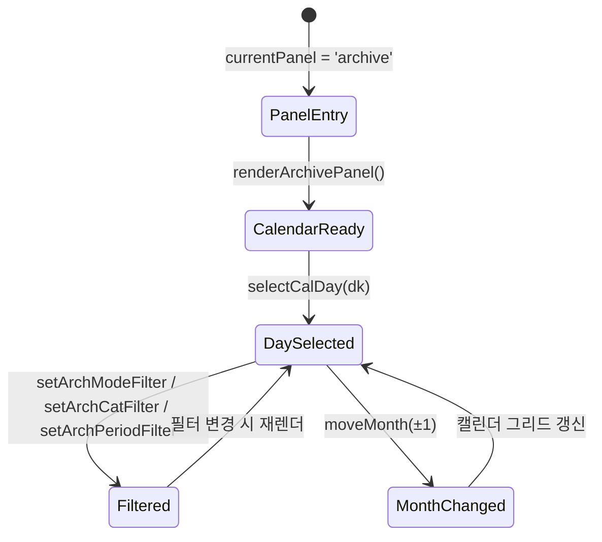

# Archive Panel

> **문서 성격**: `Archive` 시스템의 **Archive Panel** 시스템 스펙.
> 작성 규칙은 `project-docs-guide.md` 참조.

---

## 목차

1. [개요](#1-개요)
2. [UI 구조](#2-ui-구조)
3. [데이터 모델](#3-데이터-모델)
4. [동작 규칙](#4-동작-규칙)
5. [사용자 상호작용](#5-사용자-상호작용)
6. [관련 시스템](#6-관련-시스템)

---

## 1. 개요

- **한 줄 정의**: 날짜별 집중 기록과 퀘스트 이력을 캘린더 기반으로 조회하는 아카이브 패널
- **위치**: 서브패널 영역 (`#spBody`) — `currentPanel === 'archive'` 시 렌더
- **구현 상태**: ✅ 구현 완료

---

## 2. UI 구조

### 2.1. 와이어프레임

```
┌─ .arch-split ──────────────────────────────────────────────┐
│ ┌─ .arch-left (260px) ──┐  ┌─ .arch-right (flex:1) ──────┐│
│ │ ┌─ .cal-wrap ────────┐│  │ [필터 칩: 기간·타입·카테고리]││
│ │ │ .cal-hdr           ││  │ [day-strip: 선택 범위 표시]  ││
│ │ │  제목  ◀ ▶         ││  │ ┌─ .arch-content-split ────┐││
│ │ │ .cal-wds           ││  │ │ .arch-content-left       │││
│ │ │  일 월 화 수 목 금 토││  │ │  완료 퀘스트 카드       │││
│ │ │ .cal-grid          ││  │ │  집중 기록 (.record-item) │││
│ │ │  ┌──┬──┬──┬──┐     ││  │ ├──────────────────────────┤││
│ │ │  │.cal-day│..│     ││  │ │ .arch-content-right      │││
│ │ │  │ num   │  │     ││  │ │  진행 중 / 지연          │││
│ │ │  │ dots  │  │     ││  │ │  중단 / 진행 예정         │││
│ │ │  └──┴──┴──┴──┘     ││  │ └──────────────────────────┘││
│ │ └────────────────────┘│  └─────────────────────────────┘│
│ └───────────────────────┘                                  │
└────────────────────────────────────────────────────────────┘
```

### 2.2. CSS 클래스 구조

```
.arch-split
├── .arch-left (260px, flex-shrink:0)
│   └── .cal-wrap
│       ├── .cal-hdr
│       │   ├── .cal-title (연도 + span 월)
│       │   └── .cal-nav > button (◀ ▶)
│       ├── .cal-wds > .cal-wd (일~토 요일 헤더)
│       └── .cal-grid > .cal-day
│           ├── .day-num
│           ├── .day-dots > .ddot (.f | .s | .t)
│           └── .day-chk (✓)
└── .arch-right
    ├── .arch-filter-wrap
    │   └── .arch-filter-row > .filter-chips > .fchip
    ├── .day-strip (.vis)
    │   ├── .day-strip-label
    │   └── .day-strip-close
    └── .arch-content-split
        ├── .arch-content-left (flex:1)
        │   ├── .arch-q-section ("완료")
        │   │   └── .arch-q-card.done > .arch-q-icon.done-icon + .arch-q-body
        │   └── .arch-q-section ("집중 기록")
        │       └── .record-item
        │           ├── .rec-top > .rec-badges (.rb-cat, .rb-mode) + .rec-time + .rec-clock
        │           └── .rec-notes | .rec-notes-empty
        └── .arch-content-right (140px, flex-shrink:0)
            └── .arch-q-card (.active | .overdue | .suspended | .upcoming)
                ├── .arch-q-icon ({status}-icon)
                └── .arch-q-body > .arch-q-title + .arch-q-meta
```

### 2.3. 시각 요소 상세

#### 캘린더

| 요소 | 속성 |
|------|------|
| `.cal-wrap` | `background: var(--surface2)`, `border-radius: 12px`, `padding: 16px 14px 12px` |
| `.cal-title` | `DM Serif Display 16px`, 연도 표시 / `span`: `DM Mono 12px` 월 표시 |
| `.cal-wd` | `DM Mono 8px` uppercase, 일요일 `rgba(232,124,124,0.7)`, 토요일 `rgba(124,184,232,0.7)` |
| `.cal-day` | `aspect-ratio: 1`, `border-radius: 7px` |
| `.cal-day.today .day-num` | `color: var(--focus-c)` + 3px 원형 도트 |
| `.cal-day.sel` | `background: var(--focus-dim)`, `border: 1px solid rgba(232,168,124,0.15)` |
| `.cal-day.anchor` | `border-color: rgba(232,168,124,0.6)`, `box-shadow: 0 0 0 1px rgba(232,168,124,0.3)` |
| `.day-num` | `DM Mono 11px`, 일요일 빨강, 토요일 파랑, 타 월 `opacity: 0.35` |

#### 활동 도트 (`.ddot`)

| 클래스 | 색상 | 의미 |
|--------|------|------|
| `.ddot.f` | `var(--focus-c)` (오렌지) | 집중(Focus/타이머) 기록 있음 |
| `.ddot.s` | `var(--sw-c)` (그린) | 스톱워치 기록 있음 |
| `.ddot.t` | `var(--todo-c)` (옐로) | 퀘스트(할 일) 있음 |

#### 필터 칩

| 필터 | 값 | 활성 스타일 |
|------|----|-------------|
| 전체 (모드/카테고리) | `all` / `null` | `background: #c8c8d822`, `border-color: #c8c8d8`, `color: #c8c8d8` |
| Focus | `timer` | `#e8a87c` 계열 |
| Stopwatch | `sw` | `#7ce8a8` 계열 |
| 카테고리 | 각 카테고리명 | `A.catColors[cat]` 계열 |
| 일간 / 주간 / 월간 | `daily` / `weekly` / `monthly` | `.fchip.on.arch` 클래스 |

#### 퀘스트 상태 카드 색상

| 상태 | 클래스 | 아이콘 색상 | 테두리/배경 |
|------|--------|-------------|-------------|
| 완료 (done) | `.arch-q-card.done` | `#7ce8a8` (민트 그린) | `rgba(124,232,168,0.2)` / `rgba(124,232,168,0.04)` |
| 진행 중 (active) | `.arch-q-card.active` | `#7cb8e8` (스카이 블루) | `rgba(124,184,232,0.2)` / `rgba(124,184,232,0.04)` |
| 지연 (overdue) | `.arch-q-card.overdue` | `#e87c7c` (레드) | `rgba(232,124,124,0.25)` / `rgba(232,124,124,0.05)` |
| 중단 (suspended) | `.arch-q-card.suspended` | `#a0a0a0` (그레이) | `rgba(160,160,160,0.15)` / `opacity: 0.7` |
| 진행 예정 (upcoming) | `.arch-q-card.upcoming` | `#c79de8` (퍼플) | `rgba(199,157,232,0.2)` / `rgba(199,157,232,0.04)` |

#### 집중 기록 아이템

| 요소 | 속성 |
|------|------|
| `.record-item` | `background: var(--surface2)`, `border-radius: 10px`, `padding: 12px 14px` |
| `.rec-badge.rb-cat` | `DM Mono 8px`, 타이머=`var(--focus-dim)` 배경, 스톱워치=`var(--sw-dim)` 배경 |
| `.rec-badge.rb-mode` | `background: var(--surface)`, `color: var(--text-muted)` |
| `.rec-time` | `DM Mono 14px`, 타이머=`var(--focus-c)`, 스톱워치=`var(--sw-c)` |
| `.rec-clock` | `DM Mono 9px`, `color: var(--text-muted)` |

---

## 3. 데이터 모델

### 3.1. 전역 상태

| 속성 | 타입 | 기본값 | 설명 |
|------|------|--------|------|
| `A.calYear` | `number` | `new Date().getFullYear()` | 캘린더 표시 연도 |
| `A.calMonth` | `number` | `new Date().getMonth()` | 캘린더 표시 월 (0-indexed) |
| `A.selectedDay` | `string\|null` | `null` | 선택된 날짜 키 (`YYYY.MM.DD`) |
| `A.archModeFilter` | `string` | `'all'` | 모드 필터: `'all'` / `'timer'` / `'sw'` |
| `A.archCatFilter` | `string\|null` | `null` | 카테고리 필터: `null` = 전체 |
| `A.archPeriodFilter` | `string` | `'daily'` | 기간 필터: `'daily'` / `'weekly'` / `'monthly'` |

### 3.2. 데이터 스키마

#### 날짜 범위 객체 (`getArchDateRange()` 반환값)

```js
{ start: 'YYYY.MM.DD', end: 'YYYY.MM.DD' }
```

#### 기록 일자 맵 (`getRecDayMap()` 반환값)

```js
{
  'YYYY.MM.DD': { f: boolean, s: boolean }  // f=Focus 기록, s=Stopwatch 기록
}
```

#### 퀘스트 분류 리스트

렌더 시 내부적으로 과거/미래 날짜를 분리하여 5개 리스트로 분류:

| 리스트 | 조건 |
|--------|------|
| `doneList` | `inst.done === true` |
| `activeList` | 완료/중단/지연 아닌 과거~오늘 퀘스트 |
| `overdueList` | `instanceStatus(inst) === 'overdue'` |
| `suspendedList` | `inst.suspended === true` |
| `upcomingList` | 미래 날짜 퀘스트 (반복 퀘스트는 `seenRec` Set으로 중복 제거) |

---

## 4. 동작 규칙

### 4.1. 상태 전이



### 4.2. 핵심 로직

#### 패널 진입 기본값

- `renderArchivePanel()` 호출 시 `A.selectedDay = todayKey()` 설정
- `A.calYear`, `A.calMonth`를 현재 날짜로 초기화
- 즉시 `renderCalGrid()` + `renderArchiveRight()` 호출

#### 날짜 범위 계산 (`getArchDateRange`)

| 기간 필터 | start | end |
|-----------|-------|-----|
| `daily` | 선택일 | 선택일 (동일) |
| `weekly` | 선택일 포함 주의 월요일 | 해당 주 일요일 |
| `monthly` | 선택일 속한 달 1일 | 해당 달 말일 |

- 주간 계산: `dow === 0`(일요일)이면 전주 월요일로 조정 (`dow - 1` 대신 `dow - 6`)

#### 캘린더 범위 하이라이트

- `range.start ~ range.end` 사이의 모든 날짜에 `.sel` 클래스 적용
- 사용자가 직접 클릭한 날짜에 `.anchor` 클래스 추가 (강조 테두리)

#### 콘텐츠 분할 렌더

- **왼쪽 (`arch-content-left`)**: 완료 퀘스트 카드 + 집중 기록
- **오른쪽 (`arch-content-right`, 140px)**: 진행 중 / 지연 / 중단 / 진행 예정 퀘스트
- 기록이 없으면 `.arch-empty` (아이콘 + 메시지) 표시

#### 미래 날짜 반복 퀘스트 중복 제거

- `seenRec` Set에 `m.id` 저장하여 `recurrence !== 'none'`인 반복 퀘스트는 1회만 표시

#### 필터 적용 순서

1. 모드 필터 → 기록 + 캘린더 도트에 영향
2. 카테고리 필터 → 기록 + 캘린더 도트에 영향
3. 기간 필터 → 날짜 범위 변경 → 캘린더 하이라이트 + 콘텐츠 범위 변경

### 4.3. 함수 매핑

| 함수 | 역할 |
|------|------|
| `renderArchivePanel()` | 아카이브 패널 전체 HTML 생성, 초기 상태 설정, 캘린더/콘텐츠 렌더 |
| `moveMonth(d)` | 캘린더 월 이동 (`d = ±1`), 경계 처리 후 재렌더 |
| `getRecDayMap()` | 필터 적용된 기록을 날짜별 `{f, s}` 맵으로 변환 |
| `renderCalGrid()` | 캘린더 그리드 HTML 생성 (요일, 도트, 선택 상태 포함) |
| `selectCalDay(dk)` | 날짜 선택 → `A.selectedDay` 갱신 → 캘린더 + 콘텐츠 재렌더 |
| `renderArchiveRight()` | 필터 칩, day-strip, 콘텐츠 분할 영역 전체 렌더 |
| `setArchModeFilter(f)` | 모드 필터 변경 → 캘린더 + 콘텐츠 재렌더 |
| `setArchCatFilter(c)` | 카테고리 필터 변경 → 캘린더 + 콘텐츠 재렌더 |
| `setArchPeriodFilter(p)` | 기간 필터 변경 → 캘린더 + 콘텐츠 재렌더 |
| `getArchDateRange()` | 선택일 + 기간 필터 기반 `{start, end}` 범위 반환 |
| `getDatesInRange(start, end)` | 시작~종료 사이 모든 날짜 키 배열 반환 |
| `openTodoDetailFromArchive(id, dk)` | 아카이브에서 퀘스트 상세로 전환 |

---

## 5. 사용자 상호작용

### 5.1. 조작 방법

| 액션 | 결과 |
|------|------|
| 캘린더 날짜 클릭 | 해당 날짜 선택 → 기간에 따른 범위 하이라이트 + 콘텐츠 갱신 |
| `◀` / `▶` 버튼 클릭 | 이전/다음 월 이동 |
| 기간 칩 (`일간`/`주간`/`월간`) 클릭 | 기간 필터 변경 → 범위 재계산 |
| 타입 칩 (`전체`/`Focus`/`Stopwatch`) 클릭 | 모드 필터 변경 |
| 카테고리 칩 클릭 | 카테고리 필터 토글 (동일 클릭 시 전체로 복귀) |
| 퀘스트 카드 클릭 | 퀘스트 상세 화면으로 이동 (`openTodoDetailFromArchive`) |

### 5.2. 키보드 단축키

현재 Archive 전용 키보드 단축키 없음.

---

## 6. 관련 시스템

| 시스템 | 관계 |
|--------|------|
| Focus (Timer/Stopwatch) | 집중 기록 데이터 (`A.records`) 제공 |
| Quests | 퀘스트 데이터 (`A.todos`, `A.instances`) 제공, 상세 전환 연동 |
| Category | `A.categories`, `A.catColors` 공유 |

---

> **최종 수정**: 2026-04-25
