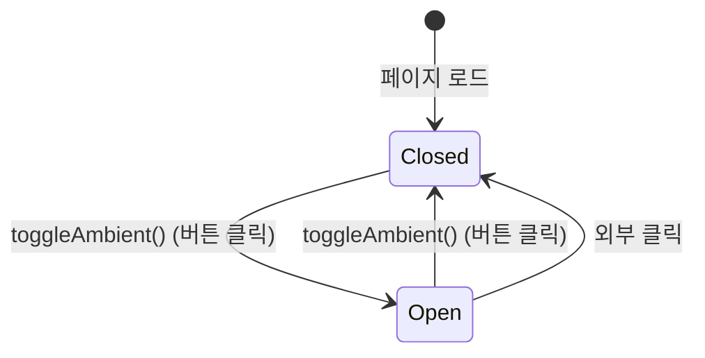

# Ambient Sound Mixer

> **문서 성격**: `Audio` 시스템의 **Ambient Sound Mixer** 시스템 스펙.
> 작성 규칙은 `project-docs-guide.md` 참조.

---

## 목차

1. [개요](#1-개요)
2. [UI 구조](#2-ui-구조)
3. [데이터 모델](#3-데이터-모델)
4. [동작 규칙](#4-동작-규칙)
5. [사용자 상호작용](#5-사용자-상호작용)
6. [관련 시스템](#6-관련-시스템)

---

## 1. 개요

- **한 줄 정의**: 5가지 환경음 볼륨을 개별 조절하는 앰비언트 사운드 믹서 (시각 전용 프로토타입)
- **위치**: 좌하단 영역 (`audio-player-panel`) — `.bl-block` 내부, Music Player 위
- **구현 상태**: 🚧 진행 중 (UI 완료, 실제 오디오 재생 미구현)

---

## 2. UI 구조

### 2.1. 와이어프레임

```
┌─ .bl-block (356px) ─────────────────────────────────────┐
│                                                          │
│ ┌─ .ambient-overlay.glass (기본 숨김) ─────────────────┐ │
│ │ ┌─ .ambient-inner ─────────────────────────────────┐ │ │
│ │ │ ⊕ Ambient Soundscape                             │ │ │
│ │ │                                                   │ │ │
│ │ │ .amb-row: 🌧  Rain    ═══════════════   0        │ │ │
│ │ │ .amb-row: 🍃  Wind    ═══════════════   0        │ │ │
│ │ │ .amb-row: 🔥  Fire    ═══════════════   0        │ │ │
│ │ │ .amb-row: 🌲  Forest  ═══════════════   0        │ │ │
│ │ │ .amb-row: 🌊  Ocean   ═══════════════   0        │ │ │
│ │ └─────────────────────────────────────────────────┘ │ │
│ └────────────────────────────────────────────────────┘ │
│                                                          │
│ [🎧 Ambient Sound]  (.ambient-btn, 토글 버튼)           │
│                                                          │
│ ┌─ .music-player ────────────────────────────────────┐ │
│ │ (Music Player — 별도 문서 참조)                     │ │
│ └────────────────────────────────────────────────────┘ │
└──────────────────────────────────────────────────────────┘
```

### 2.2. CSS 클래스 구조

```
.bl-block (position:absolute, bottom:28px, left:36px, z-index:20, width:356px)
├── .ambient-overlay.glass (#ambientOverlay)
│   └── .ambient-inner (padding:16px 18px)
│       ├── .ambient-title ("⊕ Ambient Soundscape")
│       └── #ambientSounds
│           └── .amb-row (x5)
│               ├── .amb-icon (이모지)
│               ├── .amb-name (사운드명)
│               ├── .amb-track (볼륨 트랙)
│               │   └── .amb-fill (#af-{id})
│               └── .amb-val (#av-{id})
├── button.ambient-btn (#ambientBtn)
└── .music-player (별도 문서)
```

### 2.3. 시각 요소 상세

#### 토글 버튼

| 요소 | 속성 |
|------|------|
| `.ambient-btn` | `DM Mono 10px`, `letter-spacing: 0.15em`, uppercase, `padding: 7px 14px`, `border-radius: 20px` |
| 비활성 | `background: rgba(14,14,20,0.85)`, `border: 1px solid rgba(201,169,89,0.18)`, `color: var(--text-secondary)` |
| hover | `color: var(--gold-soft)`, `border-color: rgba(201,169,89,0.4)` |
| `.active` | `color: var(--gold-soft)`, `border-color: rgba(201,169,89,0.45)`, `background: rgba(201,169,89,0.07)` |
| SVG 아이콘 | 14x14 헤드폰 아이콘, `stroke-width: 1.8` |

#### 오버레이 패널

| 요소 | 속성 |
|------|------|
| `.ambient-overlay` | `max-height: 0`, `opacity: 0`, `transform: translateY(8px)`, `pointer-events: none` |
| `.ambient-overlay.open` | `max-height: 300px`, `opacity: 1`, `transform: translateY(0)`, `pointer-events: all` |
| `.ambient-title` | `Cinzel 10px`, `letter-spacing: 0.3em`, uppercase, `color: var(--gold-soft)` |

#### 사운드 행

| 요소 | 속성 |
|------|------|
| `.amb-row` | `display: flex`, `gap: 10px`, `margin-bottom: 10px` |
| `.amb-icon` | `width: 24px`, `font-size: 14px`, 중앙 정렬 |
| `.amb-name` | `DM Mono 9px`, `width: 62px`, uppercase, `color: var(--text-secondary)` |
| `.amb-track` | `flex: 1`, `height: 3px`, `background: rgba(255,255,255,0.07)`, `border-radius: 2px`, 클릭 가능 |
| `.amb-fill` | `background: linear-gradient(90deg, rgba(201,169,89,0.5), var(--gold-soft))`, `width: 0%` 기본 |
| `.amb-val` | `DM Mono 9px`, `width: 24px`, 우측 정렬, `color: var(--text-muted)` |

---

## 3. 데이터 모델

### 3.1. 전역 상태

| 속성 | 타입 | 기본값 | 설명 |
|------|------|--------|------|
| `ambOpen` | `boolean` (`let`) | `false` | 앰비언트 오버레이 열림 여부 (모듈 스코프 변수, A 객체 밖) |

### 3.2. 데이터 스키마

#### SOUNDS 배열 (`const`, 모듈 스코프)

| id | icon | name | 설명 |
|----|------|------|------|
| `rain` | 🌧 | Rain | 비 소리 |
| `wind` | 💨 | Wind | 바람 소리 |
| `fire` | 🔥 | Fire | 불 소리 |
| `forest` | 🌲 | Forest | 숲 소리 |
| `ocean` | 🌊 | Ocean | 파도 소리 |

#### 해금 사운드 (unlock-shop 구매 시 `addAmbientSound()`로 동적 추가)

| id | icon | name | 해금 조건 | 비용 |
|----|------|------|-----------|------|
| `thunder` | ⚡ | Thunder | 길드 Lv.2 | 1,500G |
| `cave` | 🦇 | Cave | 길드 Lv.5 | 2,000G |
| `tavern` | 🍺 | Tavern | 길드 Lv.8 | 3,000G |

각 사운드의 볼륨 값은 DOM에만 저장됨:
- `#af-{id}` 요소의 `style.width` (퍼센트)
- `#av-{id}` 요소의 `textContent` (0~100 정수)

---

## 4. 동작 규칙

### 4.1. 상태 전이



### 4.2. 핵심 로직

#### 오버레이 토글 (`toggleAmbient`)

1. `ambOpen` 플래그 반전
2. `#ambientOverlay`에 `.open` 클래스 토글
3. `#ambientBtn`에 `.active` 클래스 토글
4. 외부 클릭 시 자동 닫힘 (document click 리스너에서 처리)

#### 볼륨 설정 (`setAmb`)

1. 클릭 위치의 X 좌표로 0~100 퍼센트 계산
2. `#af-{id}` (fill 바)의 `width`를 해당 퍼센트로 설정
3. `#av-{id}` (숫자 표시)의 텍스트를 해당 값으로 갱신
4. 실제 오디오 재생 없음 — 시각적 표시만 변경

#### 초기화

- IIFE로 페이지 로드 시 `#ambientSounds` 내부에 5개 `.amb-row` HTML 생성
- 모든 볼륨 초기값: 0

#### 외부 클릭 닫기

- `document.addEventListener('click')` 핸들러에서 `#ambientBtn`, `#ambientOverlay` 외부 클릭 감지 시 오버레이 닫기

### 4.3. 함수 매핑

| 함수 | 역할 |
|------|------|
| `toggleAmbient()` | 앰비언트 오버레이 열기/닫기 토글 |
| `setAmb(event, id)` | 특정 사운드의 볼륨 트랙 클릭 → 시각적 볼륨 설정 |
| IIFE (즉시 실행 함수) | 페이지 로드 시 `SOUNDS` 배열을 순회하며 `#ambientSounds`에 5개 `.amb-row` 요소 생성 |
| `addAmbientSound(id, name, icon)` | 해금 사운드 구매 시 `#ambientSounds`에 새 `.amb-row` 동적 추가 |
| `document.click` 핸들러 | `#ambientBtn`과 `#ambientOverlay` 외부 클릭 시 오버레이를 닫고 `ambOpen = false` 설정 |

---

## 5. 사용자 상호작용

### 5.1. 조작 방법

| 액션 | 결과 |
|------|------|
| "Ambient Sound" 버튼 클릭 | 오버레이 열기/닫기 토글 |
| 볼륨 트랙 바 클릭 | 클릭 위치에 따라 0~100% 볼륨 설정 (시각적) |
| 오버레이 외부 클릭 | 오버레이 자동 닫기 |

### 5.2. 키보드 단축키

없음.

---

## 6. 관련 시스템

| 시스템 | 관계 |
|--------|------|
| Music Player | 동일 `.bl-block` 컨테이너 내 하위에 위치 |
| Stage / Particles | 동일 화면의 배경 시각 요소 |
| `unlock-shop` | 해금 상점에서 앰비언트 사운드(Thunder, Cave, Tavern) 구매 시 `addAmbientSound()`로 동적 추가 |

---

## 업데이트 이력

| 날짜 | 변경 내용 |
|------|----------|
| 2026-04-27 | 해금 사운드 3종(Thunder, Cave, Tavern) 및 `addAmbientSound()` 함수, unlock-shop 관련 시스템 추가 |
| 2026-04-25 | 초안 작성 |

> **최종 수정**: 2026-04-27
