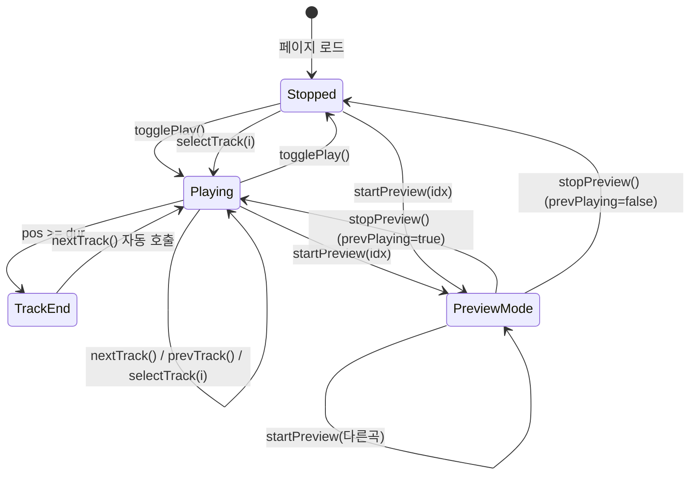

# Music Player (Bard's Refrain) — v2

> **문서 성격**: `Audio` 시스템의 **Music Player** 시스템 스펙.
> 작성 규칙은 `project-docs-guide.md` 참조.

---

## 목차

1. [개요](#1-개요)
2. [UI 구조](#2-ui-구조)
3. [데이터 모델](#3-데이터-모델)
4. [동작 규칙](#4-동작-규칙)
5. [사용자 상호작용](#5-사용자-상호작용)
6. [관련 시스템](#6-관련-시스템)

---

## 1. 개요

- **한 줄 정의**: "Bard's Refrain" 테마의 프로토타입 음악 플레이어. 트랙 잠금, 30초 미리듣기, 음악 라이브러리 모달, 장르 필터를 지원.
- **위치**: 좌하단 영역 (`audio-player-panel`) — `.bl-block` 내부 하단
- **구현 상태**: 🚧 진행 중 (UI + 타이머 시뮬레이션 + 잠금/미리듣기 완료, 실제 오디오 재생 미구현)

---

## 2. UI 구조

### 2.1. 와이어프레임

**메인 플레이어**

```
┌─ .music-player.glass (356px) ──────────────────────────┐
│ ┌─ .pl-hdr ──────────────────────────────────────────┐ │
│ │ ★ Bard's Refrain              [📖 라이브러리] [≡]  │ │
│ └────────────────────────────────────────────────────┘ │
│ ┌─ .player-tracks (드롭다운, 기본 숨김) ─────────────┐ │
│ │ [전체] [Medieval] [Lo-fi] [Ambient] [Orchestral]   │ │← 장르 탭
│ │ ▶ The Ember Vigil      Medieval   4:12             │ │
│ │ ▶ Rain Over Stone Keep Lo-fi F.   3:18             │ │
│ │ 🔒 Moonlit Vow         Ambient    5:04  · 잠김     │ │← 잠긴 트랙
│ │ ...                                                │ │
│ └────────────────────────────────────────────────────┘ │
│ ┌─ .pl-track-row ────────────────────────────────────┐ │
│ │ ┌────────┐  The Ember Vigil                |||     │ │
│ │ │  ♪     │  MEDIEVAL · 4:12              (eq-bars) │ │
│ │ └────────┘                                         │ │
│ └────────────────────────────────────────────────────┘ │
│ ┌─ .pl-progress ─────────────────────────────────────┐ │
│ │ 0:00  ═══════════════════════════════════  4:12     │ │
│ └────────────────────────────────────────────────────┘ │
│ ┌─ .pl-controls ─────────────────────────────────────┐ │
│ │        ⏮    ▶(play 42px)    ⏭       🔊 ═══       │ │
│ └────────────────────────────────────────────────────┘ │
└────────────────────────────────────────────────────────┘
```

**음악 라이브러리 모달**

```
┌──────────────────────────────────────────────┐
│                음악 라이브러리                  │
│                                              │
│ ▶ 보유 곡 (2)                                │
│ ┌───────┐ ┌───────┐                          │
│ │  ⚔   │ │  ☕   │                          │
│ │Medieval│ │Lo-fi F│                          │
│ │Ember V.│ │Rain.. │                          │
│ │ ▶ 재생 │ │▶ 재생중│                          │
│ └───────┘ └───────┘                          │
│                                              │
│ 🔒 해금 가능 (4)                              │
│ ┌───────┐ ┌───────┐ ┌───────┐ ┌───────┐    │
│ │  🔒   │ │  🔒   │ │  🔒   │ │  🔒   │    │
│ │Lo-fi  │ │Ambient│ │Orchest│ │Mediev.│    │
│ │Torchli│ │Moonlit│ │Whisper│ │Forge  │    │
│ │👂 미리듣기│ │👂 미리듣기│ │👂 미리듣기│ │👂 미리듣기│    │
│ │3,000G │ │8,000G │ │12,000G│ │5,000G │    │
│ └───────┘ └───────┘ └───────┘ └───────┘    │
│                                    [닫기]    │
└──────────────────────────────────────────────┘
```

### 2.2. CSS 클래스 구조

```
.music-player.glass
├── .pl-hdr
│   ├── .pl-label-row (★ Bard's Refrain)
│   ├── button.pl-list-btn (📖 라이브러리 → openMusicLibrary)
│   └── button.pl-list-btn (≡ 목록 → toggleTrackList)
├── .player-tracks
│   ├── .tl-genre-tabs > .tl-genre-tab (.active) + .tl-genre-tab-count
│   └── #trackListBody
│       └── .tl-item (.active | .locked)
│           ├── .tl-icon (eq-bars | play | 🔒)
│           ├── .tl-body > .tl-track-title + .tl-track-sub
│           └── .tl-dur
├── .pl-track-row
├── .pl-progress
└── .pl-controls

.music-library-modal (max-width:820px)
  .music-section > .music-section-label + .music-section-count
    .music-grid > .music-card (.owned | .locked | .playing | .previewing)
      .music-card-art (.medieval | .lofi | .ambient | .orchestral | .locked)
      .music-card-info
        .music-card-name + .music-card-genre + .music-card-dur
        .music-card-btn (.play | .playing | .buy | .poor | .free-tag | .preview | .preview-stop)

.music-player.preview-mode (미리듣기 시 보라 글로우)
```

### 2.3. 시각 요소 상세

#### 잠긴 트랙 (트랙리스트)

| 요소 | 속성 |
|------|------|
| `.tl-item.locked` | opacity 0.55, cursor pointer |
| `.tl-item.locked:hover` | opacity 0.75 |
| `.tl-item.locked .tl-track-title` | color: text-muted |

#### 장르 탭

| 요소 | 속성 |
|------|------|
| `.tl-genre-tabs` | flex, gap:3px, surface 배경, 8px radius |
| `.tl-genre-tab` | DM Mono 9px, 5px 6px padding |
| `.tl-genre-tab.active` | gold-dim 배경, gold-soft 색상 |
| `.tl-genre-tab-count` | 8px, 작은 badge |

#### 음악 카드

| 요소 | 속성 |
|------|------|
| `.music-card` | surface2 배경, 12px radius |
| `.music-card.playing` | gold border + glow |
| `.music-card.previewing` | purple border + pulse 애니메이션 |
| `.music-card-art` | 장르별 gradient 배경 |
| `.music-card-art.locked` | grayscale 0.7, brightness 0.5 |

#### 미리듣기 모드

| 요소 | 속성 |
|------|------|
| `.music-player.preview-mode` | purple glow, purple border |
| `.music-player.preview-mode .pl-art-glyph` | purple, pulse 애니메이션 |
| `.music-player.preview-mode .pl-fill` | purple gradient |

---

## 3. 데이터 모델

### 3.1. 전역 상태

#### MP 객체 (뮤직 플레이어 상태)

| 속성 | 타입 | 기본값 | 설명 |
|------|------|--------|------|
| `MP.idx` | number | 0 | 현재 재생 중인 트랙 인덱스 |
| `MP.playing` | boolean | false | 재생 여부 |
| `MP.pos` | number | 0 | 현재 재생 위치 (초) |
| `MP.tickId` | number\|null | null | setInterval ID |

#### PREVIEW 객체 (미리듣기 상태)

| 속성 | 타입 | 기본값 | 설명 |
|------|------|--------|------|
| `PREVIEW.active` | boolean | false | 미리듣기 활성 여부 |
| `PREVIEW.trackIdx` | number\|null | null | 미리듣기 중인 트랙 인덱스 |
| `PREVIEW.pos` | number | 0 | 미리듣기 진행 시간 (초) |
| `PREVIEW.duration` | number | 30 | 미리듣기 길이 (30초) |
| `PREVIEW.tickId` | number\|null | null | setInterval ID |
| `PREVIEW.prevPlaying` | boolean | false | 미리듣기 전 본 재생 상태 |

### 3.2. 데이터 스키마

#### TRACKS 배열

```js
const TRACKS = [
  { title: 'The Ember Vigil',        genre: 'Medieval',      dur: 252 },  // 기본 제공
  { title: 'Rain Over Stone Keep',   genre: 'Lo-fi Fantasy', dur: 198 },  // 기본 제공
  { title: 'Moonlit Vow',            genre: 'Ambient',       dur: 304 },  // track4 (8,000G)
  { title: 'Torchlit Library',       genre: 'Lo-fi',         dur: 221 },  // track2 (3,000G)
  { title: 'Whispers of the Arch',   genre: 'Orchestral',    dur: 287 },  // track5 (12,000G)
  { title: 'Forge of Stars',         genre: 'Medieval',      dur: 243 },  // track3 (5,000G)
];
```

#### TRACK_GENRE_GROUPS 배열 (장르 필터)

```js
const TRACK_GENRE_GROUPS = [
  { key:'all',        label:'전체',       match:()=>true },
  { key:'medieval',   label:'Medieval',   match:t=>t.genre==='Medieval' },
  { key:'lofi',       label:'Lo-fi',      match:t=>t.genre==='Lo-fi'||t.genre==='Lo-fi Fantasy' },
  { key:'ambient',    label:'Ambient',    match:t=>t.genre==='Ambient' },
  { key:'orchestral', label:'Orchestral', match:t=>t.genre==='Orchestral' },
];
```

#### CONTENT_UNLOCKS (트랙 해금 — `unlock-shop.md` 참조)

| ID | 비용 | TRACKS idx | 곡명 |
|----|------|-----------|------|
| track2 | 3,000G | 3 | Torchlit Library |
| track3 | 5,000G | 5 | Forge of Stars |
| track4 | 8,000G | 2 | Moonlit Vow |
| track5 | 12,000G | 4 | Whispers of the Arch |

> TRACKS[0], TRACKS[1]은 기본 제공 (해금 불필요).

---

## 4. 동작 규칙

### 4.1. 상태 전이



### 4.2. 트랙 잠금

- `isTrackUnlocked(idx)`: TRACKS[0], [1]은 항상 true
- 나머지는 `CONTENT_UNLOCKS`에서 매칭하여 `A.unlockedIds` 확인
- 잠긴 트랙 클릭 시 toast "라이브러리에서 구매하세요"

### 4.3. 30초 미리듣기 (`startPreview` / `stopPreview`)

1. 본 재생 상태 백업 + 일시정지
2. PREVIEW 활성화, 1초 틱으로 카운트다운
3. 메인 플레이어에 미리듣기 인디케이터 (보라 글로우, 제목 변경, 진행바)
4. 30초 경과 또는 수동 정지 시 본 재생 상태 복귀
5. 다른 곡 미리듣기 전환 시 이전 미리듣기 정지 후 새로 시작

### 4.4. 장르 필터 트랙리스트

- `trackListActiveGenre` 상태로 활성 장르 관리 (기본: 'all')
- `renderTrackList()`: 활성 장르의 매칭 함수로 필터링하여 표시
- 장르 탭: 곡이 1개 이상 있는 그룹만 노출, 각 그룹에 곡 수 badge

### 4.5. 음악 라이브러리 모달

- `openMusicLibrary()`: 모달 열기, 트랙리스트 닫기
- `closeMusicLibrary()`: 미리듣기 중이면 정지, 모달 닫기
- `renderMusicLibrary()`: 보유 곡 / 해금 가능 섹션 분리 렌더링
- `renderMusicCard(idx, isLocked)`: 카드 1개 렌더 (상태별 버튼)
- `playFromLibrary(idx)`: 모달 닫지 않고 바로 재생
- `purchaseTrackUnlock(id)`: 곡 해금 구매 (골드 차감 → 카드 갱신)

### 4.6. 해금 트랙 탐색 (`findNextUnlockedTrack`)

- `prevTrack()` / `nextTrack()`: 해금된 곡만 순회하여 이동
- 잠긴 곡은 건너뜀

### 4.7. 함수 매핑

| 함수 | 역할 |
|------|------|
| `renderTrackInfo()` | 현재 트랙 정보 DOM 갱신 |
| `renderTrackList()` | 장르 필터 적용 트랙 목록 렌더 |
| `togglePlay()` | 재생/정지 토글 |
| `selectTrack(i)` | 해금 확인 후 트랙 선택 + 재생 |
| `prevTrack()` / `nextTrack()` | 해금 트랙만 순환 이동 |
| `findNextUnlockedTrack(start, dir)` | 방향별 다음 해금 트랙 검색 |
| `isTrackUnlocked(idx)` | 트랙 해금 여부 확인 |
| `switchTrackGenre(key)` | 장르 탭 전환 |
| `startPreview(idx)` | 30초 미리듣기 시작 |
| `stopPreview(skipRender?)` | 미리듣기 정지 + 본 재생 복귀 |
| `showPreviewIndicator()` | 메인 플레이어 미리듣기 모드 표시 |
| `hidePreviewIndicator()` | 미리듣기 모드 해제 |
| `openMusicLibrary()` | 음악 라이브러리 모달 열기 |
| `closeMusicLibrary()` | 모달 닫기 (미리듣기 정지) |
| `renderMusicLibrary()` | 보유/해금 가능 곡 그리드 렌더 |
| `playFromLibrary(idx)` | 라이브러리에서 곡 재생 |
| `purchaseTrackUnlock(id)` | 곡 해금 구매 |

---

## 5. 사용자 상호작용

### 5.1. 조작 방법

| 액션 | 결과 |
|------|------|
| ▶ (play) 버튼 클릭 | 재생 시작/정지 토글 |
| ⏮ / ⏭ 클릭 | 해금 트랙만 순환 이동 |
| 프로그레스 바 클릭 | 해당 위치로 seek |
| 📖 (라이브러리) 버튼 | 음악 라이브러리 모달 열기 |
| ≡ (목록) 버튼 | 장르 필터 트랙리스트 토글 |
| 장르 탭 클릭 | 해당 장르 곡만 필터 표시 |
| 잠긴 트랙 클릭 (목록) | toast "라이브러리에서 구매하세요" |
| 라이브러리 — 보유 곡 "▶ 재생" | 모달 열린 채로 재생 시작 |
| 라이브러리 — 잠긴 곡 "👂 미리듣기" | 30초 미리듣기 시작 |
| 라이브러리 — 잠긴 곡 "N G 해금" | 골드 차감 후 곡 해금 |
| 라이브러리 — 미리듣기 중 "■ 중지" | 미리듣기 정지 |

### 5.2. 키보드 단축키

| 키 | 동작 |
|----|------|
| Escape | 음악 라이브러리 모달 닫기 |

---

## 6. 관련 시스템

| 시스템 | 관계 |
|--------|------|
| Ambient Sound | 동일 `.bl-block` 컨테이너 내 상위에 위치 |
| `unlock-shop` | CONTENT_UNLOCKS로 곡 해금 관리 |
| `gold-economy` | 곡 해금 골드 소모처 |

---

## 📝 업데이트 이력

| 날짜 | 변경 내용 |
|------|----------|
| 2026-04-25 | 초안 작성. |
| 2026-05-06 | v2 전면 개편. 트랙 잠금, 30초 미리듣기, 음악 라이브러리 모달, 장르 필터 트랙리스트, PREVIEW 객체, CONTENT_UNLOCKS. |
