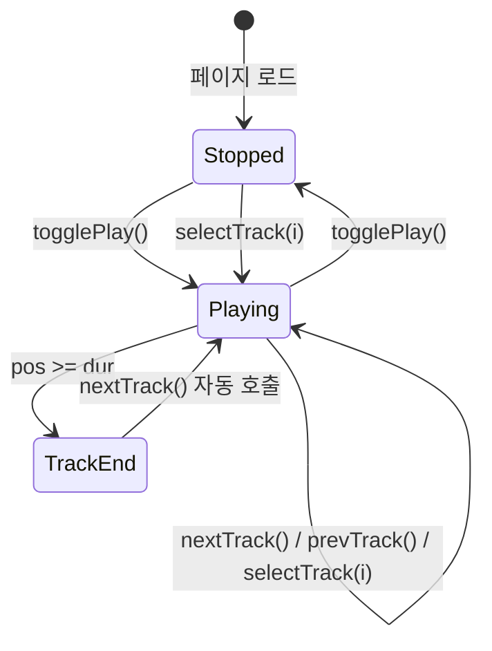

# Music Player (Bard's Refrain)

> **문서 성격**: `Audio` 시스템의 **Music Player** 시스템 스펙.
> 작성 규칙은 `project-docs-guide.md` 참조.

---

## 목차

1. [개요](#1-개요)
2. [UI 구조](#2-ui-구조)
3. [데이터 모델](#3-데이터-모델)
4. [동작 규칙](#4-동작-규칙)
5. [사용자 상호작용](#5-사용자-상호작용)
6. [관련 시스템](#6-관련-시스템)

---

## 1. 개요

- **한 줄 정의**: "Bard's Refrain" 테마의 프로토타입 음악 플레이어 (시각적 재생 시뮬레이션)
- **위치**: 좌하단 영역 (`audio-player-panel`) — `.bl-block` 내부 하단
- **구현 상태**: 🚧 진행 중 (UI + 타이머 시뮬레이션 완료, 실제 오디오 재생 미구현)

---

## 2. UI 구조

### 2.1. 와이어프레임

```
┌─ .music-player.glass (356px) ──────────────────────────┐
│ ┌─ .pl-hdr ──────────────────────────────────────────┐ │
│ │ ★ Bard's Refrain                         [≡] 목록 │ │
│ └────────────────────────────────────────────────────┘ │
│ ┌─ .player-tracks (드롭다운, 기본 숨김) ─────────────┐ │
│ │ Playlist · 6 Tracks                                │ │
│ │ ▶ The Ember Vigil      Medieval   4:12             │ │
│ │ ▶ Rain Over Stone Keep Lo-fi F.   3:18             │ │
│ │ ▶ Moonlit Vow          Ambient    5:04             │ │
│ │ ▶ Torchlit Library     Lo-fi      3:41             │ │
│ │ ▶ Whispers of the Arch Orchestral 4:47             │ │
│ │ ▶ Forge of Stars       Medieval   4:03             │ │
│ └────────────────────────────────────────────────────┘ │
│ ┌─ .pl-track-row ────────────────────────────────────┐ │
│ │ ┌────────┐  The Ember Vigil                |||     │ │
│ │ │  ♪     │  MEDIEVAL · 4:12              (eq-bars) │ │
│ │ │ 50x50  │                                         │ │
│ │ └────────┘                                         │ │
│ └────────────────────────────────────────────────────┘ │
│ ┌─ .pl-progress ─────────────────────────────────────┐ │
│ │ 0:00  ═══════════════════════════════════  4:12     │ │
│ └────────────────────────────────────────────────────┘ │
│ ┌─ .pl-controls ─────────────────────────────────────┐ │
│ │        ⏮    ▶(play 42px)    ⏭       🔊 ═══       │ │
│ └────────────────────────────────────────────────────┘ │
└────────────────────────────────────────────────────────┘
```

### 2.2. CSS 클래스 구조

```
.music-player.glass (padding:16px 18px 13px, position:relative)
├── .pl-hdr
│   ├── .pl-label-row
│   │   ├── svg.pl-ornament (13x13, gold star)
│   │   └── .pl-label ("Bard's Refrain")
│   └── button.pl-list-btn (28x28, 목록 토글)
├── .player-tracks (absolute, bottom:calc(100%+6px), 드롭다운)
│   ├── .tl-hdr-label ("Playlist · 6 Tracks")
│   └── #trackListBody
│       └── .tl-item (.active)
│           ├── .tl-icon (eq-bars 또는 play 아이콘)
│           ├── .tl-body > .tl-track-title + .tl-track-sub
│           └── .tl-dur
├── .pl-track-row
│   ├── .pl-art (50x50, album art)
│   │   └── .pl-art-glyph ("♪")
│   ├── .pl-meta
│   │   ├── .pl-title (#trackTitle)
│   │   └── .pl-sub (#trackSub)
│   └── .eq-bars (#eqBars)
│       └── .eq-bar (x3)
├── .pl-progress
│   ├── .p-time (#pCur)
│   ├── .p-bar > .p-fill (#pFill)
│   └── .p-time (#pTot)
└── .pl-controls
    ├── button.pb (prev)
    ├── button.pb.play (#playBtn, 42x42)
    ├── button.pb (next)
    ├── .sp (flex spacer)
    └── .vol-row
        ├── svg.vol-icon (14x14)
        └── .vol-track (62px) > .vol-fill (#volFill)
```

### 2.3. 시각 요소 상세

#### 헤더

| 요소 | 속성 |
|------|------|
| `.pl-ornament` | 13x13 SVG star, `color: var(--gold-soft)`, `opacity: 0.7` |
| `.pl-label` | `Cinzel 10px`, `letter-spacing: 0.28em`, uppercase, `color: var(--gold-soft)` |
| `.pl-list-btn` | 28x28px, `border-radius: 6px`, hover 시 gold 배경 |

#### 트랙 목록 드롭다운

| 요소 | 속성 |
|------|------|
| `.player-tracks` | `backdrop-filter: blur(20px)`, `box-shadow: 0 -10px 40px rgba(0,0,0,0.4)`, 위쪽으로 열림 |
| `.tl-item` | `border-radius: 7px`, hover 시 `rgba(201,169,89,0.07)` 배경 |
| `.tl-item.active` | `background: rgba(201,169,89,0.12)`, 제목/아이콘 gold 색상 |
| `.tl-hdr-label` | `Cinzel 9px`, gold, 하단 border 구분선 |

#### 앨범 아트

| 요소 | 속성 |
|------|------|
| `.pl-art` | 50x50px, `border-radius: 9px`, `border: 1px solid rgba(201,169,89,0.3)`, `background: radial-gradient + linear-gradient` 패턴 |
| `.pl-art::before` | 45도 반복 줄무늬 패턴 오버레이 |
| `.pl-art-glyph` | `Cinzel 19px bold`, gold, `text-shadow: 0 0 10px rgba(232,200,124,0.5)` |
| 재생 중 glyph | `@keyframes glow` 3초 주기 글로우 애니메이션 |

#### 프로그레스 바

| 요소 | 속성 |
|------|------|
| `.p-time` | `DM Mono 9px`, `min-width: 28px` |
| `.p-bar` | `height: 3px`, `background: rgba(255,255,255,0.08)`, 클릭으로 seek |
| `.p-fill` | `background: linear-gradient(90deg, rgba(201,169,89,0.6), var(--gold-soft))`, `transition: width 0.25s linear` |

#### 컨트롤 버튼

| 요소 | 크기 | 속성 |
|------|------|------|
| `.pb` (prev/next) | 34x34px | `border-radius: 7px`, hover 시 gold |
| `.pb.play` | 42x42px | `background: linear-gradient gold`, `border: 1px solid rgba(201,169,89,0.38)` |
| `.pb svg` | 17px (일반), 19px (play) | fill: currentColor |

#### 볼륨

| 요소 | 속성 |
|------|------|
| `.vol-icon` | 14x14 SVG, `color: var(--text-muted)` |
| `.vol-track` | `width: 62px`, `height: 3px` |
| `.vol-fill` | 기본 `width: 70%`, `background: var(--gold-soft)` |

#### 이퀄라이저 바

| 요소 | 속성 |
|------|------|
| `.eq-bars` | `display: flex`, `gap: 2px`, `height: 13px`, 재생 중에만 표시 |
| `.eq-bar` | `width: 2px`, `background: var(--gold-soft)`, `@keyframes eq` 0.9초 주기 |
| 바 딜레이 | 1번: -0.4s, 2번: -0.2s, 3번: 0s (시차 애니메이션) |

---

## 3. 데이터 모델

### 3.1. 전역 상태

#### MP 객체 (뮤직 플레이어 상태)

| 속성 | 타입 | 기본값 | 설명 |
|------|------|--------|------|
| `MP.idx` | `number` | `0` | 현재 재생 중인 트랙 인덱스 |
| `MP.playing` | `boolean` | `false` | 재생 여부 |
| `MP.pos` | `number` | `0` | 현재 재생 위치 (초) |
| `MP.tickId` | `number\|null` | `null` | `setInterval` ID (1초 간격 틱) |

### 3.2. 데이터 스키마

#### TRACKS 배열

```js
const TRACKS = [
  { title: 'The Ember Vigil',        genre: 'Medieval',      dur: 252 },
  { title: 'Rain Over Stone Keep',   genre: 'Lo-fi Fantasy', dur: 198 },
  { title: 'Moonlit Vow',            genre: 'Ambient',       dur: 304 },
  { title: 'Torchlit Library',       genre: 'Lo-fi',         dur: 221 },
  { title: 'Whispers of the Arch',   genre: 'Orchestral',    dur: 287 },
  { title: 'Forge of Stars',         genre: 'Medieval',      dur: 243 },
];
```

| 필드 | 타입 | 설명 |
|------|------|------|
| `title` | `string` | 트랙 제목 |
| `genre` | `string` | 장르 라벨 |
| `dur` | `number` | 전체 길이 (초) |

---

## 4. 동작 규칙

### 4.1. 상태 전이



### 4.2. 핵심 로직

#### 재생 토글 (`togglePlay`)

1. `MP.playing` 반전
2. 재생 시:
   - 아이콘을 pause(두 직사각형)로 변경
   - `.music-player`에 `.playing` 클래스 추가 (앨범 아트 글로우 활성화)
   - `#eqBars` 표시
   - `setInterval` 1초 간격으로 `MP.pos++`, 곡 끝 도달 시 `nextTrack()`
3. 정지 시:
   - 아이콘을 play(삼각형)로 변경
   - `.playing` 클래스 제거
   - `#eqBars` 숨김
   - `clearInterval(MP.tickId)`

#### 트랙 선택 (`selectTrack(i)`)

1. `MP.idx = i`, `MP.pos = 0`
2. 트랙 정보 + 목록 갱신
3. 트랙 목록 닫기
4. 미재생 상태면 `togglePlay()`로 자동 재생 시작

#### 이전 트랙 (`prevTrack`)

- 재생 위치 > 3초이면 현재 곡 처음으로 되돌림
- 아니면 이전 트랙으로 이동 (순환: 첫 곡 이전 → 마지막 곡)

#### 다음 트랙 (`nextTrack`)

- 다음 트랙으로 이동 (순환: 마지막 곡 다음 → 첫 곡)

#### Seek (`seekTrack`)

- 프로그레스 바 클릭 위치의 비율로 `MP.pos` 계산

#### 볼륨 (`setVolume`)

- 볼륨 트랙 클릭 위치의 비율로 `#volFill` 너비 설정 (시각적 전용)

### 4.3. 함수 매핑

| 함수 | 역할 |
|------|------|
| `renderTrackInfo()` | 현재 트랙의 제목, 장르, 시간 정보 DOM 갱신 |
| `renderTrackList()` | 트랙 목록 드롭다운 HTML 생성 (활성 트랙 하이라이트) |
| `togglePlay()` | 재생/정지 토글, 아이콘 전환, 타이머 시작/중지 |
| `selectTrack(i)` | 특정 인덱스 트랙 선택 + 자동 재생 |
| `prevTrack()` | 이전 트랙 또는 곡 시작으로 이동 |
| `nextTrack()` | 다음 트랙으로 이동 (순환) |
| `seekTrack(event)` | 프로그레스 바 클릭으로 재생 위치 변경 |
| `setVolume(event)` | 볼륨 슬라이더 클릭으로 볼륨 표시 변경 |
| `toggleTrackList()` | 트랙 목록 드롭다운 열기/닫기 |
| `fmtT(s)` | 초 → `M:SS` 포맷 문자열 변환 |

---

## 5. 사용자 상호작용

### 5.1. 조작 방법

| 액션 | 결과 |
|------|------|
| ▶ (play) 버튼 클릭 | 재생 시작/정지 토글 |
| ⏮ (prev) 버튼 클릭 | 3초 이후면 곡 처음, 아니면 이전 트랙 |
| ⏭ (next) 버튼 클릭 | 다음 트랙으로 이동 |
| 프로그레스 바 클릭 | 해당 위치로 seek |
| 볼륨 트랙 클릭 | 볼륨 슬라이더 위치 변경 |
| ≡ (목록) 버튼 클릭 | 트랙 목록 드롭다운 토글 |
| 트랙 목록 내 항목 클릭 | 해당 트랙 선택 + 재생 시작 |
| 플레이어 외부 클릭 | 트랙 목록 자동 닫기 |

### 5.2. 키보드 단축키

없음.

---

## 6. 관련 시스템

| 시스템 | 관계 |
|--------|------|
| Ambient Sound | 동일 `.bl-block` 컨테이너 내 상위에 위치 |
| Stage / Particles | 동일 화면의 배경 시각 요소 |

---

> **최종 수정**: 2026-04-25
