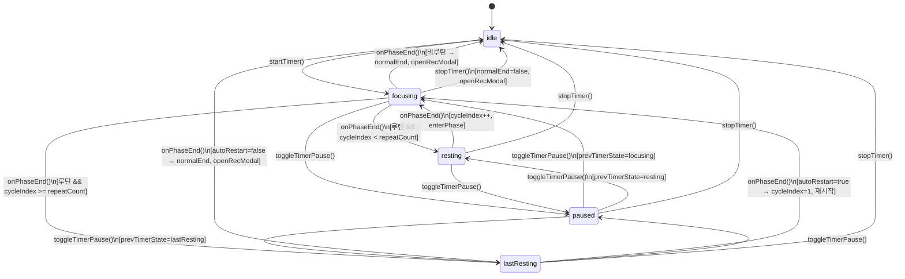
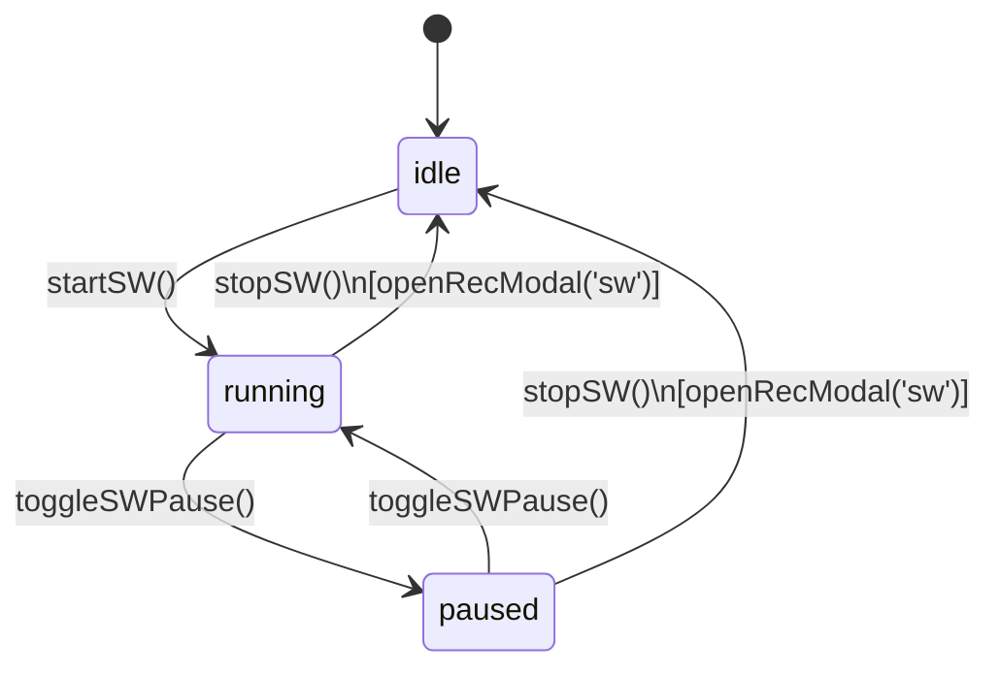

# Focus Panel — 집중 패널

> **문서 성격**: `detail-side-panel`의 **Focus** 시스템 스펙.
> 작성 규칙은 `project-docs-guide.md` 참조.

---

## 📑 목차

1. [개요](#1-개요)
2. [UI 구조](#2-ui-구조)
3. [데이터 모델](#3-데이터-모델)
4. [동작 규칙](#4-동작-규칙)
5. [사용자 상호작용](#5-사용자-상호작용)
6. [관련 시스템](#6-관련-시스템)

---

## 1. 개요

- **한 줄 정의**: 타이머와 스톱워치 두 가지 모드를 제공하는 집중 세션 관리 시스템
- **위치**: `detail-side-panel` (`.side-panel` — 우측 오버레이 패널, `currentPanel === 'focus'` 일 때 렌더링)
- **구현 상태**: ✅ 구현 완료

Focus 패널은 사이드 패널 내에서 **Timer** 모드와 **Stopwatch** 모드를 전환하며 사용한다. Timer 모드는 설정된 시간 동안 집중-휴식 사이클을 반복하는 루틴 기능을 포함하고, Stopwatch 모드는 0초부터 경과 시간을 측정한다. 세션이 종료되면 Record Modal을 통해 기록을 저장할 수 있다. 패널이 닫힌 상태에서도 세션이 진행 중이면 Session Mini 위젯이 nav-bar 영역에 표시된다.

## 2. UI 구조

### 2.1. 와이어프레임

**패널 전체 레이아웃**

```
+-----------------------------------------------+
| sp-hdr                                        |
|  [Focus]  [Deep Work]              [X close]  |
+-----------------------------------------------+
| sp-body                                       |
|  +-------------------------------------------+|
|  | mode-sw (모드 스위처)                      ||
|  | [■ Timer ][  Stopwatch ]                  ||
|  |  └ mode-sw-ind (슬라이딩 인디케이터)       ||
|  +-------------------------------------------+|
|                                               |
|  +-------------------------------------------+|
|  | focusModeContent                           ||
|  |  (Timer 또는 Stopwatch 콘텐츠)            ||
|  +-------------------------------------------+|
+-----------------------------------------------+
```

**Timer idle 상태**

```
+-------------------------------------------+
| 집중 설정                                  |
|  집중 시간  [−] [25] [+]  min              |
|  ─────────────────────────                |
|  루틴 모드  [○ toggle]                     |
|  ┌ routine-panel (open 시) ──────────┐    |
|  │  반복 횟수   [−] [4] [+]          │    |
|  │  자동 재시작 [○ toggle]            │    |
|  │  ─────────────                    │    |
|  │  일반 휴식   [−] [5] [+]   min    │    |
|  │  마지막 휴식 [−] [15] [+]  min    │    |
|  └────────────────────────────────────┘    |
|  ─────────────────────────                |
|  [▶ 집중 시작]                             |
+-------------------------------------------+
```

**Timer running 상태**

```
+-------------------------------------------+
|          ┌──────────┐                     |
|         ╱   ring-bg  ╲                    |
|        │  ring-arc    │                   |
|        │   25:00      │  ring-time        |
|        │   집중        │  ring-phase       |
|        │   ● ○ ○ ○    │  cycle-dots       |
|         ╲            ╱                    |
|          └──────────┘                     |
|    [■ stop]  [❚❚ 일시정지]                 |
+-------------------------------------------+
```

### 2.2. CSS 클래스 구조

```
.side-panel
  .sp-hdr
    .sp-hdr-left
      .sp-kicker          — "Focus"
      .sp-title           — "Deep Work"
    .sp-close
  .sp-body
    .mode-sw              — 모드 스위처 컨테이너
      .mode-sw-ind        — 슬라이딩 배경 인디케이터 (.sw 시 오른쪽)
      .mode-btn.timer     — Timer 버튼 (.active)
      .mode-btn.sw        — Stopwatch 버튼 (.active)
    #focusModeContent     — 모드별 콘텐츠 영역
      (Timer idle)
        .sec-label        — "집중 설정"
        .field-row
          .field-label
          .num-input      — [−] input [+]
        .divider-line
        .toggle           — 루틴 모드 토글
        .routine-panel    — (.open 시 표시)
          .sub-block
            .field-row
            .num-input
            #routineFields — 동적 교체 영역
        .btn-row
          .btn.btn-primary — 집중 시작
      (Timer running)
        .ring-wrap        — 180x180 SVG 링
          svg
            .ring-bg      — 배경 원
            .ring-arc     — 진행 호 (#pRingArc)
          .ring-inner
            .ring-time    — 시간 표시 (.blink 일시정지 시)
            .ring-phase   — 페이즈 라벨
            .cycle-dots   — 사이클 점 컨테이너
              .cdot       — 개별 점 (.done / .act)
        .btn-row
          .btn.btn-secondary.btn-danger — 정지
          .btn.btn-primary              — 일시정지/재개 (.rest / .lrest)
      (Stopwatch → timer.md, stopwatch.md 참조)
```

### 2.3. 시각 요소 상세

| 요소 | 속성 |
|------|------|
| 패널 | `width: 460px`, `border-radius: 18px`, `backdrop-filter: blur(28px)`, `max-height: 870px` |
| 모드 스위처 | `background: var(--surface2)`, `border-radius: 10px`, `padding: 3px` |
| 슬라이딩 인디케이터 | `background: var(--surface3)`, `border-radius: 7px`, `transition: 0.3s cubic-bezier` |
| 모드 버튼 | `font: 'DM Mono' 10px`, `letter-spacing: 0.1em`, `text-transform: uppercase` |
| 모드 버튼 아이콘 | `13x13`, `opacity: 0.5` (비활성) / `1` (활성) |
| 집중 링 | SVG `180x180`, `r=74`, `CIRC_P=465` (2π×74) |
| 링 호 (focus) | `stroke: var(--focus-c)`, `stroke-width: 5`, `stroke-linecap: round`, `filter: drop-shadow(0 0 7px)` |
| 링 호 (rest) | `stroke: var(--rest-c)` |
| 링 호 (lastRest) | `stroke: var(--lrest-c)` |
| 링 시간 | `font: 'DM Mono' 36px`, `font-weight: 300` |
| 링 페이즈 | `font: 'DM Mono' 9px`, `letter-spacing: 0.2em`, `text-transform: uppercase` |
| 사이클 점 | `5x5`, `border-radius: 50%` |
| 점 완료 | `background: var(--focus-c)`, `border-color: var(--focus-c)` |
| 점 활성 | `background: var(--focus-dim)`, `border-color: var(--focus-c)`, 펄스 애니메이션 `cdp 1.5s` |
| 일시정지 깜빡임 | `.ring-time.blink` — `blk 1s step-end infinite` (opacity 1↔0.2) |

## 3. 데이터 모델

### 3.1. 전역 상태

| 속성 | 타입 | 기본값 | 설명 |
|------|------|--------|------|
| `A.currentPanel` | `string\|null` | `null` | 현재 열린 패널 (`'focus'` 일 때 Focus 패널 렌더링) |
| `A.focusMode` | `'timer'\|'stopwatch'` | `'timer'` | 현재 선택된 Focus 모드 |
| **Timer** | | | |
| `A.timerState` | `'idle'\|'focusing'\|'resting'\|'lastResting'\|'paused'` | `'idle'` | 타이머 상태 |
| `A.prevTimerState` | `string\|null` | `null` | 일시정지 전 상태 (재개 시 복원용) |
| `A.remainingTime` | `number` | `0` | 현재 페이즈 남은 시간 (초) |
| `A.totalTime` | `number` | `0` | 현재 페이즈 전체 시간 (초, 진행률 계산용) |
| `A.cycleIndex` | `number` | `1` | 현재 사이클 번호 (1-based) |
| `A.accFocusTime` | `number` | `0` | 누적 집중 시간 (초, focusing 단계에서만 증가) |
| `A.timerInterval` | `number\|null` | `null` | `setInterval` ID |
| `A.normalEnd` | `boolean` | `false` | 정상 완료 여부 (true: 사이클 완료, false: 중도 정지) |
| **Timer 설정** | | | |
| `A.focusDuration` | `number` | `25` | 집중 시간 (분) |
| `A.restDuration` | `number` | `5` | 일반 휴식 시간 (분) |
| `A.lastRestDuration` | `number` | `15` | 마지막 휴식 시간 (분, repeatCount > 1) |
| `A.singleRestDuration` | `number` | `5` | 단일 휴식 시간 (분, repeatCount === 1일 때 사용) |
| `A.repeatCount` | `number` | `4` | 반복 횟수 (1~10) |
| `A.isRoutine` | `boolean` | `false` | 루틴 모드 활성화 여부 |
| `A.autoRestart` | `boolean` | `false` | 루틴 완료 후 자동 재시작 여부 |
| **Stopwatch** | | | |
| `A.swRunning` | `boolean` | `false` | 스톱워치 실행 중 여부 |
| `A.swPaused` | `boolean` | `false` | 스톱워치 일시정지 여부 |
| `A.swElapsed` | `number` | `0` | 경과 시간 (초) |
| `A.swInterval` | `number\|null` | `null` | `setInterval` ID |
| **Record Modal** | | | |
| `A.recMode` | `'timer'\|'sw'` | `'timer'` | 기록 모달의 모드 |
| `A.recSelCat` | `string\|null` | `null` | 선택된 카테고리 |

### 3.2. 데이터 스키마

**상수**

| 이름 | 값 | 설명 |
|------|-----|------|
| `CIRC_P` | `465` | SVG 링 둘레 (2π × 74) |

**Record 구조** (저장 시 `A.records`에 추가)

```
{
  category:  string,   // 선택된 카테고리명
  time:      number,   // 측정 시간 (초)
  mode:      'timer' | 'sw',
  notes:     string,   // 메모
  date:      string,   // dateKey (YYYY.MM.DD)
  dateLong:  string,   // 긴 형식 날짜
  clock:     string,   // HH:MM (ko-KR)
  ts:        number    // timestamp (ms)
}
```

## 4. 동작 규칙

### 4.1. 상태 전이

**Timer 상태 다이어그램**



**Stopwatch 상태 다이어그램**



### 4.2. 핵심 로직

**타이머 동작 규칙**

1. **시작**: `startTimer()` — 설정값을 `A`에 반영, `cycleIndex=1`, `accFocusTime=0`, `normalEnd=false`, `enterPhase('focusing')` 호출
2. **페이즈 진입**: `enterPhase(phase)` — 페이즈에 따라 duration 계산:
   - `focusing` → `focusDuration × 60`
   - `resting` → `restDuration × 60`
   - `lastResting` → `repeatCount === 1 ? singleRestDuration : lastRestDuration` × 60
3. **틱**: `timerTick()` — 1초마다 실행, `paused`이면 무시, `remainingTime--`, focusing이면 `accFocusTime++`
4. **페이즈 종료**: `onPhaseEnd()` — 알람 재생 후 분기:
   - 비루틴 focusing → idle, Record Modal 열기
   - 루틴 focusing + 남은 사이클 → `resting`
   - 루틴 focusing + 마지막 사이클 → `lastResting`
   - resting 종료 → `cycleIndex++`, 다음 focusing
   - lastResting 종료 + autoRestart → `cycleIndex=1`, 800ms 후 재시작
   - lastResting 종료 + !autoRestart → idle, Record Modal 열기
5. **일시정지/재개**: `toggleTimerPause()` — `prevTimerState` 저장/복원, interval 정지/재개
6. **중도 정지**: `stopTimer()` — interval 해제, `normalEnd=false`, idle, Record Modal 열기

**스톱워치 동작 규칙**

1. **시작**: `startSW()` — `swElapsed=0`, `swRunning=true`, `swPaused=false`, 1초 interval 시작
2. **일시정지/재개**: `toggleSWPause()` — `swPaused` 토글, interval 정지/재개
3. **정지**: `stopSW()` — interval 해제, `swRunning=false`, `swPaused=false`, Record Modal 열기

**모드 전환 규칙**

- Timer 실행 중(`timerState !== 'idle'`) → Stopwatch 전환 차단, 토스트 알림
- Stopwatch 실행 중(`swRunning || swPaused`) → Timer 전환 차단, 토스트 알림
- 양쪽 모두 idle → 자유 전환

**repeatCount === 1 특수 처리**

- 휴식 시간 필드: `singleRestDuration` 단일 필드 표시 (일반/마지막 구분 없음)
- 페이즈 라벨: `lastResting`이지만 "휴식"으로 표시 ("마지막 휴식" 아님)

### 4.3. 함수 매핑

| 함수 | 역할 |
|------|------|
| `renderFocusPanel()` | Focus 패널 전체 렌더링 (모드 스위처 + 콘텐츠 영역) |
| `setFocusMode(mode)` | 모드 전환 (실행 중 차단 포함) |
| `renderFocusModeContent()` | 현재 모드에 따라 Timer 또는 Stopwatch 콘텐츠 렌더링 |
| `renderTimerContent(el)` | Timer UI 렌더링 (idle: 설정폼, running: 링) |
| `routineFieldsHtml()` | 루틴 패널 내 휴식 시간 필드 HTML 생성 (repeatCount에 따라 분기) |
| `numAdj(field, delta)` | 숫자 입력 필드 ±조절, repeatCount 변경 시 routineFields 갱신 |
| `toggleRoutinePanel()` | 루틴 모드 토글 → routine-panel .open 클래스 전환 |
| `startTimer()` | 설정값 저장 후 focusing 페이즈 진입 |
| `enterPhase(phase)` | 페이즈별 duration 설정, interval 시작, UI 갱신 |
| `timerTick()` | 1초 틱 — 시간 감소, 디스플레이 갱신, session-mini 갱신 |
| `updateTimerDisplay()` | 링 시간 텍스트 + SVG arc offset 갱신 |
| `onPhaseEnd()` | 페이즈 종료 분기 처리 (다음 페이즈 / 완료 / 자동 재시작) |
| `toggleTimerPause()` | 일시정지 ↔ 재개 전환 |
| `stopTimer()` | 중도 정지 → idle + Record Modal |
| `renderSWContent(el)` | Stopwatch UI 렌더링 (idle: 설명 + 시작, running: 링) |
| `startSW()` | 스톱워치 시작 (0초부터) |
| `updateSWDisplay()` | 스톱워치 시간 텍스트 + SVG arc offset 갱신 |
| `toggleSWPause()` | 스톱워치 일시정지 ↔ 재개 |
| `stopSW()` | 스톱워치 정지 → Record Modal |
| `renderSessionMini()` | Session Mini 위젯 갱신 (패널 닫힘 + 세션 진행 시 표시) |

## 5. 사용자 상호작용

### 5.1. 조작 방법

| 액션 | 결과 |
|------|------|
| nav-bar Focus 버튼 클릭 | Focus 패널 열기 (`renderFocusPanel()`) |
| Timer / Stopwatch 탭 클릭 | 모드 전환 (실행 중이면 토스트로 차단) |
| 집중 시간 [−]/[+] | 5분 단위 증감 (1~180분) |
| 반복 횟수 [−]/[+] | 1 단위 증감 (1~10), 1일 때 휴식 필드 자동 교체 |
| 휴식 시간 [−]/[+] | 1분 단위 증감 (1~60분) |
| 루틴 모드 토글 | routine-panel 열기/닫기 |
| 자동 재시작 토글 | `A.autoRestart` 전환 |
| [집중 시작] 클릭 | Timer 시작 → focusing 페이즈 |
| [일시정지] 클릭 | 타이머/스톱워치 일시정지 (시간 깜빡임) |
| [재개] 클릭 | 일시정지 해제, 이전 페이즈로 복귀 |
| [정지 ■] 클릭 | 세션 중도 종료 → Record Modal |
| Session Mini 클릭 | Focus 패널 열기 |
| 패널 외부 클릭 | 패널 닫기 (세션은 유지) |

### 5.2. 키보드 단축키

해당 없음

### 5.3. 이벤트 흐름

**타이머 루틴 전체 흐름 (repeatCount=4)**

1. 사용자 설정 입력 → [집중 시작] 클릭
2. `startTimer()` → `enterPhase('focusing')` (사이클 1)
3. 25분 경과 → `onPhaseEnd()` → `enterPhase('resting')` (일반 휴식)
4. 5분 경과 → `onPhaseEnd()` → `cycleIndex++` → `enterPhase('focusing')` (사이클 2)
5. (사이클 2~3 반복)
6. 사이클 4 focusing 완료 → `enterPhase('lastResting')` (마지막 휴식)
7. 15분 경과 → `onPhaseEnd()` → `normalEnd=true` → `openRecModal('timer', true)`
8. Record Modal에서 카테고리 선택 + 저장 → `A.records`에 추가

**패널 닫힘 + 세션 진행 중 흐름**

1. 세션 진행 중 패널 외부 클릭 → `closePanel()`
2. `renderSessionMini()` → Session Mini `.visible` 표시
3. 매 틱마다 `renderSessionMini()` → 시간/페이즈 업데이트
4. Session Mini 클릭 → Focus 패널 재오픈

## 6. 관련 시스템

| 시스템 | 관계 |
|--------|------|
| `focus/ui/timer.md` | Timer 모드 UI 컴포넌트 상세 |
| `focus/ui/stopwatch.md` | Stopwatch 모드 UI 컴포넌트 상세 |
| `focus/ui/record-modal.md` | 세션 종료 시 기록 저장 모달 |
| `focus/ui/session-mini.md` | 패널 닫힘 시 미니 위젯 |
| `archive-panel.md` | 저장된 기록 조회 |
| `navigation-bar.md` | Focus 버튼 (진입 경로) |

---

## 📝 업데이트 이력

| 날짜 | 변경 내용 |
|------|----------|
| 2026-04-24 | 초안 작성 |
| 2026-04-25 | 8.1 wiki 템플릿 기반 전면 재작성. 전역 상태, 상태 전이 다이어그램, 함수 매핑, 이벤트 흐름 추가. |
