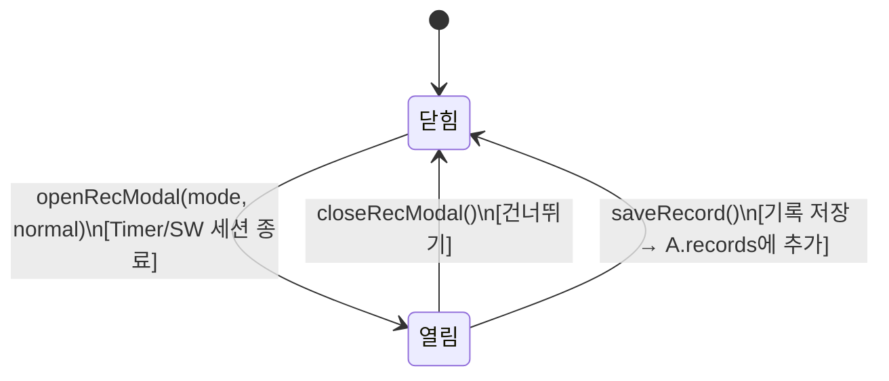

# Record Modal — 기록 저장 모달

> **문서 성격**: `Focus` 시스템의 **Record Modal** 스펙.
> 작성 규칙은 `project-docs-guide.md` 참조.

---

## 📑 목차

1. [개요](#1-개요)
2. [UI 구조](#2-ui-구조)
3. [데이터 모델](#3-데이터-모델)
4. [동작 규칙](#4-동작-규칙)
5. [사용자 상호작용](#5-사용자-상호작용)
6. [관련 시스템](#6-관련-시스템)

---

## 1. 개요

- **한 줄 정의**: 타이머/스톱워치 세션 종료 후 집중 기록을 저장하는 전체 화면 모달
- **위치**: 전역 오버레이 (`.rec-modal-wrap`, `z-index: 200`)
- **구현 상태**: ✅ 구현 완료

Focus 세션이 정상 완료되거나 중도 정지될 때 트리거되며, 카테고리 선택과 메모를 입력하여 기록을 `A.records`에 저장한다.

## 2. UI 구조

### 2.1. 와이어프레임

```
+===================================================+
| rec-modal-wrap (full-screen backdrop, z-200)       |
|                                                   |
|    +-------------------------------------------+  |
|    | rec-modal                                 |  |
|    |                                           |  |
|    |              ✅ (rm-icon)                  |  |
|    |       집중을 완료했습니다! (rm-title)       |  |
|    |   무엇을 집중했나요? 기록해두세요. (rm-sub) |  |
|    |                                           |  |
|    |  +---------------------------------------+|  |
|    |  | rm-stat                               ||  |
|    |  | 누적 집중 시간          25:00          ||  |
|    |  | (rm-stat-label)    (rm-stat-val)       ||  |
|    |  +---------------------------------------+|  |
|    |                                           |  |
|    |  카테고리 (sec-label)                      |  |
|    |  +---------------------------------------+|  |
|    |  | [공부] [프로젝트] [업무] [독서] ...     ||  |
|    |  | (cat-chips-wrap / rmCatChips)          ||  |
|    |  +---------------------------------------+|  |
|    |  [+ 카테고리 추가] (cat-add-open-btn)      |  |
|    |                                           |  |
|    |  집중 내용 (선택) (sec-label)               |  |
|    |  +---------------------------------------+|  |
|    |  | textarea (rmNotes)                    ||  |
|    |  | "오늘 무엇에 집중했나요?"               ||  |
|    |  +---------------------------------------+|  |
|    |                                           |  |
|    |  rm-actions                               |  |
|    |  [건너뛰기]          [기록 저장]           |  |
|    |  (btn-rm-skip)       (btn-rm-save)        |  |
|    +-------------------------------------------+  |
|                                                   |
+===================================================+
```

### 2.2. CSS 클래스 구조

```
.rec-modal-wrap           — 전체 화면 backdrop (z-index: 200)
  .rec-modal              — 모달 카드 (max-width: 400px)
    .rm-icon              — 이모지 아이콘 (32px)
    .rm-title             — 제목 텍스트
    .rm-sub               — 부제목 텍스트
    .rm-stat              — 시간 통계 행
      .rm-stat-label      — "누적 집중 시간" / "총 측정 시간"
      .rm-stat-val        — 시간 값 (MM:SS)
    .sec-label            — "카테고리"
    .cat-chips-wrap       — 카테고리 칩 컨테이너 (#rmCatChips)
      .cat-chip           — 개별 칩 (.sel 선택 시)
        span              — 색상 도트
        .cat-chip-del     — [x] 삭제 버튼
    .cat-add-open-btn     — "+ 카테고리 추가" 버튼
    .sec-label            — "집중 내용 (선택)"
    .form-textarea        — 메모 입력 (#rmNotes)
    .rm-actions           — 버튼 행
      .btn-rm-skip        — "건너뛰기"
      .btn-rm-save        — "기록 저장"
```

### 2.3. 시각 요소 상세

**모달 백드롭**

| 요소 | 속성 |
|------|------|
| `.rec-modal-wrap` | `position: absolute`, `inset: 0`, `z-index: 200` |
| | `background: rgba(0,0,0,0.7)`, `backdrop-filter: blur(10px)` |
| | `opacity: 0 → 1` (`.open` 시), `transition: opacity 0.3s ease` |

**모달 카드**

| 요소 | 속성 |
|------|------|
| `.rec-modal` | `background: var(--glass)`, `border: 1px solid var(--glass-b)` |
| | `border-radius: 18px`, `padding: 28px 26px` |
| | `max-width: 400px`, `max-height: 90vh`, `overflow-y: auto` |
| | `transform: translateY(16px) scale(0.97) → translateY(0) scale(1)` (`.open` 시) |

**내부 요소**

| 요소 | 속성 |
|------|------|
| `.rm-icon` | `font-size: 32px`, `text-align: center`, `margin-bottom: 11px` |
| `.rm-title` | `font: 'DM Serif Display' 19px`, `text-align: center`, `letter-spacing: -0.02em` |
| `.rm-sub` | `font-size: 12px`, `color: var(--text-secondary)`, `text-align: center`, `margin-bottom: 18px` |
| `.rm-stat` | `background: var(--surface2)`, `border: 1px solid var(--border)`, `border-radius: 9px`, `padding: 10px 14px` |
| `.rm-stat-label` | `font-size: 12px`, `color: var(--text-secondary)` |
| `.rm-stat-val` | `font: 'DM Mono' 16px`, `font-weight: 500` |

**버튼**

| 요소 | 속성 |
|------|------|
| `.btn-rm-save` | `flex: 1`, `height: 42px`, `background: var(--focus-c)`, `color: #1a0e00`, `font-weight: 600`, `border-radius: 8px` |
| `.btn-rm-skip` | `height: 42px`, `padding: 0 14px`, `background: var(--surface2)`, `border: 1px solid var(--border)`, `border-radius: 8px` |
| `.rm-actions` | `display: flex`, `gap: 9px`, `margin-top: 4px` |

**카테고리 추가 버튼**

| 요소 | 속성 |
|------|------|
| `.cat-add-open-btn` | `border: 1px dashed var(--border)`, `border-radius: 8px`, `color: var(--text-muted)`, `font-size: 12px` |
| hover | `border-color: rgba(232,200,124,0.4)`, `color: var(--text-primary)` |

**카테고리 칩**

| 요소 | 속성 |
|------|------|
| `.cat-chip` | 기본 스타일 |
| `.cat-chip.sel` | 선택 시: `background: {color}22`, `border-color: {color}`, `color: {color}` (catColors 기반) |
| 색상 도트 | `8x8`, `border-radius: 50%`, catColors에 색상이 있으면 표시 |

## 3. 데이터 모델

### 3.1. 전역 상태

| 속성 | 타입 | 기본값 | 설명 |
|------|------|--------|------|
| `A.recMode` | `'timer'\|'sw'` | `'timer'` | 현재 기록 모달의 모드 |
| `A.recSelCat` | `string\|null` | `null` | 선택된 카테고리 |
| `A.categories` | `string[]` | `['공부','프로젝트','업무','독서','운동','기타']` | 공유 카테고리 목록 |
| `A.catColors` | `object` | `{}` | 카테고리별 색상 맵 (`{카테고리명: '#hex'}`) |
| `A.records` | `array` | `[]` | 저장된 기록 배열 |
| `A.accFocusTime` | `number` | `0` | Timer 모드 누적 집중 시간 (초) |
| `A.swElapsed` | `number` | `0` | Stopwatch 모드 경과 시간 (초) |

### 3.2. 데이터 스키마

**Record 구조** (저장 시 `A.records.unshift()`로 추가)

```
{
  category:  string,           // 선택된 카테고리명
  time:      number,           // 측정 시간 (초) — Timer: accFocusTime, SW: swElapsed
  mode:      'timer' | 'sw',   // 모드
  notes:     string,           // 메모 (빈 문자열 가능)
  date:      string,           // dateKey(now) — "YYYY.MM.DD"
  dateLong:  string,           // dateLong(now) — 긴 형식
  clock:     string,           // "HH:MM" (ko-KR, 2-digit)
  ts:        number            // Date.now() timestamp (ms)
}
```

**모달 표시 데이터** (openRecModal 시 동적 결정)

| 모드 | 아이콘 | 제목 (정상) | 제목 (중도) | 통계 라벨 | 통계 색상 |
|------|--------|-----------|-----------|----------|----------|
| timer | ✅ | "집중을 완료했습니다!" | "집중을 종료했습니다." | "누적 집중 시간" | `var(--focus-c)` |
| sw | ⏱️ | "측정을 종료했습니다." | "측정을 종료했습니다." | "총 측정 시간" | `var(--sw-c)` |

> Timer 정상 완료: ✅, 중도 정지: ⏹️

## 4. 동작 규칙

### 4.1. 상태 전이



### 4.2. 핵심 로직

**모달 열기 (openRecModal)**

1. `A.recMode = mode` (timer / sw)
2. `A.recSelCat = null` (카테고리 선택 초기화)
3. 아이콘 결정: sw → "⏱️", timer + normal → "✅", timer + !normal → "⏹️"
4. 제목/부제/통계 라벨 설정
5. 통계 값: sw → `fmt(A.swElapsed)`, timer → `fmt(A.accFocusTime)`
6. 통계 색상: sw → `var(--sw-c)`, timer → `var(--focus-c)`
7. 메모 초기화, 카테고리 칩 렌더링
8. `.rec-modal-wrap.open` 클래스 추가

**카테고리 칩 렌더링 (renderRmCatChips)**

1. `A.categories` 배열 순회
2. 각 카테고리에 `A.catColors[cat]` 색상 도트 적용
3. 선택된 카테고리: `.sel` 클래스 + 색상 기반 스타일 (background, border, color)
4. 각 칩에 `[x]` 삭제 버튼 (`.cat-chip-del`) 포함

**카테고리 선택 (selectRmCat)**

1. 동일 카테고리 재클릭 → 선택 해제 (`null`)
2. 다른 카테고리 → 해당 카테고리 선택
3. 칩 리렌더링

**카테고리 삭제 (delRmCat)**

1. 선택된 카테고리 삭제 시 선택 해제
2. `A.catColors`에서 색상 삭제
3. `A.categories`에서 제거
4. 칩 리렌더링

**기록 저장 (saveRecord)**

1. `A.recSelCat`이 null이면 토스트 경고 후 리턴
2. Record 객체 생성 (3.2 스키마 참조)
3. `A.records.unshift(record)` — 최신 기록이 배열 앞에
4. 토스트 알림: `"{카테고리}에 {시간} 기록됨"`
5. `closeRecModal()` 호출
6. Archive 패널 열려있으면 갱신

**모달 닫기 (closeRecModal)**

1. `.rec-modal-wrap.open` 제거
2. 상태 초기화: `A.accFocusTime = 0`, `A.cycleIndex = 1`, `A.swElapsed = 0`

**카테고리 추가 (openCatAddModal)**

1. [+ 카테고리 추가] 클릭 → 카테고리 추가 모달 (`.cat-add-modal-wrap`) 열기
2. 이름 입력 + 색상 선택
3. 최대 12개 제한
4. 저장 시 `A.categories`에 추가, `A.catColors`에 색상 등록
5. 자동으로 `A.recSelCat`에 선택, Record Modal 칩 리렌더링

### 4.3. 함수 매핑

| 함수 | 역할 |
|------|------|
| `openRecModal(mode, normal)` | 모달 열기 — 모드/정상완료 여부에 따라 표시 내용 결정 |
| `renderRmCatChips()` | 카테고리 칩 목록 렌더링 |
| `selectRmCat(cat)` | 카테고리 선택/해제 토글 |
| `delRmCat(i)` | 카테고리 삭제 |
| `saveRecord()` | 기록 저장 → `A.records`에 추가 |
| `closeRecModal()` | 모달 닫기 + 상태 초기화 |
| `openCatAddModal(caller)` | 카테고리 추가 모달 열기 (caller: 'rec' 또는 'quest') |
| `saveCatFromModal()` | 새 카테고리 저장 |
| `closeCatAddModal()` | 카테고리 추가 모달 닫기 |

## 5. 사용자 상호작용

### 5.1. 조작 방법

| 액션 | 결과 |
|------|------|
| 카테고리 칩 클릭 | 해당 카테고리 선택 (재클릭 시 해제) |
| 카테고리 칩 [x] 클릭 | 카테고리 삭제 |
| [+ 카테고리 추가] 클릭 | 카테고리 추가 모달 열기 |
| 메모 textarea 입력 | 자유 텍스트 입력 (선택사항) |
| [기록 저장] 클릭 | 카테고리 미선택 시 토스트 경고, 선택 시 저장 후 모달 닫기 |
| [건너뛰기] 클릭 | 저장 없이 모달 닫기 + 상태 초기화 |

### 5.2. 키보드 단축키

해당 없음

### 5.3. 이벤트 흐름

**Timer 정상 완료 → 기록 저장 흐름**

1. 타이머 사이클 완료 → `onPhaseEnd()` → `normalEnd = true`
2. `openRecModal('timer', true)` → 아이콘 ✅, 제목 "집중을 완료했습니다!"
3. 통계: "누적 집중 시간" + `fmt(accFocusTime)`, 주황색
4. 카테고리 칩 선택 → "공부"
5. 메모 입력 (선택)
6. [기록 저장] → Record 생성, `A.records.unshift()`, 토스트 "공부에 25:00 기록됨"
7. 모달 닫기, `accFocusTime = 0`

**Stopwatch 중도 정지 → 건너뛰기 흐름**

1. 사용자 [■ 정지] → `stopSW()` → `openRecModal('sw', false)`
2. 아이콘 ⏱️, 제목 "측정을 종료했습니다."
3. 통계: "총 측정 시간" + `fmt(swElapsed)`, 초록색
4. [건너뛰기] → `closeRecModal()` → 기록 저장 없이 상태 초기화

## 6. 관련 시스템

| 시스템 | 관계 |
|--------|------|
| `focus/focus-panel.md` | 상위 시스템 — Timer/SW 세션이 이 모달을 트리거 |
| `focus/ui/timer.md` | Timer 세션 완료/정지 시 트리거 |
| `focus/ui/stopwatch.md` | Stopwatch 정지 시 트리거 |
| `archive-panel.md` | 저장된 기록을 조회하는 시스템 |

---

## 📝 업데이트 이력

| 날짜 | 변경 내용 |
|------|----------|
| 2026-04-24 | 초안 작성 |
| 2026-04-25 | 8.1 wiki 템플릿 기반 전면 재작성. 데이터 모델, 동작 규칙, 함수 매핑, 이벤트 흐름 추가. |
