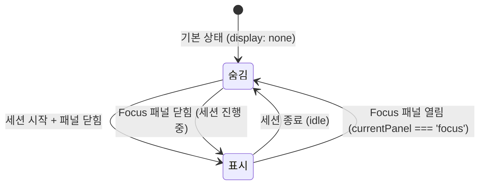

# Session Mini — 세션 미니 위젯

> **문서 성격**: `Focus` 시스템의 **Session Mini** 위젯 스펙.
> 작성 규칙은 `project-docs-guide.md` 참조.

---

## 📑 목차

1. [개요](#1-개요)
2. [UI 구조](#2-ui-구조)
3. [데이터 모델](#3-데이터-모델)
4. [동작 규칙](#4-동작-규칙)
5. [사용자 상호작용](#5-사용자-상호작용)
6. [관련 시스템](#6-관련-시스템)

---

## 1. 개요

- **한 줄 정의**: Focus 패널이 닫힌 상태에서 타이머/스톱워치 진행 상황을 표시하는 플로팅 미니 위젯
- **위치**: `.tr-bottom-row` 내, `.nav-bar` 좌측에 위치 (우상단 nav 영역)
- **구현 상태**: ✅ 구현 완료

세션이 진행 중(`timerState !== 'idle'` 또는 `swRunning || swPaused`)이고 Focus 패널이 닫혀있을 때만 표시된다. 매 틱마다 `renderSessionMini()`가 호출되어 실시간 갱신된다.

## 2. UI 구조

### 2.1. 와이어프레임

**Timer 모드 (루틴, focusing)**

```
+---------------------------------------------------+
| session-mini                                      |
|  ● (주황 pulsing)  |  sm-body                     |
|  sm-indicator      |    25:00      sm-time        |
|                    |    집중 중     sm-phase       |
|                    |    ●●○○       sm-dots         |
+---------------------------------------------------+
```

**Stopwatch 모드 (running)**

```
+---------------------------------------------------+
| session-mini                                      |
|  ● (초록 pulsing)  |  sm-body                     |
|  sm-indicator.sw   |    01:23      sm-time        |
|                    |    스톱워치    sm-phase       |
+---------------------------------------------------+
```

**일시정지 상태**

```
+---------------------------------------------------+
| session-mini                                      |
|  ● (회색, 정지)    |  sm-body                     |
|  sm-indicator.pause|    25:00      sm-time        |
|                    |    일시정지    sm-phase       |
+---------------------------------------------------+
```

**레이아웃 위치**

```
+-------------------------------+
|  .tr-block (우상단)            |
|    .clock-plate               |
|      .clock-time              |
|      .clock-date              |
|    .tr-bottom-row             |
|      [session-mini] [nav-bar] |
|                     [F][Q][A] |
+-------------------------------+
```

### 2.2. CSS 클래스 구조

```
.tr-bottom-row            — 하단 행 (flex, gap: 12px)
  .session-mini           — 미니 위젯 컨테이너 (.visible 시 표시)
    .sm-indicator         — 상태 표시 도트 (8x8)
                            .focus — 주황 (focusing)
                            .sw    — 초록 (stopwatch / resting)
                            .pause — 회색, 애니메이션 없음
    .sm-body              — 텍스트 영역
      .sm-time            — 시간 표시
      .sm-phase           — 페이즈 라벨
      .sm-dots            — 사이클 점 컨테이너 (루틴 전용)
        .sm-dot           — 개별 점 (.done | .act)
  .nav-bar                — 네비게이션 바
```

### 2.3. 시각 요소 상세

**컨테이너**

| 요소 | 속성 |
|------|------|
| `.session-mini` | `display: none` (기본), `display: flex` (`.visible`) |
| | `align-items: center`, `gap: 14px` |
| | `padding: 10px 18px`, `border-radius: 14px`, `cursor: pointer` |
| | `background: var(--glass)`, `border: 1px solid var(--glass-b)` |
| | `backdrop-filter: blur(24px)` |
| | `box-shadow: 0 8px 24px rgba(0,0,0,0.3), inset 0 1px 0 rgba(255,255,255,0.04)` |
| hover | `border-color: rgba(201,169,89,0.4)`, `box-shadow: 0 10px 30px rgba(201,169,89,0.12)` |

**상태 표시 도트 (sm-indicator)**

| 클래스 | 배경색 | box-shadow | 애니메이션 |
|--------|--------|------------|-----------|
| `.sm-indicator` | — | — | `pdot 1.5s ease infinite` |
| `.sm-indicator.focus` | `var(--focus-c)` | `0 0 8px rgba(232,168,124,0.6)` | 펄스 |
| `.sm-indicator.sw` | `var(--sw-c)` | `0 0 8px rgba(124,232,168,0.6)` | 펄스 |
| `.sm-indicator.pause` | `var(--text-muted)` | 없음 | `animation: none` |

| 속성 | 값 |
|------|-----|
| 크기 | `width: 8px`, `height: 8px` |
| 모양 | `border-radius: 50%`, `flex-shrink: 0` |

**텍스트 요소**

| 요소 | 속성 |
|------|------|
| `.sm-body` | `display: flex`, `flex-direction: column`, `gap: 3px` |
| `.sm-time` | `font: 'DM Mono' 20px`, `font-weight: 300`, `letter-spacing: -0.02em`, `line-height: 1` |
| `.sm-phase` | `font: 'DM Mono' 9px`, `letter-spacing: 0.15em`, `text-transform: uppercase`, `color: var(--text-secondary)` |

**사이클 점 (sm-dots / sm-dot)**

| 요소 | 속성 |
|------|------|
| `.sm-dots` | `display: flex`, `gap: 4px`, `margin-top: 2px` |
| `.sm-dot` | `5x5`, `border-radius: 50%`, `background: var(--surface2)`, `border: 1px solid rgba(255,255,255,0.1)` |
| `.sm-dot.done` | `background/border-color: var(--focus-c)` |
| `.sm-dot.act` | `background: var(--focus-dim)`, `border-color: var(--focus-c)` |

## 3. 데이터 모델

### 3.1. 전역 상태

Session Mini는 자체 상태를 갖지 않으며, Focus 시스템의 전역 상태를 읽어 렌더링한다.

| 참조 속성 | 용도 |
|----------|------|
| `A.timerState` | 타이머 활성 여부 및 페이즈 판별 |
| `A.prevTimerState` | 일시정지 시 원래 페이즈 복원 |
| `A.swRunning` / `A.swPaused` | 스톱워치 활성 여부 |
| `A.remainingTime` | 타이머 남은 시간 표시 |
| `A.swElapsed` | 스톱워치 경과 시간 표시 |
| `A.currentPanel` | `'focus'`이면 미니 위젯 숨김 |
| `A.isRoutine` | 사이클 점 표시 여부 |
| `A.repeatCount` | 사이클 점 개수 |
| `A.cycleIndex` | 현재/완료 사이클 판별 |

### 3.2. 데이터 스키마

**표시 조건 판정**

```
timerActive = A.timerState !== 'idle'
swActive    = A.swRunning || A.swPaused
show        = (timerActive || swActive) && A.currentPanel !== 'focus'
```

**인디케이터 클래스 결정**

```
Stopwatch:
  className = 'sm-indicator sw' + (swPaused ? ' pause' : '')

Timer:
  isPaused = timerState === 'paused'
  state    = isPaused ? prevTimerState : timerState
  indCls   = state === 'focusing' ? 'focus' : state === 'resting' ? 'sw' : ''
  className = 'sm-indicator ' + indCls + (isPaused ? ' pause' : '')
```

> 참고: Timer의 resting/lastResting 페이즈에서는 `.sw` (초록) 인디케이터를 사용한다.

**페이즈 라벨 결정 (Timer)**

```
isPaused   → '일시정지'
focusing   → '집중 중'
resting    → '휴식 중'
lastResting → '마지막 휴식'
```

## 4. 동작 규칙

### 4.1. 상태 전이



### 4.2. 핵심 로직

**renderSessionMini() 흐름**

1. 표시 조건 판정 (`show`)
2. `.session-mini`에 `.visible` 클래스 토글
3. `show === false`이면 즉시 리턴
4. 스톱워치 활성:
   - 인디케이터: `.sw` (일시정지 시 `.pause` 추가)
   - 시간: `fmt(A.swElapsed)`
   - 페이즈: "스톱워치" 또는 "일시정지"
   - 사이클 점: 없음
5. 타이머 활성:
   - 인디케이터: 페이즈별 색상 클래스
   - 시간: `fmt(A.remainingTime)`
   - 페이즈: 상태별 라벨
   - 사이클 점: `A.isRoutine`이면 `A.repeatCount`개 렌더링

**호출 시점**

- `timerTick()` — 매 1초
- `toggleTimerPause()` — 일시정지/재개
- `stopTimer()` — 타이머 정지
- `onPhaseEnd()` — 페이즈 종료
- `startSW()` — 스톱워치 시작
- SW interval 콜백 — 매 1초
- `toggleSWPause()` — 스톱워치 일시정지/재개
- `stopSW()` — 스톱워치 정지
- `enterPhase()` — 새 페이즈 진입 시 (renderFocusModeContent → renderSessionMini)

### 4.3. 함수 매핑

| 함수 | 역할 |
|------|------|
| `renderSessionMini()` | 미니 위젯 전체 렌더링 (표시 조건 판정 + 콘텐츠 갱신) |

## 5. 사용자 상호작용

### 5.1. 조작 방법

| 액션 | 결과 |
|------|------|
| Session Mini 클릭 | Focus 패널 열기 (미니 위젯은 숨김으로 전환) |
| Session Mini hover | `border-color` 하이라이트, `box-shadow` 강화 |

### 5.2. 키보드 단축키

해당 없음

### 5.3. 이벤트 흐름

**타이머 실행 중 패널 닫기 → 미니 위젯 표시 흐름**

1. 타이머 실행 중 (focusing 페이즈)
2. 패널 외부 클릭 → `closePanel()` → `A.currentPanel = null`
3. 다음 `timerTick()` → `renderSessionMini()`
4. `show = true` (timerActive && currentPanel !== 'focus')
5. `.session-mini.visible` → 주황 펄스 도트, 남은 시간, "집중 중", 사이클 점
6. 매초 시간 갱신

**미니 위젯 클릭 → 패널 복귀 흐름**

1. Session Mini 클릭 → Focus 패널 열기
2. `A.currentPanel = 'focus'`
3. `renderSessionMini()` → `show = false` → `.session-mini` 숨김
4. Focus 패널에서 링 UI로 세션 상태 확인

## 6. 관련 시스템

| 시스템 | 관계 |
|--------|------|
| `focus/focus-panel.md` | 상위 시스템 — 세션 상태 제공 |
| `focus/ui/timer.md` | Timer 세션 진행 상황 표시 |
| `focus/ui/stopwatch.md` | Stopwatch 세션 진행 상황 표시 |
| `navigation-bar.md` | 같은 `.tr-bottom-row`에 위치 |

---

## 📝 업데이트 이력

| 날짜 | 변경 내용 |
|------|----------|
| 2026-04-25 | 초안 작성. |
