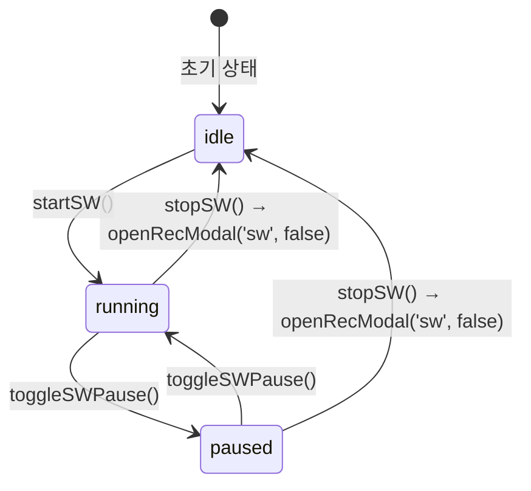

# Stopwatch — 스톱워치 UI 컴포넌트

> **문서 성격**: `Focus` 시스템의 **Stopwatch** UI 컴포넌트 스펙.
> 작성 규칙은 `project-docs-guide.md` 참조.

---

## 📑 목차

1. [개요](#1-개요)
2. [UI 구조](#2-ui-구조)
3. [데이터 모델](#3-데이터-모델)
4. [동작 규칙](#4-동작-규칙)
5. [사용자 상호작용](#5-사용자-상호작용)
6. [관련 시스템](#6-관련-시스템)

---

## 1. 개요

- **한 줄 정의**: 0초부터 경과 시간을 측정하는 스톱워치 UI 컴포넌트
- **위치**: Focus 패널 내 `#focusModeContent` 영역 (`A.focusMode === 'stopwatch'` 일 때)
- **구현 상태**: ✅ 구현 완료

## 2. UI 구조

### 2.1. 와이어프레임

**idle 상태 — 설명 + 시작 버튼**

```
+-------------------------------------------+
|                                           |
|  "시작 버튼을 누르면 0초부터               |
|   측정됩니다."                             |
|                                           |
|  btn-row                                  |
|    [▶ 시작]  btn-primary.sw               |
|                                           |
+-------------------------------------------+
```

**running 상태 — 프로그레스 링 + 컨트롤**

```
+-------------------------------------------+
|                                           |
|            ring-wrap (180x180)            |
|          ┌────────────────┐               |
|         ╱  ring-bg (원형)  ╲              |
|        │                    │             |
|        │  sw-ring-arc (호)  │  초록색     |
|        │                    │             |
|        │    ring-inner      │             |
|        │    ┌──────────┐   │             |
|        │    │  01:23   │   │  ring-time  |
|        │    │ 스톱워치  │   │  ring-phase |
|        │    └──────────┘   │             |
|         ╲                ╱               |
|          └────────────────┘               |
|                                           |
|  btn-row                                  |
|    [■ stop]  [❚❚ 일시정지]  btn-primary.sw |
|                                           |
+-------------------------------------------+
```

**paused 상태**

```
+-------------------------------------------+
|            ring-wrap (180x180)            |
|        │    ┌──────────┐   │             |
|        │    │  01:23   │   │  .blink     |
|        │    │ 일시정지  │   │  ring-phase |
|        │    └──────────┘   │             |
|                                           |
|    [■ stop]  [▶ 재개]                     |
+-------------------------------------------+
```

### 2.2. CSS 클래스 구조

```
#focusModeContent
  (idle 상태)
    div                     — 설명 텍스트 (font-size: 13px, color: var(--text-secondary))
    .btn-row
      .btn.btn-primary.sw   — "시작" 버튼

  (running / paused 상태)
    .ring-wrap              — 180x180 컨테이너
      svg                   — transform: rotate(-90deg)
        circle.ring-bg      — 배경 원 (cx=90, cy=90, r=74)
        circle              — sw-ring-arc 역할 (id="swRingArc")
                              stroke: var(--sw-c), stroke-dasharray/offset
      .ring-inner           — 중앙 텍스트 오버레이
        .ring-time          — 경과 시간 표시 (.blink 일시정지 시)
        .ring-phase         — "스톱워치" 또는 "일시정지"
    .btn-row
      .btn.btn-secondary.btn-danger  — 정지 버튼
      .btn.btn-primary.sw           — 일시정지/재개 버튼
```

### 2.3. 시각 요소 상세

**스톱워치 링**

| 요소 | 속성 |
|------|------|
| sw-ring-arc | `stroke: var(--sw-c)` (초록색) |
| | `stroke-width: 5`, `stroke-linecap: round` |
| | `stroke-dasharray: 465`, `stroke-dashoffset: 465` (초기값) |
| | `filter: drop-shadow(0 0 7px rgba(124,232,168,0.45))` |
| | `transition: stroke-dashoffset 1s linear` |

**CSS 클래스 상세 (.sw-ring-arc)**

```css
.sw-ring-arc {
  fill: none;
  stroke: var(--sw-c);
  stroke-width: 5;
  stroke-linecap: round;
  stroke-dasharray: 465;
  stroke-dashoffset: 465;
  transition: stroke-dashoffset 1s linear;
  filter: drop-shadow(0 0 7px rgba(124,232,168,0.45));
}
```

> 참고: running 상태의 ring-arc는 `.sw-ring-arc` 클래스를 사용하지 않고 인라인 스타일로 동일한 속성을 적용한다.

**페이즈 라벨**

| 상태 | ring-phase 텍스트 | ring-phase 색상 |
|------|------------------|----------------|
| running | "스톱워치" | `var(--sw-c)` (초록) |
| paused | "일시정지" | `var(--sw-c)` (초록) |

**일시정지 깜빡임**: Timer와 동일하게 `.ring-time.blink` 적용 (blk 1s step-end infinite)

**idle 설명 텍스트**

| 속성 | 값 |
|------|-----|
| font-size | `13px` |
| color | `var(--text-secondary)` |
| line-height | `1.75` |
| margin-bottom | `18px` |

**시작 버튼**: `.btn.btn-primary.sw` — Stopwatch 전용 스타일 (초록색 계열)

## 3. 데이터 모델

### 3.1. 전역 상태

| 속성 | 타입 | 기본값 | 설명 |
|------|------|--------|------|
| `A.swRunning` | `boolean` | `false` | 스톱워치 실행 중 여부 |
| `A.swPaused` | `boolean` | `false` | 스톱워치 일시정지 여부 |
| `A.swElapsed` | `number` | `0` | 경과 시간 (초) |
| `A.swInterval` | `number\|null` | `null` | setInterval ID |

**UI 상태 판정**

```
idle    = !swRunning && !swPaused
running = swRunning && !swPaused
paused  = swRunning && swPaused
```

### 3.2. 데이터 스키마

**링 진행률 계산**

```
offset = CIRC_P × (1 - (swElapsed % 60) / 60)
→ 60초마다 한 바퀴 순환
→ swRingArc의 stroke-dashoffset에 적용
```

Timer와 달리 전체 시간 대비 진행률이 아니라, **초 단위 60초 모듈러**로 링이 순환한다.

## 4. 동작 규칙

### 4.1. 상태 전이



### 4.2. 핵심 로직

**시작 (startSW)**

1. `A.swElapsed = 0` (0초부터 시작)
2. `A.swRunning = true`, `A.swPaused = false`
3. 기존 interval 해제 후 새 interval 시작 (1초 주기)
4. 매 틱: `swElapsed++` → `updateSWDisplay()` → `renderSessionMini()`
5. Focus 패널 열려있으면 `renderFocusModeContent()` 호출

**링 갱신 (updateSWDisplay)**

1. `swDisp` 텍스트: `fmt(A.swElapsed)` (MM:SS 또는 HH:MM:SS)
2. `swRingArc` offset: `CIRC_P × (1 - (swElapsed % 60) / 60)`
3. 60초마다 링이 한 바퀴 완성 후 리셋

**일시정지/재개 (toggleSWPause)**

1. `swRunning`이 false면 무시
2. `A.swPaused = !A.swPaused`
3. 일시정지: interval 해제
4. 재개: interval 재시작 (경과 시간 유지)
5. UI 리렌더링 (blink 클래스 적용/해제)

**정지 (stopSW)**

1. interval 해제
2. `A.swRunning = false`, `A.swPaused = false`
3. `openRecModal('sw', false)` — Record Modal 열기
4. UI를 idle 상태로 리렌더링

### 4.3. 함수 매핑

| 함수 | 역할 |
|------|------|
| `renderSWContent(el)` | 스톱워치 상태에 따라 idle 또는 running UI HTML 생성 |
| `startSW()` | 스톱워치 시작 (0초, interval 설정) |
| `updateSWDisplay()` | swDisp 텍스트 + swRingArc offset 갱신 |
| `toggleSWPause()` | 일시정지 ↔ 재개 전환 |
| `stopSW()` | 스톱워치 종료 → Record Modal 열기 |

## 5. 사용자 상호작용

### 5.1. 조작 방법

| 액션 | 결과 |
|------|------|
| [시작] 클릭 | 0초부터 경과 시간 측정 시작, 링 표시 |
| [일시정지] 클릭 | 시간 정지, 시간 텍스트 깜빡임, 라벨 "일시정지" |
| [재개] 클릭 | 경과 시간 유지하며 측정 재개, 라벨 "스톱워치" |
| [■ 정지] 클릭 | 측정 종료 → Record Modal 열기 |

### 5.2. 키보드 단축키

해당 없음

### 5.3. 이벤트 흐름

**기본 사용 흐름**

1. Focus 패널 → Stopwatch 탭 선택
2. idle 화면: "시작 버튼을 누르면 0초부터 측정됩니다." 표시
3. [시작] 클릭 → 링 표시, 초록색 arc가 60초 주기로 순환
4. 시간 표시: `00:00` → `00:01` → ... → `01:00` → ...
5. 필요 시 [일시정지] → 시간 깜빡임 → [재개]
6. [■ 정지] 클릭 → Record Modal 열기
7. 카테고리 선택 + 메모 → [기록 저장]

## 6. 관련 시스템

| 시스템 | 관계 |
|--------|------|
| `focus/focus-panel.md` | 상위 시스템, 전역 상태 정의 |
| `focus/ui/timer.md` | 같은 위치의 대안 모드 |
| `focus/ui/record-modal.md` | 정지 시 트리거 |
| `focus/ui/session-mini.md` | 패널 닫힘 시 미니 표시 |

---

## 📝 업데이트 이력

| 날짜 | 변경 내용 |
|------|----------|
| 2026-04-25 | 초안 작성. |
