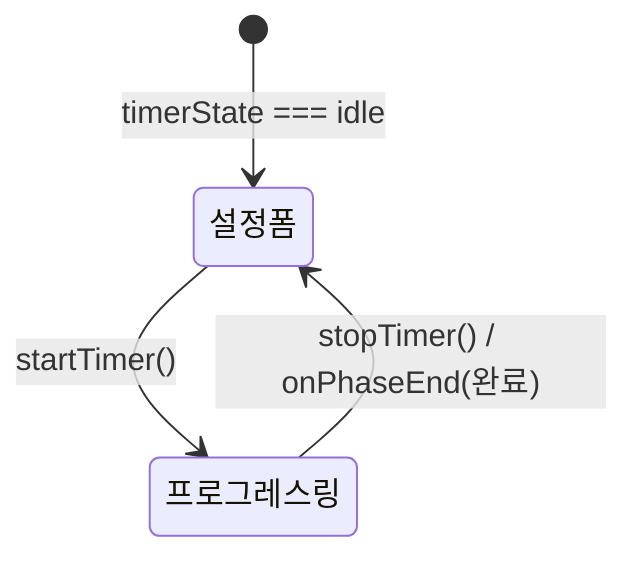

# Timer — 타이머 UI 컴포넌트

> **문서 성격**: `Focus` 시스템의 **Timer** UI 컴포넌트 스펙.
> 작성 규칙은 `project-docs-guide.md` 참조.

---

## 📑 목차

1. [개요](#1-개요)
2. [UI 구조](#2-ui-구조)
3. [데이터 모델](#3-데이터-모델)
4. [동작 규칙](#4-동작-규칙)
5. [사용자 상호작용](#5-사용자-상호작용)
6. [관련 시스템](#6-관련-시스템)

---

## 1. 개요

- **한 줄 정의**: 설정 폼(idle)과 프로그레스 링(running) 두 상태를 전환하는 타이머 UI 컴포넌트
- **위치**: Focus 패널 내 `#focusModeContent` 영역 (`A.focusMode === 'timer'` 일 때)
- **구현 상태**: ✅ 구현 완료

## 2. UI 구조

### 2.1. 와이어프레임

**idle 상태 — 설정 폼**

```
+-------------------------------------------+
| sec-label: "집중 설정"                     |
|                                           |
| field-row                                 |
|   "집중 시간 min"  [−] [25] [+]            |
|                                           |
| ─── divider-line ───                      |
|                                           |
| field-row                                 |
|   "루틴 모드"  [○ toggle-slider]           |
|                                           |
| ┌─ routine-panel (.open) ──────────────┐  |
| │  sub-block                           │  |
| │  field-row                           │  |
| │    "반복 횟수"  [−] [4] [+]           │  |
| │  field-row                           │  |
| │    "자동 재시작" [○ toggle-slider]     │  |
| │  ─── divider ───                     │  |
| │  #routineFields (동적)               │  |
| │  ┌ repeatCount > 1 ──────────────┐   │  |
| │  │  "일반 휴식 min"  [−] [5] [+]  │   │  |
| │  │  "마지막 휴식 min" [−] [15] [+] │   │  |
| │  └──────────────────────────────┘   │  |
| │  ┌ repeatCount === 1 ───────────┐   │  |
| │  │  "휴식 시간 min"  [−] [5] [+] │   │  |
| │  └──────────────────────────────┘   │  |
| └──────────────────────────────────────┘  |
|                                           |
| ─── divider-line ───                      |
|                                           |
| btn-row                                   |
|   [▶ 집중 시작]  btn-primary               |
+-------------------------------------------+
```

**running 상태 — 프로그레스 링**

```
+-------------------------------------------+
|                                           |
|            ring-wrap (180x180)            |
|          ┌────────────────┐               |
|         ╱  ring-bg (원형)  ╲              |
|        │                    │             |
|        │   ring-arc (호)    │             |
|        │                    │             |
|        │    ring-inner      │             |
|        │    ┌──────────┐   │             |
|        │    │  25:00   │   │  ring-time  |
|        │    │  집중     │   │  ring-phase |
|        │    │  ●○○○    │   │  cycle-dots |
|        │    └──────────┘   │             |
|         ╲                ╱               |
|          └────────────────┘               |
|                                           |
|  btn-row                                  |
|    [■ stop]  [❚❚ 일시정지]                 |
|                                           |
+-------------------------------------------+
```

### 2.2. CSS 클래스 구조

```
#focusModeContent
  (idle 상태)
    .sec-label              — "집중 설정"
    .field-row
      .field-label          — 라벨 텍스트
      .num-input            — 숫자 입력 그룹
        button              — [−]
        input[type=number]  — 값 (id: focusDuration, restDuration 등)
        button              — [+]
    .divider-line
    .field-row
      .field-label          — "루틴 모드"
      label.toggle
        input[type=checkbox] — id="isRoutine"
        span.toggle-slider
    .routine-panel          — (.open 시 표시)
      .sub-block
        .field-row          — 반복 횟수
        .field-row          — 자동 재시작 토글
        #routineFields      — 동적 교체 영역
          .field-row        — 휴식 시간 필드(들)
    .btn-row
      .btn.btn-primary      — "집중 시작"

  (running 상태)
    .ring-wrap              — 180x180 컨테이너
      svg                   — transform: rotate(-90deg)
        circle.ring-bg      — 배경 원 (cx=90, cy=90, r=74)
        circle.ring-arc     — 진행 호 (#pRingArc)
      .ring-inner           — 중앙 텍스트 오버레이
        .ring-time          — 시간 표시 (.blink 일시정지 시)
        .ring-phase         — 페이즈 라벨
        .cycle-dots         — 사이클 점 컨테이너
          .cdot             — (.done | .act)
    .btn-row
      .btn.btn-secondary.btn-danger  — 정지 버튼
      .btn.btn-primary               — 일시정지/재개 (.rest | .lrest)
```

### 2.3. 시각 요소 상세

**프로그레스 링**

| 요소 | 속성 |
|------|------|
| `.ring-wrap` | `width: 180px`, `height: 180px`, `margin: 0 auto` |
| SVG | `rotate(-90deg)` (12시 방향에서 시작) |
| `.ring-bg` | `fill: none`, `stroke: rgba(255,255,255,0.06)`, `stroke-width: 5` |
| `.ring-arc` | `fill: none`, `stroke-width: 5`, `stroke-linecap: round`, `transition: stroke-dashoffset 1s linear, stroke 0.4s` |
| `.ring-inner` | `position: absolute`, `inset: 0`, `flex-direction: column`, `align-items/justify-content: center`, `gap: 4px` |

**페이즈별 색상**

| 페이즈 | stroke 색상 | CSS 변수 | ring-phase 텍스트 |
|--------|------------|----------|------------------|
| `focusing` | `var(--focus-c)` | 주황 | "집중" 또는 "집중 (N/M)" (루틴) |
| `resting` | `var(--rest-c)` | — | "휴식" |
| `lastResting` | `var(--lrest-c)` | — | "마지막 휴식" (repeatCount > 1) / "휴식" (repeatCount === 1) |
| `paused` | 이전 페이즈 색상 유지 | — | "일시정지" |

**사이클 점 (cycle-dots)**

| 요소 | 속성 |
|------|------|
| `.cycle-dots` | `display: flex`, `gap: 5px`, `margin-top: 3px` |
| `.cdot` | `5x5`, `border-radius: 50%`, `background: var(--surface2)`, `border: 1px solid var(--border)` |
| `.cdot.done` | `background/border-color: var(--focus-c)` |
| `.cdot.act` | `background: var(--focus-dim)`, `border-color: var(--focus-c)`, 애니메이션 `cdp 1.5s ease infinite` |

**일시정지 깜빡임**

| 요소 | 속성 |
|------|------|
| `.ring-time.blink` | `animation: blk 1s step-end infinite` |
| `@keyframes blk` | `0%,100% { opacity: 1 }`, `50% { opacity: 0.2 }` |

**버튼 상태별 클래스**

| 타이머 상태 | 일시정지/재개 버튼 추가 클래스 | 라벨 |
|------------|--------------------------|------|
| `focusing` | (기본) | "일시정지" |
| `resting` | `.rest` | "시작" |
| `lastResting` | `.lrest` | "시작" |
| `paused` | (기본) | "재개" |

**숫자 입력 필드**

| 필드 | 증감 단위 | 범위 |
|------|----------|------|
| `focusDuration` | ±5 | 1 ~ 180 (분) |
| `repeatCount` | ±1 | 1 ~ 10 |
| `restDuration` | ±1 | 1 ~ 60 (분) |
| `lastRestDuration` | ±1 | 1 ~ 60 (분) |
| `singleRestDuration` | ±1 | 1 ~ 60 (분) |

## 3. 데이터 모델

### 3.1. 전역 상태

Focus 패널 전역 상태의 Timer 관련 속성을 사용한다. 상세는 `focus-panel.md` 3.1절 참조.

핵심 속성 요약:

| 속성 | 용도 (Timer UI) |
|------|----------------|
| `A.timerState` | idle → 설정 폼 렌더링, 그 외 → 링 렌더링 |
| `A.remainingTime` / `A.totalTime` | 링 arc offset 계산: `CIRC_P × (1 - remainingTime/totalTime)` |
| `A.cycleIndex` / `A.repeatCount` | cycle-dots 렌더링 (루틴 모드) |
| `A.isRoutine` | routine-panel 표시 여부 |
| `A.focusDuration` | 집중 시간 input 값 |

### 3.2. 데이터 스키마

**링 진행률 계산**

```
pct = totalTime > 0 ? remainingTime / totalTime : 0
offset = CIRC_P × (1 - pct)
→ ring-arc의 stroke-dashoffset에 적용
```

**routineFieldsHtml 분기**

```
repeatCount === 1  → singleRestDuration 필드 1개 ("휴식 시간")
repeatCount > 1   → restDuration + lastRestDuration 필드 2개 ("일반 휴식" + "마지막 휴식")
```

## 4. 동작 규칙

### 4.1. 상태 전이

Timer 상태 전이는 `focus-panel.md` 4.1절의 Timer 상태 다이어그램 참조.

Timer UI는 두 가지 렌더링 상태를 가진다:



### 4.2. 핵심 로직

**idle → running 전환**

1. `startTimer()` 호출
2. 모든 설정 input에서 값 읽어 `A`에 저장
3. `A.cycleIndex = 1`, `A.accFocusTime = 0`, `A.normalEnd = false`
4. `enterPhase('focusing')` → UI가 프로그레스 링으로 전환

**repeatCount 변경 시 동적 필드 교체**

1. `numAdj('repeatCount', delta)` 호출
2. `$('routineFields').innerHTML = routineFieldsHtml()` — 전체 리렌더링 없이 필드 영역만 교체
3. `repeatCount === 1` → singleRestDuration 필드 / `> 1` → restDuration + lastRestDuration 필드

**페이즈 라벨 결정 (running 상태)**

```
focusing → isRoutine ? "집중 (cycleIndex/repeatCount)" : "집중"
resting  → "휴식"
lastResting → repeatCount === 1 ? "휴식" : "마지막 휴식"
paused → "일시정지"
```

**일시정지/재개 버튼 아이콘 결정**

```
paused     → 재생 아이콘 (▶)
focusing   → 일시정지 아이콘 (❚❚)
resting    → 재생 아이콘 (▶), 라벨 "시작"
lastResting → 재생 아이콘 (▶), 라벨 "시작"
```

### 4.3. 함수 매핑

| 함수 | 역할 |
|------|------|
| `renderTimerContent(el)` | `A.timerState`에 따라 설정 폼 또는 프로그레스 링 HTML 생성 |
| `routineFieldsHtml()` | `A.repeatCount`에 따라 휴식 시간 필드 HTML 반환 |
| `numAdj(field, delta)` | 숫자 입력 값 증감, repeatCount 변경 시 routineFields 갱신 |
| `toggleRoutinePanel()` | `A.isRoutine` 토글, routine-panel `.open` 클래스 전환 |
| `startTimer()` | 설정값 저장 → `enterPhase('focusing')` |
| `updateTimerDisplay()` | ring-time 텍스트 + ring-arc stroke-dashoffset 갱신 |

## 5. 사용자 상호작용

### 5.1. 조작 방법

| 액션 | 결과 |
|------|------|
| 집중 시간 [−] | `focusDuration -= 5` (최소 1) |
| 집중 시간 [+] | `focusDuration += 5` (최대 180) |
| 루틴 모드 토글 ON | routine-panel 슬라이드 오픈 |
| 루틴 모드 토글 OFF | routine-panel 닫기 |
| 반복 횟수 [−]/[+] | `repeatCount ±1`, routineFields 동적 교체 |
| 자동 재시작 토글 | `A.autoRestart` 전환 |
| [집중 시작] | 설정값 저장 → focusing 페이즈 시작, UI를 링으로 전환 |
| 링 화면 [일시정지] | 시간 깜빡임, interval 정지 |
| 링 화면 [재개] | 이전 페이즈로 복귀, interval 재개 |
| 링 화면 [■ 정지] | 중도 종료 → idle + Record Modal |

### 5.2. 키보드 단축키

해당 없음

### 5.3. 이벤트 흐름

**단일 모드 (isRoutine=false) 흐름**

1. 집중 시간 25분 설정 → [집중 시작]
2. 링 표시: `25:00`, 페이즈 "집중", 주황색 arc
3. 매초 링 arc 줄어듦, 시간 감소
4. 25분 완료 → `playAlarm()` → Record Modal 열기

**루틴 모드 (repeatCount=1) 흐름**

1. 집중 25분, 휴식 5분 설정 → [집중 시작]
2. focusing (25분) → lastResting (5분, singleRestDuration 사용)
3. 라벨: "휴식" (마지막 휴식 아님)
4. 완료 → Record Modal

## 6. 관련 시스템

| 시스템 | 관계 |
|--------|------|
| `focus/focus-panel.md` | 상위 시스템, 전역 상태 정의 |
| `focus/ui/stopwatch.md` | 같은 위치의 대안 모드 |
| `focus/ui/record-modal.md` | 세션 종료 후 트리거 |
| `focus/ui/session-mini.md` | 패널 닫힘 시 미니 표시 |

---

## 📝 업데이트 이력

| 날짜 | 변경 내용 |
|------|----------|
| 2026-04-25 | 초안 작성. |
