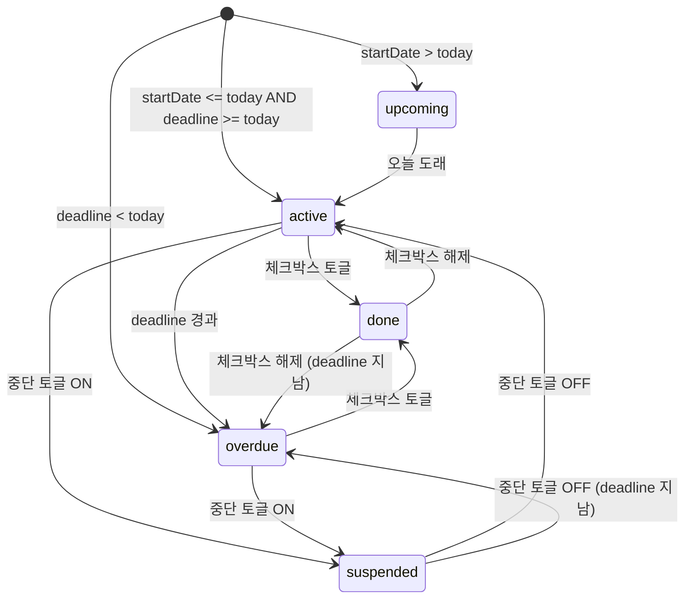

# Quests Panel -- 퀘스트 패널

> **문서 성격**: `detail-side-panel`의 **Quests 모드** 시스템 스펙.
> 작성 규칙은 `project-docs-guide.md` 참조.

---

## 목차

1. [개요](#1-개요)
2. [UI 구조](#2-ui-구조)
3. [데이터 모델](#3-데이터-모델)
4. [동작 규칙](#4-동작-규칙)
5. [사용자 상호작용](#5-사용자-상호작용)
6. [관련 시스템](#6-관련-시스템)

---

## 1. 개요

- **한 줄 정의**: 퀘스트(할 일)의 생성 / 조회 / 편집 / 상세 / 반복 제거를 총괄하는 사이드 패널 모드
- **위치**: 우측 `detail-side-panel` -- navigation-bar에서 Quests 버튼 클릭 시 활성
- **구현 상태**: ✅ 구현 완료

## 2. UI 구조

### 2.1. 와이어프레임

```
+-------------------------------------------+
| [side-panel header: "QUESTS"]             |
|-------------------------------------------|
| [★ 즐겨찾기] [🔁 반복 관리]   ← qtab-bar |
| ┌─ fav-row / rec-manage-list ──────────┐  |
| │  (탭 컨텐츠)                          │  |
| └──────────────────────────────────────┘  |
| ─── divider ───                           |
| [+ 새 퀘스트 추가]        ← todo-add-btn |
| ┌ filter-chips ─────────────────────────┐ |
| │ 전체 | 지연(n) | 진행예정 | 진행중    │ |
| │ 완료 | 중단                            │ |
| └───────────────────────────────────────┘ |
| ┌─ [OVERDUE · 3] ──────────────────────┐ |
| │ ☐ Quest A  [카테고리] [반복·매일]     │ |
| │ ☐ Quest B  [카테고리] [D+2]          │ |
| ├─ [ACTIVE · 2] ───────────────────────┤ |
| │ ☐ Quest C  ...                        │ |
| ├─ [UPCOMING · 1] ─────────────────────┤ |
| │ ☐ Quest D  ...                        │ |
| └───────────────────────────────────────┘ |
| [더보기 (n건)]            ← load-more-btn |
+-------------------------------------------+
```

### 2.2. CSS 클래스 구조

```
.q-view                         (뷰 컨테이너, .active 시 display:flex)
├── .qtab-bar                   (탭 바 -- 즐겨찾기 / 반복 관리)
│   └── .qtab (.on)             (개별 탭 버튼)
├── .qtab-content
│   ├── .fav-row                (즐겨찾기 칩 수평 스크롤)
│   │   ├── .fav-chip           (즐겨찾기 아이템)
│   │   │   └── .fav-star       (별 아이콘)
│   │   └── .fav-empty          (빈 상태 텍스트)
│   └── .rec-manage-list        (반복 관리 목록)
│       └── .rec-manage-item
│           ├── .rec-manage-top
│           │   ├── .rec-manage-title
│           │   └── .tbadge.rec
│           └── .rec-manage-sub
├── .todo-add-btn               (새 퀘스트 추가 -- dashed border)
├── .filter-chips               (상태 필터)
│   ├── .fchip (.on)
│   └── .fchip-badge            (지연 카운트 뱃지)
├── .todo-list                  (퀘스트 목록)
│   ├── .qlist-section-hdr      (섹션 헤더 -- overdue/active/upcoming/done/suspended)
│   └── .todo-item (.done .overdue .suspended)
│       ├── .todo-chk (.done)   (체크박스)
│       ├── .todo-content       (클릭 시 상세로 이동)
│       │   ├── .todo-title-text
│       │   ├── .todo-badges
│       │   │   ├── .tbadge     (카테고리)
│       │   │   ├── .tbadge.rec (반복 규칙)
│       │   │   └── .tbadge.dday (.near .today .overdue)
│       │   └── .todo-desc-text
│       └── .todo-acts
│           ├── .todo-act-btn.star (.on)
│           └── .todo-act-btn.btn-danger
├── .load-more-btn              (더보기 버튼)
└── .todo-empty-wrap            (빈 상태)
    ├── .todo-empty-icon
    └── .todo-empty-msg
```

### 2.3. 시각 요소 상세

| 요소 | 폰트 | 크기 | 색상 |
|------|------|------|------|
| `.qtab` | Noto Sans KR | 11.5px | `--text-muted`, 활성: `--todo-c` |
| `.fav-chip` | Noto Sans KR | 11px | `--text-secondary`, hover: `--todo-c` |
| `.fchip` | DM Mono | 9px, uppercase | `--text-muted`, 활성: 각 상태색 |
| `.fchip-badge` | -- | 8px, bold | `--danger` 배경, `#1a0a0a` 글자 |
| `.todo-title-text` | -- | 13px, 500 | `--text-primary`, done: `--text-muted` + line-through |
| `.tbadge` | DM Mono | 8px, uppercase | `--focus-c` 배경 `--focus-dim` |
| `.tbadge.rec` | DM Mono | 8px | `--text-muted`, `--surface` 배경 |
| `.tbadge.dday` | -- | -- | 초록(D-7+), 노랑(D-3~6), 주황(D-1~2), 빨강(D-DAY/D+) |
| `.qlist-section-hdr` | DM Mono | 8.5px, 0.22em spacing | 상태별 색상 |
| `.todo-desc-text` | -- | 11px | `--text-muted` |
| `.todo-add-btn` | Noto Sans KR | 12px | `--text-secondary`, dashed `--border`, hover: `--todo-c` |

**D-day 뱃지 색상 매핑**:

| 조건 | 클래스 | 배경 | 텍스트 |
|------|--------|------|--------|
| D-7 이상 | `.tbadge.dday` | `rgba(124,232,168,0.12)` | `--success` |
| D-3 ~ D-6 | `.tbadge.dday.near` | `rgba(232,200,124,0.14)` | `--todo-c` |
| D-1 ~ D-2 | `.tbadge.dday.near` | (동일) | (동일) |
| D-DAY | `.tbadge.dday.today` | `rgba(232,168,124,0.14)` | `--focus-c` |
| D+1 이상 | `.tbadge.dday.overdue` | `rgba(232,124,124,0.18)` | `--danger` |

## 3. 데이터 모델

### 3.1. 전역 상태 (A 객체)

| 속성 | 타입 | 기본값 | 설명 |
|------|------|--------|------|
| `todos` | `Array<MasterTodo>` | `[]` | 마스터 퀘스트 레코드 배열 |
| `instances` | `Object` | `{}` | 반복 인스턴스 캐시 (키: 인스턴스 ID) |
| `questsTab` | `'favorites'\|'recurring'` | `'favorites'` | 상단 탭 선택 |
| `statusFilter` | `string` | `'all'` | 상태 필터: all/overdue/upcoming/active/done/suspended |
| `questsView` | `string` | `'list'` | 현재 뷰: list/create/edit/detail/recurRemove |
| `visibleCount` | `number` | `10` | 페이지네이션: 현재 노출 개수 |
| `editingTodoId` | `string\|null` | `null` | 편집 중인 마스터 ID |
| `detailTodoId` | `string\|null` | `null` | 상세 보기 중인 마스터 ID |
| `detailTodoDk` | `string\|null` | `null` | 상세 보기 인스턴스 날짜 키 (null = 마스터 뷰) |
| `detailFromRecurTab` | `boolean` | `false` | true면 반복 관리 탭에서 진입 -- [반복 제거] 버튼 노출 |
| `todoSelCat` | `string\|null` | `null` | 폼: 선택된 카테고리 |
| `todoSelRec` | `string` | `'none'` | 폼: 선택된 반복 주기 |
| `todoStartDate` | `string\|null` | `null` | 폼: 시작일 `'YYYY.MM.DD'` |
| `questStartCalYear` | `number` | 현재 연도 | 시작일 캘린더 연도 커서 |
| `questStartCalMonth` | `number` | 현재 월(0-11) | 시작일 캘린더 월 커서 |
| `todoHasDeadline` | `boolean` | `false` | 폼: 마감일 토글 |
| `todoDeadline` | `string\|null` | `null` | 폼: 마감일 (단발성용) |
| `todoDeadlineOffset` | `number` | `1` | 폼: 마감일 오프셋 (반복용, 일 단위) |
| `questDeadlineCalYear` | `number` | 현재 연도 | 마감일 캘린더 연도 커서 |
| `questDeadlineCalMonth` | `number` | 현재 월(0-11) | 마감일 캘린더 월 커서 |
| `todoHasRecEnd` | `boolean` | `false` | 폼: 반복 종료일 토글 |
| `todoRecEnd` | `string\|null` | `null` | 폼: 반복 종료일 `'YYYY.MM.DD'` |
| `questRecEndCalYear` | `number` | 현재 연도 | 반복 종료일 캘린더 연도 커서 |
| `questRecEndCalMonth` | `number` | 현재 월(0-11) | 반복 종료일 캘린더 월 커서 |
| `recurRemoveCalYear` | `number` | 현재 연도 | 반복 제거 캘린더 연도 커서 |
| `recurRemoveCalMonth` | `number` | 현재 월(0-11) | 반복 제거 캘린더 월 커서 |
| `recurRemoveDate` | `string\|null` | `null` | 반복 제거 선택 날짜 |
| `idCounters` | `Object` | `{}` | 날짜별 ID 시퀀스 카운터 (YYYYMMDD -> next seq) |
| `lastRolloverDate` | `string\|null` | `null` | 자정 롤오버 마지막 처리 일자 |
| `categories` | `string[]` | `['공부','프로젝트','업무','독서','운동','기타']` | 공유 카테고리 목록 |
| `catColors` | `Object` | `{}` | 카테고리별 커스텀 색상 |
| `tlCollapsed` | `boolean` | `false` | TL 오버레이 접힘 상태 |

### 3.2. 데이터 스키마

#### 마스터 레코드 (MasterTodo)

`A.todos[]` 배열에 저장되는 퀘스트 원본 레코드.

| 필드 | 타입 | 설명 |
|------|------|------|
| `id` | `string` (13자리) | `YYYYMMDD` + 5자리 시퀀스 (예: `2026042300001`) |
| `title` | `string` | 제목 (필수, 최대 80자) |
| `description` | `string` | 설명 (선택) |
| `category` | `string` | 카테고리명 (필수) |
| `recurrence` | `'none'\|'daily'\|'weekly'\|'monthly'` | 반복 주기 |
| `startDate` | `string` | 시작일 `'YYYY.MM.DD'` (필수) |
| `deadline` | `string\|null` | 마감일 -- 단발성 전용 |
| `deadlineOffset` | `number\|null` | 마감일 오프셋(일) -- 반복 전용 |
| `recEndDate` | `string\|null` | 반복 종료일 (null이면 시작일 + 1년 자동) |
| `doneAt` | `number\|null` | 완료 timestamp -- 단발성 전용 |
| `doneDate` | `string\|null` | 완료 일자 키 -- 단발성 전용 |
| `suspendedAt` | `number\|null` | 중단 timestamp -- 단발성 전용 |
| `suspendReason` | `string` | 중단 사유 |
| `recurData` | `Object` | 반복 인스턴스별 상태 `{ [dk]: { doneAt, doneDate, suspendedAt, suspendReason } }` |
| `isFavorite` | `boolean` | 즐겨찾기 여부 |

#### 인스턴스 (Instance)

`getInstance(masterId, dk)` 호출 시 즉석 생성되는 가상 객체. 영속 저장하지 않음.

| 필드 | 타입 | 설명 |
|------|------|------|
| `id` | `string` | 마스터 ID와 동일 |
| `masterId` | `string` | 소속 마스터 ID |
| `master` | `MasterTodo` | 마스터 레코드 참조 |
| `startDate` | `string` | 단발성: 마스터 startDate / 반복: 발생일(dk) |
| `deadline` | `string` | 단발성: `master.deadline \|\| master.startDate` / 반복: `deadlineOffset ? addDays(dk, offset) : dk` |
| `done` | `boolean` | 완료 여부 |
| `doneAt` | `number\|null` | 완료 timestamp |
| `suspended` | `boolean` | 중단 여부 |
| `suspendReason` | `string` | 중단 사유 |
| `suspendedAt` | `number\|null` | 중단 timestamp |
| `isRecurringInstance` | `boolean` | 반복 인스턴스 여부 |
| `occurrenceKey` | `string` | 반복 인스턴스의 발생 날짜 키 (반복 전용) |

#### ID 생성 규칙

```
ID = YYYYMMDD + 5자리 시퀀스 (zero-padded)
예: 20260423 + 00001 = "2026042300001"

A.idCounters = { "20260423": 3, "20260424": 1, ... }
nextIdForDate("20260423") → A.idCounters["20260423"]++ → "2026042300004"
claimIdForDate → nextIdForDate의 별칭
```

## 4. 동작 규칙

### 4.1. 상태 전이



**`instanceStatus(inst, tk)` 판정 순서** (tk = todayKey()):
1. `inst.suspended` -> `'suspended'`  ← 최우선 (suspended+done 시에도 suspended)
2. `inst.done` -> `'done'`
3. `inst.startDate > tk` -> `'upcoming'`
4. `(inst.deadline || inst.startDate) < tk` -> `'overdue'`
5. 그 외 -> `'active'`  ← 기본

### 4.2. 핵심 로직

#### todoOccursOn(master, date) -- 반복 발생 판정

1. 시작일/종료일 범위 확인: `startDate <= dk <= (recEndDate || startDate+1년)`
2. `recurrence === 'none'` -> dk === startDate
3. `recurrence === 'daily'` -> 항상 true
4. `recurrence === 'weekly'` -> `date.getDay() === parseKey(startDate).getDay()`
5. `recurrence === 'monthly'` -> `date.getDate() === parseKey(startDate).getDate()`

#### getInstance(masterId, dk) -- 인스턴스 획득

- **단발성**: 마스터 레코드에서 직접 필드 추출하여 인스턴스 객체 구성
- **반복**: `master.recurData[dk]`에서 done/suspended 상태 조회
  - deadline 계산: `master.deadlineOffset ? addDays(dk, offset) : dk`

#### getAllInstances() -- 전체 인스턴스 수집

- 단발성: 1개 인스턴스
- 반복: startDate ~ min(today, recEndDate||startDate+1년) 범위 스캔
  - 과거+오늘: 모두 포함
  - 미래: **첫 번째 1건만** 포함 (upcoming 표시용)
  - 안전 캡: 500회 루프 제한

#### countOverdue() -- 지연 뱃지 카운트

```javascript
getAllInstances().filter(i => instanceStatus(i) === 'overdue').length
```

#### D-day 계산: ddayInfoForKey(deadlineKey)

```
diff = daysBetween(todayKey(), deadlineKey)
diff > 0  -> { label: 'D-{diff}', cls: diff<=3 ? 'near' : '' }
diff === 0 -> { label: 'D-DAY', cls: 'today' }
diff < 0  -> { label: 'D+{-diff}', cls: 'overdue', overdue: true }
```

#### Midnight Rollover -- 자정 ID 선점

목적: 반복 퀘스트 인스턴스가 해당 날짜의 낮은 번호를 선점하고, 수동 생성 퀘스트는 그 이후 번호를 받음.

1. `initMidnightRollover()`: 앱 시작 시 호출. `lastRolloverDate = todayKey()`, visibilitychange 리스너 등록, `scheduleMidnightRollover()` 호출
2. `scheduleMidnightRollover()`: 다음 자정+1초에 `processRollover()` 실행 후 재귀 예약
3. `processRollover()`: lastRolloverDate 다음 날 ~ 오늘까지 순차 `performRolloverForDate(dk)` 호출 (멀티일 대응, 안전장치 400)
4. `performRolloverForDate(dk)`: 해당 날짜에 발생하는 반복 마스터를 시작일/ID 순 정렬 후 각각 `nextIdForDate(compact)` 호출하여 카운터 선점

#### 상태별 정렬 규칙

| 상태 | 정렬 기준 |
|------|----------|
| overdue | 마감일 오래된 순(asc) -> ID asc |
| active | 마감일 가까운 순(asc) -> ID asc |
| upcoming | 시작일 가까운 순(asc) -> ID asc |
| done | 완료 시간 빠른 순(asc) -> ID asc |
| suspended | 중단 시간 최근 순(desc) -> ID desc |

### 4.3. 함수 매핑

| 함수 | 역할 |
|------|------|
| `renderQuestsPanel()` | questsView에 따라 적절한 하위 렌더러 호출 |
| `renderQuestsList()` | 탭 + 필터 + 리스트 전체 렌더링 |
| `renderFavoritesTab()` | 즐겨찾기 칩 행 렌더링 |
| `renderRecurringManageTab()` | 반복 관리 목록 렌더링 |
| `renderQuestListItem(inst)` | 개별 퀘스트 리스트 아이템 HTML |
| `renderQuestsEmpty(label)` | 빈 상태 HTML |
| `filterInstancesByStatus(status)` | 상태별 인스턴스 필터 |
| `sortInstancesForStatus(items, status)` | 상태별 정렬 |
| `setQuestsTab(tab)` | 탭 전환 |
| `setStatusFilter(f)` | 상태 필터 변경 (visibleCount 10으로 리셋) |
| `loadMoreQuests()` | visibleCount += 10 |
| `qToggleDone(masterId, dk)` | 리스트에서 체크박스 토글 |
| `qToggleFav(masterId)` | 즐겨찾기 토글 |
| `qDeleteTodo(masterId)` | 마스터 삭제 (confirm) |
| `dupFav(id)` | 즐겨찾기 복제 -> 오늘 단발성 퀘스트 생성 |
| `openRecurringMasterDetail(masterId)` | 반복 관리 탭에서 마스터 상세 열기 |
| `openQuestsForm(editId?)` | 생성/편집 폼 열기 |
| `renderQuestsForm(t?)` | 폼 HTML 렌더링 |
| `rerenderForm()` | 타이핑 값 보존하며 폼 재렌더 |
| `saveQuest()` | 검증 후 생성/수정 저장 |
| `resetQuestFormState()` | 폼 상태 초기화 |
| `backToQuestsList()` | 리스트 뷰로 복귀 |
| `openQuestDetail(id, dk)` | 퀘스트 상세 열기 |
| `renderQuestsDetail()` | 상세 뷰 렌더링 |
| `detailToggleDone()` | 상세에서 완료 토글 |
| `detailToggleSuspend()` | 상세에서 중단 토글 |
| `detailSetSuspendReason()` | 중단 사유 저장 (onblur) |
| `detailDelete()` | 상세에서 삭제 |
| `openRecurRemoveView(id)` | 반복 제거 뷰 열기 |
| `renderRecurRemoveView()` | 반복 제거 뷰 렌더링 |
| `applyRecurRemove()` | 반복 제거 적용 |
| `cancelRecurRemove()` | 반복 제거 취소 -> 마스터 상세 복귀 |
| `nextIdForDate(compactDate)` | 13자리 ID 발급 |
| `claimIdForDate(compactDate)` | nextIdForDate 별칭 |
| `todoOccursOn(master, date)` | 반복 발생 판정 |
| `getInstance(masterId, dk)` | 인스턴스 즉석 생성/조회 |
| `getAllInstances()` | 전체 인스턴스 수집 |
| `toggleInstanceDone(masterId, dk)` | 인스턴스 완료 토글 |
| `setInstanceSuspended(masterId, dk, suspended, reason)` | 인스턴스 중단 설정 |
| `instanceStatus(inst, tk)` | 인스턴스 상태 판정. 우선순위: ①suspended ②done ③upcoming(startDate>tk) ④overdue(deadline<tk) ⑤active. suspended는 done보다 우선(suspended+done → suspended 표시) |
| `statusLabel(status)` | 상태 필터 키 → 한국어 라벨 매핑. `{all:'전체', overdue:'마감 지남', upcoming:'예정', active:'진행 중', done:'완료', suspended:'보류'}`. 빈 상태 메시지에 사용 |
| `countOverdue()` | 지연 건수 |
| `daysBetween(fromKey, toKey)` | 두 dateKey 사이 정수 일수 계산 (`Math.round` 사용) |
| `ddayInfoForKey(deadlineKey)` | D-day 정보 객체 반환: `{text, cls, overdue}`. diff>0→`{text:'D-{diff}', cls:(diff<=3?'near':''), overdue:false}`, diff===0→`{text:'D-DAY', cls:'today', overdue:false}`, diff<0→`{text:'D+{-diff}', cls:'', overdue:true}` |
| `performRolloverForDate(dk)` | 특정 날짜 롤오버 |
| `processRollover()` | 누적 롤오버 처리 |
| `scheduleMidnightRollover()` | 다음 자정 롤오버 예약 |
| `initMidnightRollover()` | 롤오버 시스템 초기화 |
| `renderTlTodos()` | 오늘의 퀘스트 오버레이 갱신 |
| `buildMiniCalHtml(opts)` | 미니 캘린더 공통 빌더 |
| `buildRecSummaryHtml()` | 반복 규칙 요약 텍스트 |

## 5. 사용자 상호작용

### 5.1. 조작 방법

| 액션 | 결과 |
|------|------|
| 탭(즐겨찾기/반복 관리) 클릭 | 탭 컨텐츠 전환 |
| 즐겨찾기 칩 클릭 | 해당 퀘스트를 오늘 단발성으로 복제 |
| 반복 관리 아이템 클릭 | 마스터 상세 뷰 (detailFromRecurTab=true) |
| 상태 필터 칩 클릭 | 해당 상태로 필터링, visibleCount 리셋 |
| 체크박스 클릭 | 완료/미완료 토글 |
| 퀘스트 본문 영역 클릭 | 상세 뷰로 이동 |
| 별 아이콘 클릭 | 즐겨찾기 토글 |
| 휴지통 아이콘 클릭 | confirm 후 삭제 (반복: 모든 기록 포함 경고) |
| "새 퀘스트 추가" 클릭 | 생성 폼 열기 |
| "더보기" 클릭 | 10건 추가 노출 |

## 6. 관련 시스템

| 문서 | 다루는 것 |
|------|---------|
| `quest-list.md` | 퀘스트 리스트 뷰 상세 |
| `quest-form.md` | 퀘스트 생성/편집 폼 상세 |
| `quest-detail.md` | 퀘스트 상세 뷰 상세 |
| `recurrence-removal.md` | 반복 제거 플로우 상세 |
| `today-todo-overlay.md` | 오늘의 퀘스트 오버레이 |
| `navigation-bar.md` | Quests 버튼, nav-dot 표시 |
| `archive-panel.md` | 완료된 퀘스트 기록 조회 |

---

## 업데이트 이력

| 날짜 | 변경 내용 |
|------|----------|
| 2026-04-24 | 초안 작성 |
| 2026-04-25 | 8.1 wiki 템플릿 기반 전면 재작성 |
