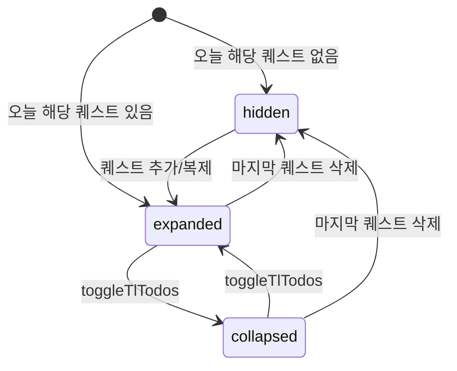

# Today Todo Overlay -- 오늘의 퀘스트 오버레이

> **문서 성격**: `daily-status-panel`의 **오늘의 퀘스트 오버레이** 시스템 스펙.
> 작성 규칙은 `project-docs-guide.md` 참조.

---

## 목차

1. [개요](#1-개요)
2. [UI 구조](#2-ui-구조)
3. [데이터 모델](#3-데이터-모델)
4. [동작 규칙](#4-동작-규칙)
5. [사용자 상호작용](#5-사용자-상호작용)
6. [관련 시스템](#6-관련-시스템)

---

## 1. 개요

- **한 줄 정의**: 오늘 수행 예정인 퀘스트 인스턴스를 접이식 리스트로 표시하는 좌상단 오버레이
- **위치**: 좌상단 `daily-status-panel` > `.tl-block` > `.todo-overlay`, guild-plate 아래
- **구현 상태**: ✅ 구현 완료

## 2. UI 구조

### 2.1. 와이어프레임

```
+-------------------------------------------+
| [guild-plate]                              |
|-------------------------------------------|
| ┌─ todo-overlay ────────────────────────┐ |
| │ ● Today's Quests              [▾]     │ |
| │ ┌ todo-body-list ─────────────────┐   │ |
| │ │ ☐ 알고리즘 풀기                 │   │ |
| │ │   공부                           │   │ |
| │ │ ☑ 독서 30분                     │   │ |
| │ │   독서                           │   │ |
| │ │ ☐ 운동하기                      │   │ |
| │ │   운동 · D-3                     │   │ |
| │ └─────────────────────────────────┘   │ |
| └────────────────────────────────────────┘ |
+-------------------------------------------+
```

### 2.2. CSS 클래스 구조

```
.todo-overlay (.has-todos .collapsed)
├── .todo-hdr                    (헤더 -- 클릭 시 접기/펼치기)
│   ├── .todo-hdr-left
│   │   ├── .todo-dot            (노란색 펄스 도트)
│   │   └── .todo-hdr-title      ("Today's Quests")
│   └── .todo-toggle-btn         (▾ 토글 아이콘)
└── .todo-body-list              (아이템 목록, collapsed 시 display:none)
    └── .tl-todo-item (.done)
        ├── .tl-todo-chk (.done) (15x15 체크박스)
        └── div                   (flex:1)
            ├── .tl-todo-text    (퀘스트 제목)
            └── .tl-todo-cat     (카테고리 + D-day)
```

### 2.3. 시각 요소 상세

**오버레이 컨테이너 (`todo-overlay`)**:

| 속성 | 값 |
|------|-----|
| 기본 | max-height:0, opacity:0, overflow:hidden |
| `.has-todos` | max-height:400px, opacity:1 |
| transition | max-height 0.35s cubic-bezier(0.4,0,0.2,1), opacity 0.25s ease |

오늘 해당 퀘스트가 없으면 `.has-todos` 클래스 제거 -> 자동 숨김.

**헤더 (`todo-hdr`)**:

| 요소 | 설명 |
|------|------|
| 레이아웃 | flex, space-between, padding 11px 16px 9px, cursor:pointer |
| `.todo-dot` | 7x7px, border-radius 50%, bg `--todo-c`, box-shadow `0 0 8px rgba(232,200,124,0.6)`, animation `pdot 2s ease infinite` (펄스) |
| `.todo-hdr-title` | Cinzel 10px, uppercase, 0.25em spacing, `--todo-c` |
| `.todo-toggle-btn` | 20x20px, `--todo-c`, bg:none, border:none |
| `.collapsed .todo-toggle-btn` | transform:rotate(180deg) |

**아이템 리스트 (`todo-body-list`)**:

| 속성 | 값 |
|------|-----|
| 레이아웃 | flex column, gap 4px, padding 0 12px 10px |
| `.collapsed .todo-body-list` | display:none |

**개별 아이템 (`tl-todo-item`)**:

| 속성 | 값 |
|------|-----|
| 레이아웃 | flex, align-items:flex-start, gap 9px, padding 7px 10px |
| 배경 | `rgba(255,255,255,0.02)`, border 1px transparent, border-radius 8px |
| hover | bg `rgba(232,200,124,0.05)`, border `rgba(232,200,124,0.1)` |
| 지연(overdue) 인라인 | border-color `rgba(232,124,124,0.3)`, bg `rgba(232,124,124,0.05)` |

**체크박스 (`tl-todo-chk`)**:

| 속성 | 값 |
|------|-----|
| 크기 | 15x15px, border-radius 4px, margin-top 2px |
| 기본 | border 1.5px `--text-muted`, transparent bg |
| `.done` | bg `--todo-c`, border `--todo-c` |
| `.done::after` | content "✓", 9px bold, `#1a1500` |

**제목 텍스트 (`tl-todo-text`)**:

| 속성 | 값 |
|------|-----|
| 폰트 | 11.5px, `--text-primary`, line-height 1.4 |
| done 인라인 | text-decoration:line-through, color:`--text-muted` |
| overdue 인라인 | color:`#f5b5b5` |

**카테고리 라벨 (`tl-todo-cat`)**:

| 속성 | 값 |
|------|-----|
| 폰트 | DM Mono 8px, uppercase, 0.08em spacing, `--todo-c` |
| margin-top | 2px |
| overdue 인라인 | color:`--danger` |
| D-day 표시 | 카테고리 뒤에 " · {D-day}" (단발성+별도 마감일 시만) |

**nav-dot (`#questsDot`)**:

| 조건 | 표시 |
|------|------|
| 오늘 미완료/미중단 인스턴스 있음 | `display:block` |
| 지연 건수 > 0 | `display:block` |
| 그 외 | `display:none` |

## 3. 데이터 모델

### 3.1. 전역 상태

| 속성 | 타입 | 기본값 | 설명 |
|------|------|--------|------|
| `A.tlCollapsed` | `boolean` | `false` | 오버레이 접힘 여부 |

### 3.2. 데이터 스키마

표시 데이터는 `getAllInstances().filter(inst => inst.startDate === todayKey())`로 수집. Instance 스키마는 `quests-panel.md` 3.2절 참조.

## 4. 동작 규칙

### 4.1. 상태 전이



### 4.2. 핵심 로직

#### 오늘의 인스턴스 수집 (renderTlTodos)

```
items = getAllInstances().filter(inst => inst.startDate === todayKey())
```

- 단발성: `master.startDate === todayKey()`인 것만 포함
- 반복: `getAllInstances()`가 과거+오늘+미래 1건을 반환하므로, `dk === todayKey()`만 필터

#### 표시/숨김 로직

- `items.length === 0`:
  - `.todo-overlay`에서 `.has-todos` 제거 -> max-height:0, opacity:0 (트랜지션으로 사라짐)
  - `#questsDot` display:none
- `items.length > 0`:
  - `.has-todos` 추가 -> max-height:400px, opacity:1 (트랜지션으로 나타남)
  - nav-dot 판정:
    - 미완료+미중단 인스턴스 있으면 display:block
    - 또는 `countOverdue() > 0`이면 display:block
    - 그 외 display:none

#### D-day 표시 규칙

- 반복 인스턴스: D-day 미표기
- 단발성 + `master.deadline` 있을 때만: `ddayInfoForKey(master.deadline)` -> 카테고리 뒤에 " · {label}" 추가

#### 체크박스 토글 (tlComplete)

1. `toggleInstanceDone(masterId, dk)` 호출
2. `renderTlTodos()` 재렌더
3. 퀘스트 패널 열려 있으면 `renderQuestsPanel()` 갱신
4. 아카이브 패널 열려 있으면 캘린더/목록 갱신

#### 접기/펼치기 (toggleTlTodos)

- `A.tlCollapsed = !A.tlCollapsed`
- `.todo-overlay.collapsed` 클래스 토글
- collapsed 시: `.todo-body-list` display:none, toggle 버튼 180도 회전

### 4.3. 함수 매핑

| 함수 | 역할 |
|------|------|
| `renderTlTodos()` | 오늘 인스턴스 수집 -> 리스트 HTML 생성 -> 표시/숨김 + nav-dot 판정 |
| `tlComplete(masterId, dk)` | 체크박스 토글 -> 연쇄 UI 갱신 |
| `toggleTlTodos()` | 오버레이 접기/펼치기 토글 |

## 5. 사용자 상호작용

### 5.1. 조작 방법

| 액션 | 대상 | 결과 |
|------|------|------|
| 헤더 영역 클릭 | `.todo-hdr` | 오버레이 접기/펼치기 |
| 체크박스 클릭 | `.tl-todo-chk` | 해당 인스턴스 완료/미완료 토글 |

## 6. 관련 시스템

| 문서 | 다루는 것 |
|------|---------|
| `quests-panel.md` | 퀘스트 데이터 모델, 인스턴스 상태 전이 |
| `quest-list.md` | 완료 토글 시 동기화 대상 |
| `guild-info.md` | 같은 daily-status-panel 영역의 길드 플레이트 |
| `navigation-bar.md` | `#questsDot` (nav-dot) 표시 조건 |

---

## 업데이트 이력

| 날짜 | 변경 내용 |
|------|----------|
| 2026-04-24 | 초안 작성 |
| 2026-04-25 | 8.1 wiki 템플릿 기반 전면 재작성 |
