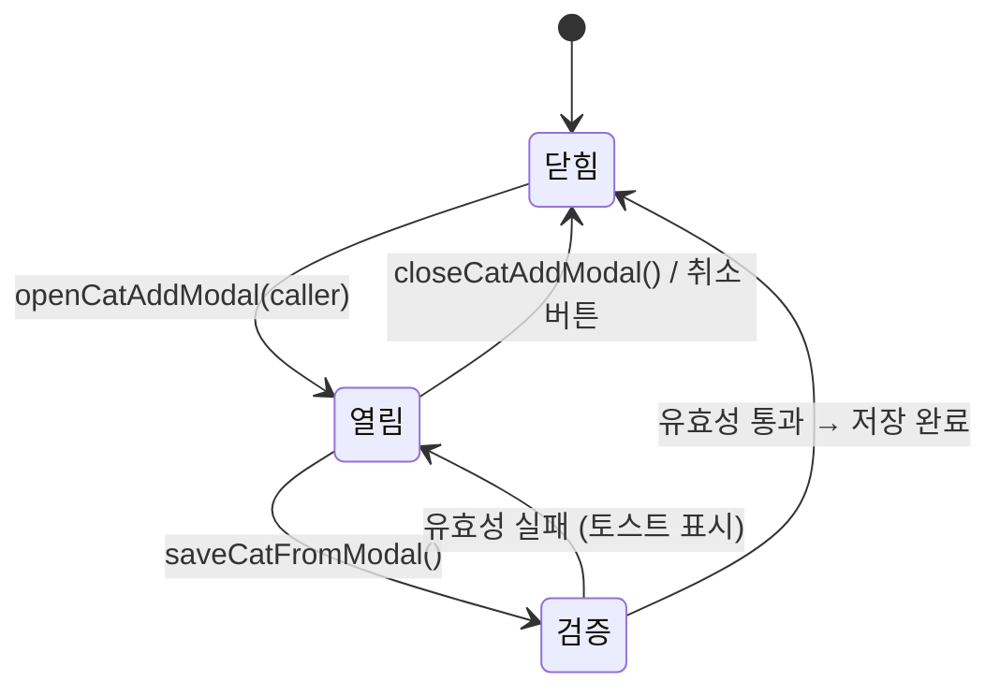

# Category Add Modal

> **문서 성격**: `글로벌 UI`의 **카테고리 추가 모달** 컴포넌트 스펙.
> 작성 규칙은 `project-docs-guide.md` 참조.

---

## 목차

1. [개요](#1-개요)
2. [UI 구조](#2-ui-구조)
3. [데이터 모델](#3-데이터-모델)
4. [동작 규칙](#4-동작-규칙)
5. [사용자 상호작용](#5-사용자-상호작용)
6. [관련 시스템](#6-관련-시스템)

---

## 1. 개요

- **한 줄 정의**: 새 카테고리의 이름과 색상을 입력받아 전역 카테고리 목록에 추가하는 모달
- **위치**: `.stage` 전체 오버레이 (z-index: 250, 레코드 모달 위)
- **구현 상태**: ✅ 구현 완료

## 2. UI 구조

### 2.1. 와이어프레임

```
┌─── .cat-add-modal-wrap (full overlay, z-index:250) ──────────┐
│                                                                │
│              ┌─── .cat-add-modal (320px) ─────┐               │
│              │                                 │               │
│              │  .cam-title "카테고리 추가"       │               │
│              │                                 │               │
│              │  .sec-label "카테고리 이름"       │               │
│              │  ┌── .cam-name-row ───────────┐ │               │
│              │  │ 🔵  [이름 입력...        ]  │ │               │
│              │  │ 18px  .cam-name-input       │ │               │
│              │  └────────────────────────────┘ │               │
│              │                                 │               │
│              │  .sec-label "카테고리 색상"       │               │
│              │  ┌── .cam-color-row ──────────┐ │               │
│              │  │ [  🎨  ]                   │ │               │
│              │  │  44x36 color picker        │ │               │
│              │  └────────────────────────────┘ │               │
│              │                                 │               │
│              │  ┌── .cam-actions ────────────┐ │               │
│              │  │ [ 취소 ]  [ 카테고리 추가 ] │ │               │
│              │  │ secondary    primary        │ │               │
│              │  └────────────────────────────┘ │               │
│              │                                 │               │
│              └─────────────────────────────────┘               │
│                                                                │
└────────────────────────────────────────────────────────────────┘
```

### 2.2. CSS 클래스 구조

```
.cat-add-modal-wrap#catAddModalWrap   ← 풀스크린 백드롭 (z-index:250)
└── .cat-add-modal                     ← 모달 본체 (max-width:320px)
    ├── .cam-title                     ← 타이틀 "카테고리 추가"
    ├── .sec-label                     ← "카테고리 이름" 레이블
    ├── .cam-name-row                  ← 이름 입력 행 (flex)
    │   ├── .cam-color-preview#camColorPreview  ← 색상 미리보기 (18px 원형)
    │   └── .cam-name-input#camNameInput        ← 이름 텍스트 입력
    ├── .sec-label                     ← "카테고리 색상" 레이블
    ├── .cam-color-row                 ← 색상 선택 행
    │   └── .cam-color-input#camColorInput      ← 네이티브 color picker (44x36)
    └── .cam-actions                   ← 버튼 행 (flex)
        ├── .btn.btn-secondary         ← "취소" 버튼
        └── .btn.btn-primary           ← "카테고리 추가" 버튼
```

### 2.3. 시각 요소 상세

#### 백드롭 (`.cat-add-modal-wrap`)

| 속성 | 값 |
|------|----|
| 위치 | `absolute`, `inset: 0`, z-index: 250 |
| 배경 | `rgba(0,0,0,0.75)` |
| 블러 | `backdrop-filter: blur(10px)` |
| 레이아웃 | `flex`, `align-items: center`, `justify-content: center`, `padding: 20px` |
| 초기 상태 | `opacity: 0`, `pointer-events: none` |
| 열림 (`.open`) | `opacity: 1`, `pointer-events: all` |
| 트랜지션 | `opacity 0.25s ease` |

#### 모달 본체 (`.cat-add-modal`)

| 속성 | 값 |
|------|----|
| 배경 | `var(--glass)` |
| 테두리 | `1px solid var(--glass-b)`, `border-radius: 16px` |
| 패딩 | `24px 22px` |
| 최대 너비 | `320px` |
| 닫힌 상태 | `transform: translateY(12px) scale(0.97)` |
| 열린 상태 | `transform: translateY(0) scale(1)` |
| 트랜지션 | `transform 0.25s cubic-bezier(0.4,0,0.2,1)` |

#### 타이틀 (`.cam-title`)

| 속성 | 값 |
|------|----|
| 폰트 | `DM Serif Display`, `17px` |
| 자간 | `letter-spacing: -0.02em` |
| 하단 여백 | `16px` |

#### 색상 미리보기 (`.cam-color-preview`)

| 속성 | 값 |
|------|----|
| 크기 | `18px x 18px`, `border-radius: 50%` |
| 테두리 | `1px solid rgba(255,255,255,0.15)` |
| 배경 | JS에서 동적 설정 (기본값: `#e8c87c`) |

#### 이름 입력 (`.cam-name-input`)

| 속성 | 값 |
|------|----|
| 레이아웃 | `flex: 1`, `min-width: 0` |
| 최대 길이 | `maxlength="20"` |
| 플레이스홀더 | `"이름 입력..."` |
| Enter 키 | `saveCatFromModal()` 호출 |

#### 색상 선택 (`.cam-color-input`)

| 속성 | 값 |
|------|----|
| 타입 | `<input type="color">` (네이티브 피커) |
| 크기 | `44px x 36px` |
| 배경 | `var(--surface2)` |
| 테두리 | `1px solid var(--border)`, `border-radius: 8px` |
| 기본값 | `#e8c87c` |

#### 버튼 행 (`.cam-actions`)

| 속성 | 값 |
|------|----|
| 레이아웃 | `flex`, `gap: 8px` |
| 버튼 크기 | `flex: 1`, `height: 40px`, `font-size: 12px` |

## 3. 데이터 모델

### 3.1. 전역 상태

| 속성 | 타입 | 기본값 | 설명 |
|------|------|--------|------|
| `A.categories` | `string[]` | `['공부','프로젝트','업무','독서','운동','기타']` | 전역 카테고리 목록 |
| `A.catColors` | `object` | `{}` | 카테고리 이름 → 색상 hex 매핑 |
| `A._catAddCaller` | `'quest' \| 'rec'` | — | 모달을 호출한 컨텍스트 |
| `A.todoSelCat` | `string \| null` | `null` | 퀘스트 폼에서 선택된 카테고리 |
| `A.recSelCat` | `string \| null` | `null` | 레코드 모달에서 선택된 카테고리 |

### 3.2. 데이터 스키마

해당 없음. 카테고리는 문자열 배열과 색상 객체로 관리된다.

## 4. 동작 규칙

### 4.1. 상태 전이



### 4.2. 핵심 로직

#### openCatAddModal(caller)

1. `A._catAddCaller = caller || 'rec'` 설정
2. 입력 필드 초기화: 이름 비우기, 색상 `#e8c87c`로 리셋
3. 색상 미리보기 동기화
4. `oninput` 핸들러 등록: 색상 피커 변경 시 미리보기 업데이트
5. `.cat-add-modal-wrap`에 `.open` 클래스 추가
6. 100ms 후 이름 입력 필드에 포커스

#### saveCatFromModal()

1. **검증 1**: 이름이 비어있으면 → `showToast('이름을 입력해주세요')` → 리턴
2. **검증 2**: 이미 존재하는 카테고리면 → `showToast('이미 존재하는 카테고리')` → 리턴
3. **검증 3**: 카테고리 12개 이상이면 → `showToast('최대 12개')` → 리턴
4. `A.catColors[name] = selectedColor` 색상 저장
5. `A.categories.push(name)` 카테고리 추가
6. 호출 컨텍스트에 따라:
   - `caller === 'quest'` → `A.todoSelCat = name` → `closeCatAddModal()` → `renderQCatChips()`
   - `caller === 'rec'` → `A.recSelCat = name` → `closeCatAddModal()` → `renderRmCatChips()`

#### closeCatAddModal()

1. `.cat-add-modal-wrap`에서 `.open` 클래스 제거

### 4.3. 함수 매핑

| 함수 | 역할 |
|------|------|
| `openCatAddModal(caller)` | 모달 열기, 입력 초기화, 호출 컨텍스트 저장 |
| `closeCatAddModal()` | 모달 닫기 |
| `saveCatFromModal()` | 유효성 검증 → 카테고리 저장 → 호출처 UI 갱신 |
| `showToast(msg)` | 유효성 실패 시 피드백 메시지 표시 |
| `renderQCatChips()` | 퀘스트 폼의 카테고리 칩 목록 재렌더링 |
| `renderRmCatChips()` | 레코드 모달의 카테고리 칩 목록 재렌더링 |

## 5. 사용자 상호작용

### 5.1. 조작 방법

| 액션 | 결과 |
|------|------|
| 카테고리 추가 버튼 클릭 (퀘스트 폼 또는 레코드 모달) | `openCatAddModal(caller)` — 모달 열기 |
| 이름 입력 | 카테고리 이름 작성 (최대 20자) |
| 색상 피커 변경 | `.cam-color-preview` 원형에 실시간 색상 반영 |
| Enter 키 (이름 입력 필드) | `saveCatFromModal()` 실행 |
| "카테고리 추가" 버튼 클릭 | `saveCatFromModal()` 실행 |
| "취소" 버튼 클릭 | `closeCatAddModal()` — 모달 닫기 |

### 5.2. 키보드 단축키

| 키 | 동작 |
|----|------|
| `Enter` (이름 입력 필드 포커스 시) | `saveCatFromModal()` 실행 |

### 5.3. 이벤트 흐름

#### 카테고리 추가 전체 흐름

```
사용자: 퀘스트 폼에서 "+ 카테고리 추가" 클릭
  → openCatAddModal('quest')
  → 모달 열림, 이름 입력 포커스

사용자: 이름 입력 + 색상 선택
  → cam-color-input oninput → cam-color-preview 색상 동기화

사용자: "카테고리 추가" 클릭 또는 Enter
  → saveCatFromModal()
  → 검증 통과?
     → NO → showToast(오류 메시지)
     → YES → A.categories에 추가
            → A.catColors에 색상 저장
            → A.todoSelCat = 새 카테고리
            → closeCatAddModal()
            → renderQCatChips() (새 카테고리 선택 상태로 표시)
```

## 6. 관련 시스템

| 시스템 | 관계 |
|--------|------|
| `quests-panel` | 퀘스트 생성/편집 폼에서 `openCatAddModal('quest')` 호출 |
| `record-modal` | 레코드 모달에서 `openCatAddModal('rec')` 호출 |
| `toast` | 유효성 검증 실패 시 `showToast()` 사용 |
| `categories` (공유 데이터) | `A.categories`, `A.catColors`를 직접 변경 |

---

## 업데이트 이력

| 날짜 | 변경 내용 |
|------|----------|
| 2026-04-25 | 초기 작성 |
