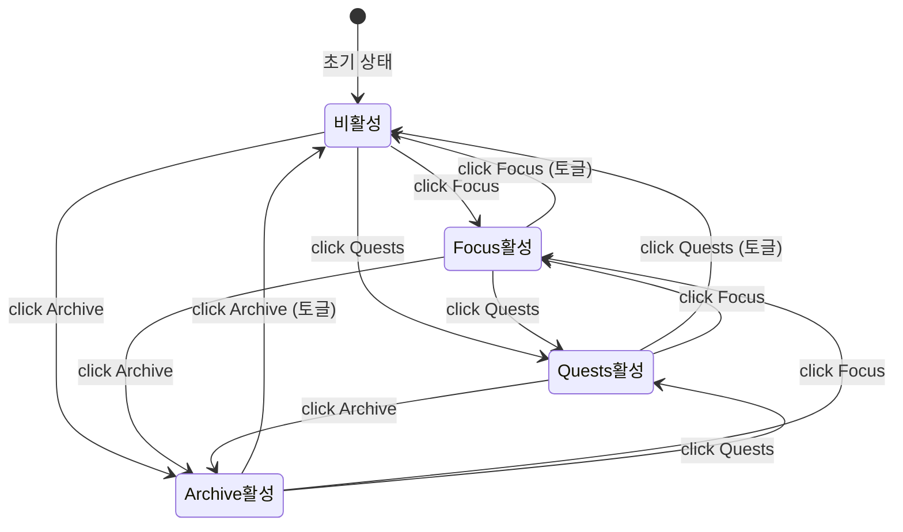

# Navigation Bar

> **문서 성격**: `글로벌 UI`의 **네비게이션 바** 컴포넌트 스펙.
> 작성 규칙은 `project-docs-guide.md` 참조.

---

## 목차

1. [개요](#1-개요)
2. [UI 구조](#2-ui-구조)
3. [데이터 모델](#3-데이터-모델)
4. [동작 규칙](#4-동작-규칙)
5. [사용자 상호작용](#5-사용자-상호작용)
6. [관련 시스템](#6-관련-시스템)

---

## 1. 개요

- **한 줄 정의**: 3개의 글래스 버튼(Focus, Quests, Archive)으로 사이드 패널을 열고 닫는 메인 네비게이션
- **위치**: 우측 상단 `.tr-block` > `.tr-bottom-row` 내부, `session-mini` 옆
- **구현 상태**: ✅ 구현 완료

## 2. UI 구조

### 2.1. 와이어프레임

```
┌─── .tr-bottom-row ──────────────────────────────────────────┐
│                                                              │
│  [session-mini]   ┌─── .nav-bar (glass) ──────────────────┐ │
│   (조건부 표시)    │                                        │ │
│                   │  ┌──────┐  ┌──────┐  ┌──────┐         │ │
│                   │  │ ⏱    │  │ 📋   │  │ 📚   │         │ │
│                   │  │Focus │  │Quests│  │Archiv│         │ │
│                   │  │      │  │  🔴  │  │      │         │ │
│                   │  └──────┘  └──────┘  └──────┘         │ │
│                   │   88x88     88x88     88x88           │ │
│                   └────────────────────────────────────────┘ │
└──────────────────────────────────────────────────────────────┘
                              🔴 = .nav-dot (overdue 뱃지)
```

### 2.2. CSS 클래스 구조

```
.tr-bottom-row                ← 하단 행 컨테이너 (flex, gap:12px)
├── .session-mini             ← 세션 미니 위젯 (별도 컴포넌트)
└── .nav-bar.glass            ← 네비게이션 바 (flex, gap:10px, padding:8px, radius:20px)
    ├── .nav-btn[data-key="focus"]    ← Focus 버튼
    │   ├── svg               ← 시계 아이콘 (30x30)
    │   └── .nav-btn-label    ← "Focus" 텍스트
    ├── .nav-btn[data-key="quests"]   ← Quests 버튼
    │   ├── svg               ← 문서 아이콘 (30x30)
    │   ├── .nav-btn-label    ← "Quests" 텍스트
    │   └── .nav-dot#questsDot ← 오버듀 알림 뱃지 (조건부)
    └── .nav-btn[data-key="archive"]  ← Archive 버튼
        ├── svg               ← 책장 아이콘 (30x30)
        └── .nav-btn-label    ← "Archive" 텍스트
```

### 2.3. 시각 요소 상세

#### 버튼 기본 상태 (`.nav-btn`)

| 속성 | 값 |
|------|----|
| 크기 | `88px x 88px` |
| 배경 | `linear-gradient(180deg, rgba(28,28,38,0.9), rgba(20,20,28,0.9))` |
| 테두리 | `1px solid var(--border)`, `border-radius: 18px` |
| 그림자 | `0 2px 10px rgba(0,0,0,0.3)`, `inset 0 1px 0 rgba(255,255,255,0.04)` |
| 텍스트 | `var(--text-secondary)` |
| 레이아웃 | `flex-column`, `align-items: center`, `justify-content: center`, `gap: 8px` |

#### 버튼 호버 (`:hover`)

| 속성 | 값 |
|------|----|
| 텍스트 | `var(--text-primary)` |
| 테두리 | `rgba(201,169,89,0.4)` |
| 변환 | `translateY(-3px)` |
| 그림자 | `0 10px 28px rgba(0,0,0,0.4)`, `0 0 24px rgba(201,169,89,0.1)` |

#### 버튼 활성 상태 (`.nav-btn.active`)

| 패널 | 텍스트 색상 | 테두리 색상 |
|------|------------|------------|
| 공통 | `var(--gold-soft)` | `rgba(201,169,89,0.55)` |
| Focus | `var(--focus-c)` (coral/orange) | `rgba(232,168,124,0.5)` |
| Quests | `var(--todo-c)` (gold/yellow) | `rgba(232,200,124,0.5)` |
| Archive | `var(--diary-c)` (lavender/purple) | `rgba(199,157,232,0.5)` |

활성 배경: `linear-gradient(180deg, rgba(201,169,89,0.14), rgba(201,169,89,0.06))`

#### 레이블 (`.nav-btn-label`)

| 속성 | 값 |
|------|----|
| 폰트 | `DM Mono`, `11px`, `uppercase` |
| 자간 | `letter-spacing: 0.12em` |
| 색상 | `inherit` (버튼 상태에 따라 변경) |

#### 알림 뱃지 (`.nav-dot`)

| 속성 | 값 |
|------|----|
| 크기 | `10px x 10px`, 원형 |
| 위치 | `absolute`, `top: 11px`, `right: 11px` |
| 배경 | `var(--todo-c)` |
| 그림자 | `0 0 10px rgba(232,200,124,0.7)` |
| 애니메이션 | `pdot 2s ease infinite` (맥박 효과) |
| 테두리 | `1.5px solid var(--bg-deep)` |

## 3. 데이터 모델

### 3.1. 전역 상태

| 속성 | 타입 | 기본값 | 설명 |
|------|------|--------|------|
| `A.currentPanel` | `null \| 'focus' \| 'quests' \| 'archive'` | `null` | 현재 열린 패널 키 |

### 3.2. 데이터 스키마

해당 없음. 네비게이션 바 자체는 데이터를 저장하지 않는다.

## 4. 동작 규칙

### 4.1. 상태 전이



### 4.2. 핵심 로직

- **토글 동작**: 이미 활성화된 버튼을 다시 클릭하면 `closePanel()` 호출
- **전환 동작**: 다른 버튼 클릭 시 기존 패널 닫고 새 패널 오픈
- **Overdue 뱃지**: `countOverdue() > 0`일 때 Quests 버튼의 `.nav-dot` 표시 (`display:block`)
- 패널 열림 시: 해당 `nav-btn`에 `.active` 클래스 추가, 나머지 제거
- 패널 닫힘 시: 모든 `nav-btn`에서 `.active` 클래스 제거

### 4.3. 함수 매핑

| 함수 | 역할 |
|------|------|
| `openPanel(key)` | 패널 열기 / 토글 (내부에서 `.nav-btn.active` 클래스 관리) |
| `closePanel()` | 패널 닫기, 모든 `.nav-btn`에서 `.active` 제거 |
| `countOverdue()` | overdue 퀘스트 수 반환 → `.nav-dot` 표시 여부 결정 |

## 5. 사용자 상호작용

### 5.1. 조작 방법

| 액션 | 결과 |
|------|------|
| 비활성 버튼 클릭 | 해당 패널 열림, 버튼 활성화 |
| 활성 버튼 클릭 | 패널 닫힘, 버튼 비활성화 (토글) |
| 다른 버튼 클릭 | 기존 패널 닫히고 새 패널 열림 |
| 호버 | `translateY(-3px)` 상승 + 골드 테두리 글로우 |
| 클릭 유지 (`:active`) | `translateY(-1px) scale(0.97)` 눌림 효과 |

### 5.2. 키보드 단축키

| 키 | 동작 |
|----|------|
| `Escape` | 현재 열린 패널 닫기 (`closePanel()`) |

### 5.3. 이벤트 흐름

```
사용자 클릭 → onclick="openPanel('focus')"
  → A.currentPanel === 'focus'? → YES → closePanel()
                                → NO  → A.currentPanel = 'focus'
                                       → .nav-btn.active 클래스 토글
                                       → renderPanelContent('focus')
                                       → renderSessionMini()
```

## 6. 관련 시스템

| 시스템 | 관계 |
|--------|------|
| `clock` | 같은 `.tr-block` 내 상단에 배치 |
| `panel-system` | 버튼 클릭으로 사이드 패널 열기/닫기 제어 |
| `session-mini` | `.tr-bottom-row`에서 나란히 배치, 패널 닫힘 시 표시 |
| `quests` | Quests 버튼의 `.nav-dot`으로 overdue 건수 표시 |

---

## 업데이트 이력

| 날짜 | 변경 내용 |
|------|----------|
| 2026-04-25 | 초기 작성 |
