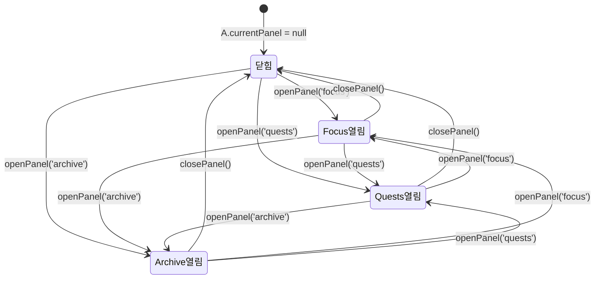

# Panel System

> **문서 성격**: `글로벌 UI`의 **사이드 패널 시스템** 스펙.
> 작성 규칙은 `project-docs-guide.md` 참조.

---

## 목차

1. [개요](#1-개요)
2. [UI 구조](#2-ui-구조)
3. [데이터 모델](#3-데이터-모델)
4. [동작 규칙](#4-동작-규칙)
5. [사용자 상호작용](#5-사용자-상호작용)
6. [관련 시스템](#6-관련-시스템)

---

## 1. 개요

- **한 줄 정의**: Focus/Quests/Archive 콘텐츠를 우측에 오버레이로 표시하는 단일 사이드 패널 시스템
- **위치**: `.stage` 내부, 우측 (`right: 36px`, `top: 204px`), z-index 50
- **구현 상태**: ✅ 구현 완료

## 2. UI 구조

### 2.1. 와이어프레임

```
┌─── .stage ─────────────────────────────────────────────────────┐
│                                                                 │
│  .panel-backdrop (absolute, inset:0, z-index:49)               │
│  ┌─────────────────────────────────────────────────────────┐   │
│  │  (투명 — 클릭 캐처 역할만 수행)                          │   │
│  └─────────────────────────────────────────────────────────┘   │
│                                                                 │
│                              ┌─── .side-panel ────────────────┐│
│                              │  ┌── .sp-hdr ────────────────┐ ││
│                              │  │  .sp-hdr-left             │ ││
│                              │  │    .sp-kicker  "FOCUS"    │ ││
│                              │  │    .sp-title   ""         │ ││
│                              │  │               [.sp-close] │ ││
│                              │  └───────────────────────────┘ ││
│                              │  ┌── .sp-body ───────────────┐ ││
│                              │  │                           │ ││
│                              │  │  (패널별 콘텐츠 렌더링)    │ ││
│                              │  │                           │ ││
│                              │  └───────────────────────────┘ ││
│                              └────────────────────────────────┘│
│                               460px (기본) / 760px (wide)      │
└─────────────────────────────────────────────────────────────────┘
```

### 2.2. CSS 클래스 구조

```
.panel-backdrop#backdrop      ← 클릭 캐처 (absolute, inset:0, z-index:49)
.side-panel#sidePanel         ← 패널 본체 (absolute, z-index:50)
├── .sp-hdr                   ← 헤더 (flex, space-between)
│   ├── .sp-hdr-left          ← 헤더 좌측 (flex-column)
│   │   ├── .sp-kicker        ← 패널 이름 (Cinzel 24px uppercase)
│   │   └── .sp-title         ← 패널 부제목
│   └── .sp-close             ← 닫기 버튼 (30x30)
└── .sp-body#spBody           ← 본문 영역 (flex:1, overflow-y:auto)
```

### 2.3. 시각 요소 상세

#### 패널 본체 (`.side-panel`)

| 속성 | 값 |
|------|----|
| 위치 | `absolute`, `top: 204px`, `right: 36px` |
| 기본 너비 | `460px` |
| Wide 너비 | `760px` (`.side-panel.wide`) |
| 최대 높이 | `870px` |
| 배경 | `var(--glass)` |
| 테두리 | `1px solid var(--glass-b)`, `border-radius: 18px` |
| 블러 | `backdrop-filter: blur(28px)` |
| 그림자 | `0 30px 80px rgba(0,0,0,0.55)`, `inset 0 1px 0 rgba(255,255,255,0.04)` |
| 레이아웃 | `flex-direction: column`, `overflow: hidden` |

#### 닫힌 상태 (기본)

| 속성 | 값 |
|------|----|
| `opacity` | `0` |
| `transform` | `translateY(-12px) scale(0.98)` |
| `pointer-events` | `none` |

#### 열린 상태 (`.side-panel.open`)

| 속성 | 값 |
|------|----|
| `opacity` | `1` |
| `transform` | `translateY(0) scale(1)` |
| `pointer-events` | `all` |
| 트랜지션 | `opacity 0.25s ease, transform 0.25s ease, width 0.25s ease` |

#### 헤더 (`.sp-hdr`)

| 속성 | 값 |
|------|----|
| 패딩 | `22px 24px 16px` |
| 하단 테두리 | `1px solid rgba(201,169,89,0.1)` |
| 레이아웃 | `flex`, `space-between`, `align-items: center` |

#### 킥커 (`.sp-kicker`)

| 속성 | 값 |
|------|----|
| 폰트 | `Cinzel`, `24px`, `uppercase` |
| 자간 | `letter-spacing: 0.3em` |
| 색상 | 패널별 `meta.color` 값 (JS에서 동적 설정) |

#### 닫기 버튼 (`.sp-close`)

| 속성 | 값 |
|------|----|
| 크기 | `30px x 30px`, `border-radius: 8px` |
| 배경 | 투명, `border: 1px solid var(--border)` |
| 아이콘 | X 마크 SVG (`13x13`) |
| 호버 | `background: var(--border)`, `color: var(--text-primary)` |

#### 본문 (`.sp-body`)

| 속성 | 값 |
|------|----|
| 레이아웃 | `flex: 1`, `overflow-y: auto` |
| 패딩 | `20px 24px 22px` |
| 스크롤바 | 4px, `rgba(255,255,255,0.08)` |

#### 백드롭 (`.panel-backdrop`)

| 속성 | 값 |
|------|----|
| 위치 | `absolute`, `inset: 0`, z-index: 49 |
| 기본 | `opacity: 0`, `pointer-events: none` |
| 열림 (`.open`) | `pointer-events: all` (투명하게 유지, 클릭만 감지) |

## 3. 데이터 모델

### 3.1. 전역 상태

| 속성 | 타입 | 기본값 | 설명 |
|------|------|--------|------|
| `A.currentPanel` | `null \| 'focus' \| 'quests' \| 'archive'` | `null` | 현재 열린 패널 키 |

### 3.2. 데이터 스키마

#### PANEL_META 설정 객체

```javascript
const PANEL_META = {
  focus:   { kicker: 'FOCUS',   title: '', color: 'var(--focus-c)', wide: false },
  quests:  { kicker: 'Quests',  title: '', color: 'var(--todo-c)',  wide: false },
  archive: { kicker: 'Archive', title: '', color: 'var(--diary-c)', wide: true  },
};
```

| 필드 | 타입 | 설명 |
|------|------|------|
| `kicker` | `string` | 헤더에 표시할 패널 이름 |
| `title` | `string` | 헤더 부제목 (현재 미사용) |
| `color` | `string` | 킥커 텍스트 색상 (CSS 변수) |
| `wide` | `boolean` | `true`이면 760px, `false`이면 460px |

## 4. 동작 규칙

### 4.1. 상태 전이



### 4.2. 핵심 로직

#### openPanel(key)

1. `A.currentPanel === key`이면 `closePanel()` 호출 후 리턴 (토글)
2. `A.currentPanel = key` 설정
3. `PANEL_META[key]`에서 kicker, color, wide 값 적용
4. `.side-panel`에 `.open` 클래스 추가, `wide` 토글
5. 모든 `.nav-btn`에서 `.active` 제거 후 해당 버튼에 `.active` 추가
6. `renderPanelContent(key)` 호출하여 본문 렌더링
7. `renderSessionMini()` 호출 (패널 열림 시 미니 위젯 숨김)

#### closePanel()

1. `A.currentPanel = null` 설정
2. `.side-panel`에서 `.open` 클래스 제거
3. 모든 `.nav-btn`에서 `.active` 제거
4. `renderSessionMini()` 호출 (세션 실행 중이면 미니 위젯 표시)

#### renderPanelContent(key)

- `'focus'` → `renderFocusPanel()`
- `'quests'` → `renderQuestsPanel()`
- `'archive'` → `renderArchivePanel()`

### 4.3. 함수 매핑

| 함수 | 역할 |
|------|------|
| `openPanel(key)` | 패널 열기 (토글 포함), 헤더 설정, 콘텐츠 렌더링 |
| `closePanel()` | 패널 닫기, 상태 초기화 |
| `renderPanelContent(key)` | 패널 키에 따라 해당 렌더 함수 호출 |
| `renderSessionMini()` | 패널 열림/닫힘에 따라 세션 미니 위젯 토글 |

## 5. 사용자 상호작용

### 5.1. 조작 방법

| 액션 | 결과 |
|------|------|
| 네비게이션 버튼 클릭 | `openPanel(key)` — 패널 열기 또는 토글 |
| `.sp-close` 버튼 클릭 | `closePanel()` — 패널 닫기 |
| 백드롭 클릭 | `closePanel()` — 패널 닫기 |
| 패널 외부 클릭 | `closePanel()` (`.tr-block` 및 패널 영역 제외) |

### 5.2. 키보드 단축키

| 키 | 동작 |
|----|------|
| `Escape` | `closePanel()` + `closeRecModal()` 동시 호출 |

### 5.3. 이벤트 흐름

#### 패널 열기

```
nav-btn 클릭 → openPanel(key)
  → A.currentPanel === key? → YES → closePanel() → 종료
                            → NO  → A.currentPanel = key
                                   → PANEL_META 적용 (kicker, color, wide)
                                   → .side-panel.open 추가
                                   → .nav-btn.active 설정
                                   → renderPanelContent(key)
                                   → renderSessionMini()
```

#### 패널 닫기 (외부 클릭)

```
document click 이벤트 발생
  → document.contains(e.target)? → NO → 무시 (DOM에서 제거된 요소)
  → e.target이 #sidePanel 내부? → YES → 무시
  → e.target이 .tr-block 내부? → YES → 무시
  → A.currentPanel 존재? → YES → closePanel()
```

## 6. 관련 시스템

| 시스템 | 관계 |
|--------|------|
| `navigation-bar` | 버튼 클릭으로 패널 열기/닫기 트리거 |
| `focus-panel` | `renderFocusPanel()`이 `.sp-body`에 Focus 콘텐츠 렌더링 |
| `quests-panel` | `renderQuestsPanel()`이 `.sp-body`에 Quests 콘텐츠 렌더링 |
| `archive-panel` | `renderArchivePanel()`이 `.sp-body`에 Archive 콘텐츠 렌더링 (wide 모드) |
| `session-mini` | 패널 열림 시 숨김, 닫힘 시 표시 |
| `record-modal` | Escape 키로 패널과 레코드 모달 동시 닫기 |

---

## 업데이트 이력

| 날짜 | 변경 내용 |
|------|----------|
| 2026-04-25 | 초기 작성 |
