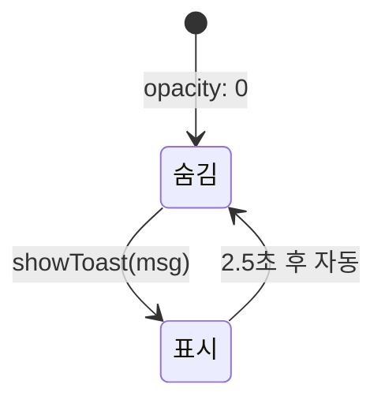

# Toast Notification

> **문서 성격**: `글로벌 UI`의 **토스트 알림** 컴포넌트 스펙.
> 작성 규칙은 `project-docs-guide.md` 참조.

---

## 목차

1. [개요](#1-개요)
2. [UI 구조](#2-ui-구조)
3. [데이터 모델](#3-데이터-모델)
4. [동작 규칙](#4-동작-규칙)
5. [사용자 상호작용](#5-사용자-상호작용)
6. [관련 시스템](#6-관련-시스템)

---

## 1. 개요

- **한 줄 정의**: 하단 중앙에 잠시 나타났다 사라지는 글래스모피즘 스타일의 피드백 알림
- **위치**: `.stage` 하단 중앙 (`bottom: 28px`, `left: 50%`, z-index: 300)
- **구현 상태**: ✅ 구현 완료

## 2. UI 구조

### 2.1. 와이어프레임

```
┌─── .stage ──────────────────────────────────────┐
│                                                   │
│                    (콘텐츠 영역)                   │
│                                                   │
│           ┌── .toast ──────────────┐             │
│           │  "이미 존재하는 카테고리" │             │
│           └────────────────────────┘             │
│            bottom: 28px, 수평 중앙                │
└───────────────────────────────────────────────────┘
```

### 2.2. CSS 클래스 구조

```
.toast#toast                  ← 토스트 요소 (absolute, bottom 중앙)
```

### 2.3. 시각 요소 상세

#### 기본 상태 (`.toast`)

| 속성 | 값 |
|------|----|
| 위치 | `absolute`, `bottom: 28px`, `left: 50%` |
| z-index | `300` |
| 배경 | `var(--glass)` |
| 테두리 | `1px solid rgba(124,232,168,0.3)` (녹색 계열) |
| 텍스트 | `var(--success)`, `DM Mono 11px`, `letter-spacing: 0.05em` |
| 패딩 | `8px 16px` |
| 모서리 | `border-radius: 18px` |
| 초기 상태 | `opacity: 0`, `transform: translateX(-50%) translateY(14px)` |
| 트랜지션 | `all 0.3s ease` |
| 상호작용 | `pointer-events: none`, `white-space: nowrap` |

#### 표시 상태 (`.toast.show`)

| 속성 | 값 |
|------|----|
| `opacity` | `1` |
| `transform` | `translateX(-50%) translateY(0)` |

## 3. 데이터 모델

### 3.1. 전역 상태

해당 없음. 토스트는 전역 상태(`A`)를 사용하지 않는다.

### 3.2. 데이터 스키마

해당 없음. 메시지는 함수 인자로 전달된다.

## 4. 동작 규칙

### 4.1. 상태 전이



### 4.2. 핵심 로직

#### showToast(msg)

```javascript
function showToast(msg) {
  const t = $('toast');
  t.textContent = msg;
  t.classList.add('show');
  setTimeout(() => t.classList.remove('show'), 2500);
}
```

1. `#toast` 요소의 `textContent`를 메시지로 설정
2. `.show` 클래스 추가 → 슬라이드업 + 페이드인
3. **2,500ms 후** `.show` 클래스 제거 → 슬라이드다운 + 페이드아웃
4. CSS `transition: all 0.3s ease`로 부드러운 전환

> **참고**: 연속 호출 시 기존 타이머를 취소하지 않으므로, 빠르게 반복 호출하면 이전 메시지가 2.5초 후에 사라진다.

### 4.3. 함수 매핑

| 함수 | 역할 |
|------|------|
| `showToast(msg)` | 토스트 메시지 표시 → 2.5초 후 자동 해제 |

## 5. 사용자 상호작용

### 5.1. 조작 방법

없음. 시스템이 자동으로 표시/해제하며, `pointer-events: none`으로 클릭 불가.

### 5.2. 키보드 단축키

해당 없음.

### 5.3. 이벤트 흐름

```
시스템 이벤트 발생 → showToast("메시지")
  → .toast.textContent = "메시지"
  → .toast.show 클래스 추가 (페이드인 + 슬라이드업)
  → 2,500ms 대기
  → .toast.show 클래스 제거 (페이드아웃 + 슬라이드다운)
```

#### 토스트가 호출되는 상황

| 호출 위치 | 메시지 예시 |
|----------|------------|
| 카테고리 모달 — 이름 미입력 | `"이름을 입력해주세요"` |
| 카테고리 모달 — 중복 | `"이미 존재하는 카테고리"` |
| 카테고리 모달 — 최대 초과 | `"최대 12개"` |
| 레코드 저장 — 카테고리 미선택 | `"카테고리를 선택해주세요"` |
| 포커스 모드 전환 오류 | 모드 전환 불가 메시지 |
| 타이머 자동 재시작 | 자동 재시작 알림 |
| 유효성 검증 실패 | 각종 검증 오류 메시지 |

## 6. 관련 시스템

| 시스템 | 관계 |
|--------|------|
| `category-modal` | 카테고리 추가 시 유효성 검증 실패 메시지 표시 |
| `focus-panel` | 모드 전환 오류, 자동 재시작 알림 등 |
| `quests-panel` | 퀘스트 관련 검증 오류 메시지 |
| `record-modal` | 레코드 저장 시 카테고리 미선택 경고 |

---

## 업데이트 이력

| 날짜 | 변경 내용 |
|------|----------|
| 2026-04-25 | 초기 작성 |
